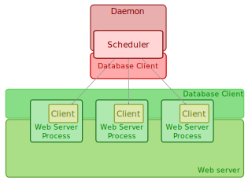
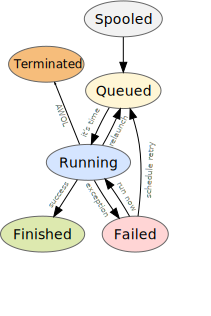

:mod:`indico.modules.scheduler` -- task scheduling framework and daemon
=======================================================================

.. automodule:: indico.modules.scheduler

========
Overview
========

------------
Architecture
------------

The scheduler module uses the database as the communication medium between "web server processes" (Indico instances, running inside a web server, etc...) and the daemon. This has advantages such as:

 * No need for complex IPC mechanisms (RPC, shared memory, etc...);
 * Everything is in the Indico DB, which makes migration much easier;

But also poses some problems such as:

 * Overhead introduced by regular DB polling on the scheduler (daemon) side;
 * Extra database traffic that can slow down things a bit;
 * Increased possibility of database conflicts;

We tried to mitigate these problems by using conflict-free lightweight data structures.

The `Scheduler` is the element that is responsible for accepting new tasks and prioritizing them by execution time, launching new processes/threads as they need to be executed. Logs of the operations are kept.

A `Client` is basically a proxy object that allows operations to be performed on the `Scheduler` and its tasks in a transparent way.

--------
Workflow
--------

Tasks can be in one of the following states:

* ``TASK_STATUS_NONE`` - Nothing happened yet - this is a transitory state, and normally the state task objects are in when they are created;
* ``TASK_STATUS_SPOOLED`` - The task has been added to the spool, and is currently waiting to be put in the waiting queue;
* ``TASK_STATUS_QUEUED`` - The algorithm has put the task in the waiting queue;
* ``TASK_STATUS_RUNNING`` - The task is being executed;
* ``TASK_STATUS_FAILED`` - The task has failed (execution threw an exception, maybe it was cancelled);
* ``TASK_STATUS_FINISHED`` - The task has successfully finished;
* ``TASK_STATUS_TERMINATED`` - The task has been cancelled by the scheduler (i.e. was AWOL for too long);

...

=========
Scheduler
=========
The main class in the module is the `Scheduler`

.. autoclass:: indico.modules.scheduler.Scheduler
   :members:

======
Client
======

Client applications only need to worry about:

.. autoclass:: indico.modules.scheduler.Client
    :members:

=====
Tasks
=====

.. autoclass:: indico.modules.scheduler.tasks.BaseTask
.. autoclass:: indico.modules.scheduler.tasks.OneShotTask
.. autoclass:: indico.modules.scheduler.tasks.PeriodicTask

======
Module
======

The module object is of little interest for developers in general. Every Indico instance will transparently provide one through :py:meth:`~indico.modules.scheduler.SchedulerModule.getDBInstance`.

.. autoclass:: indico.modules.scheduler.SchedulerModule
    :members:
    :inherited-members:

=======
Example
=======

A simple client use case::

    >>> from indico.modules.scheduler import Client
    >>> from indico.modules.scheduler.tasks import SampleOneShotTask, SamplePeriodicTask
    >>> from datetime import timedelta
    >>> from dateutil import rrule
    >>> from indico.util.date_time import nowutc
    >>> c = Client()
    >>> st = SampleOneShotTask(nowutc() + timedelta(seconds=1))
    >>> c.enqueue(st)
    True
    >>> dbi.commit()
    >>> pt = SamplePeriodicTask(rrule.MINUTELY, bysecond=(40,))
    >>> c.enqueue(pt)
    True
    >>> dbi.commit()
    >>> c.dequeue(pt)
    >>> dbi.commit()

A simple scheduler configuration::

    s = Scheduler(sleep_interval = 1,
                  task_max_tries = 1,
                  multitask_mode = 'processes')

======
Daemon
======

.. autoclass:: indico.modules.scheduler.Scheduler
   :members:
