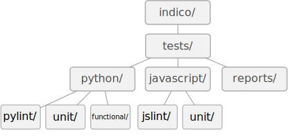

:mod:`indico.tests` - test framework
=================================================

.. automodule:: indico.tests
   :members:

============
Architecture
============
The framework is called through ``setup.py`` with the argument ``test`` and optional flags such as ``--unit``.

Some dependencies are required:
  * ``figleaf``
  * ``nose``
  * ``selenium``
  * ``twill``

Each test category is also a class, inheriting from another class named :class:`~indico.tests.BaseTestRunner`, which contains useful functions used by all the test classes.

The class :class:`~indico.tests.TestManager` is in charge of instantiating each test class and to call their :meth:`~indico.tests.BaseTestRunner.run` method.

Some external components such as `JAR` files (for ``selenium``/``js-test-driver``) are automatically downloaded.
All the information for the downloads is stored in the *tests configuration file*.

=================================
Implementing a new ``TestRunner``
=================================
To add a new test to the framework, one has to add a new class inheriting from :class:`~indico.tests.BaseTestRunner` with a method called ``_run()``.

A flag can be added in ``setup.py`` to run only the new test.

Finally, if for some reason you need to add permanent files in the tests folder, remember to follow the naming convention, which is one folder for each progamming language and one folder for each test category.

