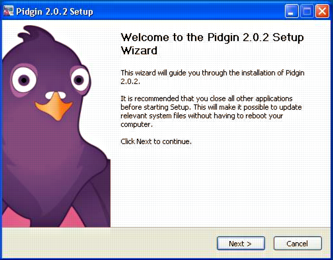
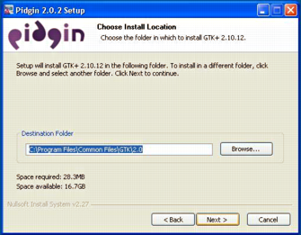
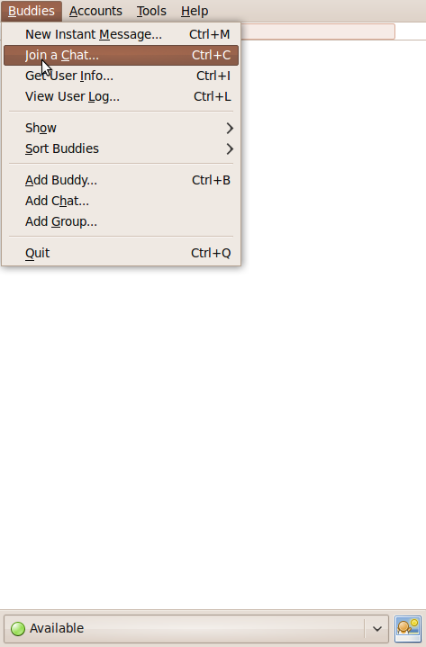

==============
What is Pidgin
==============

Pidgin is an Instant Messaging Client for Windows & Linux. Pidgin
now supports Google Talk, MSN, ICQ, QQ, Yahoo! Messenger,
Jabber/XMPP and many more.

========================
Where can I download it?
========================

If you are a Linux user, from here: http://www.pidgin.im/download/source/
(Besides the source code, packages are also available
for CentOS and Fedora, though).

If you are a Windows user, from here: http://www.pidgin.im/download/windows/

=====================
How can I install it?
=====================

- Double-click the Pidgin installation file. Windows warns you that the publisher cannot be verified. Since this file is from Fermilab support, click Run to allow the installation.

|image0|

- Choose the language that you wish to use with Pidgin and click OK.

|image1|

- The setup wizard starts. Click Next to continue.

|image2|

- Read the Pidgin license agreement (GPL2), and if you agree, click Next.

|image3|

- Select the components that you wish to install and click Next. The default selections should be fine.

|image4|

- In the Destination Folder box, type the directory you wish to use for Pidgin. We recommend installing Pidgin in C:\Program Files\Pidgin.

|image5|

- The Pidgin installation will begin. When the installation is complete, click Next to continue, then click Finish to run Pidgin and complete the configuration.

|image6|

- Click Add to add your chat accounts to your configuration.

|image7|

========================
How do I add my account?
========================

- In the Pidgin Login Screen, click Accounts, then click Add. The Add Account dialog appears.

|image8|

- Type your CERN username into the Username box, which is the part that goes before @cern.ch

- Type jabber.cern.ch into the Domain box.

- Type the name you want to give this account in the Resource box. For example, Work or CERN.

- Type your NICE password into the Password box. DO NOT check Remember password, since it will be saved in plain text and it could cause a security problem.

- Click the Advanced tab.

|image9|

- Make sure that the port selected is the 5222 and that Require SSL/TLS is enabled.

================================
How do I enter into a chat room?
================================

- Click in Join a chat

|image10|

- Insert the name of the chat room, the server (conference.jabber.cern.ch), the nickname that you will use and, in case the room is protected, the chat room's password.

|image11|

=========
More info
=========

- http://developer.pidgin.im/wiki/Using%20Pidgin
- http://www.pidgin.im/

.. |image0| image:: images/security_warning.png
.. |image1| image:: images/installer_language.png

.. |image3| image:: images/license_agreement.png
.. |image4| image:: images/choose_components.png

.. |image6| image:: images/wizard_complete.png
.. |image7| image:: images/welcome_to_pidgin.png
.. |image8| image:: images/screenshot.png
.. |image9| image:: images/advanced.png

.. |image11| image:: images/joinchat2.png
