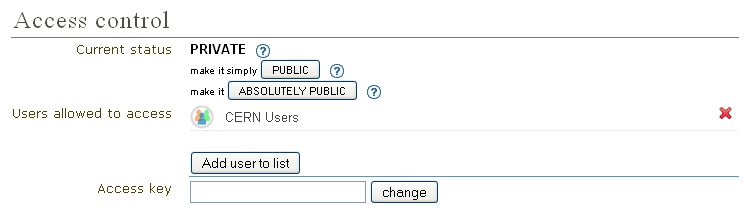

Indico's FAQ
============

Downloading and Installing
--------------------------

From where can I download the latest Indico Release?
^^^^^^^^^^^^^^^^^^^^^^^^^^^^^^^^^^^^^^^^^^^^^^^^^^^^

You can download the lastest release of Indico from:
::

    http://cdswaredev.cern.ch/indico

--------------

General Event
-------------

How do I create the proceedings for my conference?
^^^^^^^^^^^^^^^^^^^^^^^^^^^^^^^^^^^^^^^^^^^^^^^^^^

From the Management area within your conference, go to the
Contributions area and above the list of contributions there is a
button for proceedings. If there are resources along with the
contribution the main resource will be shown in the proceedings

--------------

I log in but I am taken back to the login page again, how can I avoid this?
^^^^^^^^^^^^^^^^^^^^^^^^^^^^^^^^^^^^^^^^^^^^^^^^^^^^^^^^^^^^^^^^^^^^^^^^^^^

Enable cookies within your browser and try to log in again.

--------------

How do I enter the management/modification area of an item in Indico?
^^^^^^^^^^^^^^^^^^^^^^^^^^^^^^^^^^^^^^^^^^^^^^^^^^^^^^^^^^^^^^^^^^^^^

Wherever you see the small red pen |image1| or the edition botton |image2| you can click on this
and modify the item.

--------------

How do I restrict the access rights of my event to certain users?
^^^^^^^^^^^^^^^^^^^^^^^^^^^^^^^^^^^^^^^^^^^^^^^^^^^^^^^^^^^^^^^^^

In order to do that, go to the Managment Area of your event and
select the 'Protection' entry in the side menu. Once that you are in
the protection settings, pay attention to the 'Access Control' settings.
In order to set the access rights, you have to make your event 'Private' first by
changing its 'Current status' to either 'Private by itself' or 'Private by inheritance'
(if available). Once the event is private, add users to the 'Users allowed to access' list
by clicking the 'Add user to list' button. A form will be displayed in which you can
search for users by entering their family name, first name, etc... You can also restrict
the access to groups of users by filling the 'Group name' entry of the search form and
select one of the resulting groups. All the people included
in the group will be granted access to the event.

For example, if somebody wants to grant access to his/her event only to users from the CERN,
he/she will first search for the group containing all the CERN users (namely 'CERN Users') and
add this group to the list of users allowed to access. The 'Access Control' section will then
look like this :

|image3|

--------------

.. |image1| image:: FAQPics/pen.png
.. |image2| image:: FAQPics/newpen.png

