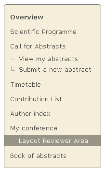
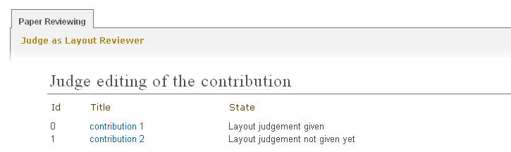
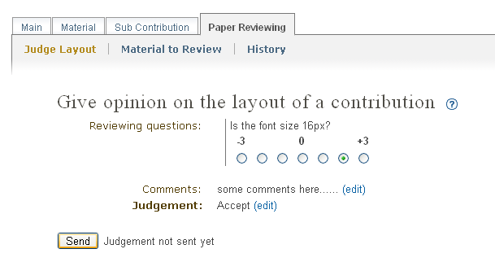
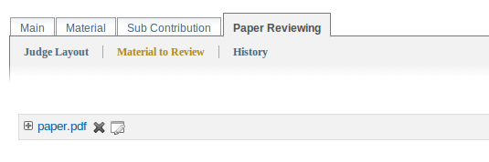

===============================================
Paper Reviewing Module - Layout Reviewers's Guide
===============================================

Start using the system
----------------------

 As a layout reviewer your responsibility is to judge the layout of all of the contributions
 you are assigned to. You may log in the system and you will find a link in the left menu under 
 ``My Conference``.

        |image1|

-----------------

Layout Reviewer Area
--------------------
        
 When you access the Layout Reviewers Area you will find a list of all the contributions that are assign
 to you for judgment. You can see the state for every contribution.
        
        |image2|
        
 First you should fill in the approved requirements given by the Paper Review Manager. Then give 
 your judgment for the layout of the contribution: ``to be corrected``, ``rejected``, ``accepted``. 
 The comments that you will write down should help the Referee to give his judgment. If the Managers
 of the Paper Reviewing set this option - the authors of the contribution will receive automatically
 generated e-mail notification containing your comments and judgment.
        
       |image3|
        
 The material which is subject of reviewing is accessible under ``Material to Review``.
 
        |image4|
        
 
------------------------

