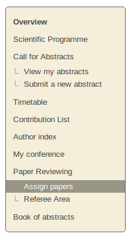
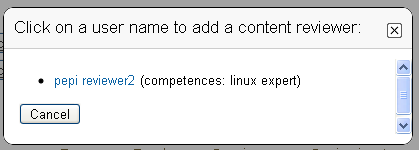
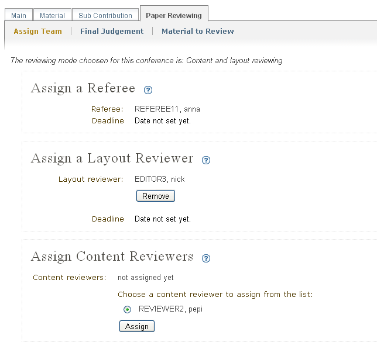
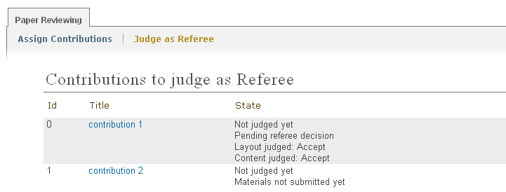
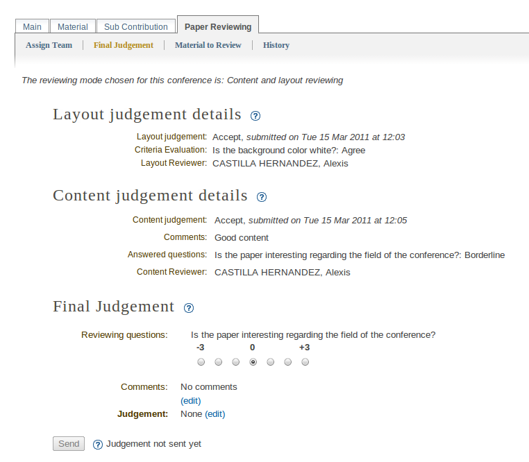
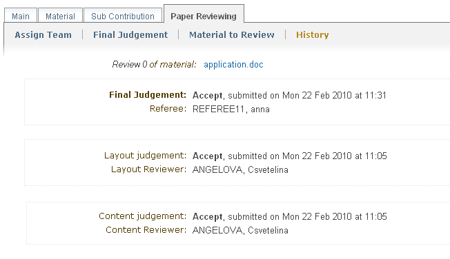

=======================================
Paper Reviewing Module - Referee's Guide
=======================================

Start using the system
----------------------

 As a referee your responsibilities are to assign contributions to the reviewers and to 
 give the final judgement for all of the contributions you are assigned to. 
 You may log in the system and you will find in the left menu two links under ``My Conference``.

        |image1|

-----------------

Assign Contributions to the Reviewers
-------------------------------------

 The Paper Reviewing module gives you the 
 opportunity to assign more than one contributions 
 to the same Reviewers by selecting them using the check boxes.
 Depending on the chosen reviewing mode you need to assign different
 team of reviewers.
 
        |image2| 

 Use the dialog popup to select the reviewer you wish to assign. 
 If there are defined competences for him, they will be shown in the dialog.

        |image3|
        
 By click on the name of a contribution you can assign reviewing team per contribution.

        |image4|
        
-------------------------

Referee Area
------------

        |image7|
        
 When you access the Referee Area you will find a list of all the contributions that are assign
 to you for judgment. You can follow if the author of the contribution had submitted the mateials 
 for reviewing. You can see the state for every contribution - if it is judged by the 
 Content Reviewers or by the Layout Reviewer, or by both. Once the Layout Reviewer has given
 a judgment and Content Reviewers have given their opinion of the contribution you can see their status:
        
        |image5|
        
 Your responsibility as Referee will be to give the final judgment for the contribution: 
 ``to be corrected``, ``rejected``, ``accepted`` or one of the statues added by the Managers.
 Accessing again the reviewing part (by clicking on the contribution's Title) you will be able 
 to see the judgments and the opinions of the layout and the content given by the reviewing team.
 
 To submit your final judgment click on ``Send`` button. If the Managers of the Paper Reviewing
 set this option - the authors of the contribution will receive automatically generated e-mail 
 notification containing your comments and judgment.  
        
        |image6|
        
 The material which is subject of reviewing is accessible for the Referees.
 
        |image8|
        
 The system gives you the opportunity to follow the reviewing history for every contribution.
 The reviewing history is build when there are more than one reviews per contribution.  
 You can access it just right after you send your final judgment.
 
        |image9|

------------------------

.. |image2| image:: PaperReviewingRefereesPics/referee2.png

.. |image7| image:: PaperReviewingRefereesPics/referee7.png
.. |image8| image:: PaperReviewingRefereesPics/referee8.png

