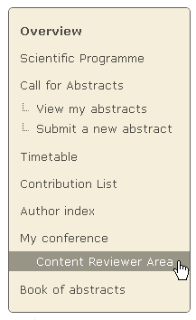
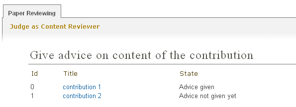
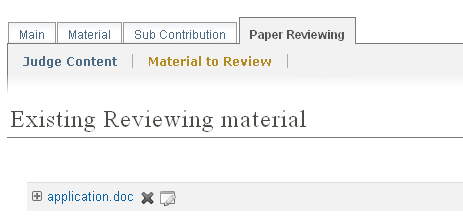

==================================================
Paper Reviewing Module - Content Reviewers's Guide
==================================================

Getting Started
---------------

 As a content reviewer your responsibility is to give your opinion about the contribution's content. 
 Firstlly, you must log in the system, then you will find a link ``Content Reviewer Area`` in the left 
 menu under ``My Conference``.

        |image1|

-----------------

Content Reviewer Area
----------------------
        
 When you access the Content Reviewers Area you will find a list of all the contributions that are 
 assigned to you in order to judge them. You see the state for every contribution - if you have already
 judged a contribution or if the assigned referee has given the final judgement.
        
        |image2|
        
 From list you can click on a contribution's title and access the page which will allow you to judge 
 that contribution. Once in that page, you should fill in the questions provided by the Paper Review Manager. 
 The comments that you will write down should help the Referee to give his judgement. As a final step, give 
 your judgement for the content of the contribution: to be ``corrected``, ``rejected``, accepted``. The authors of the 
 contribution will receive an automatic e-mail notification containing your comments and judgment, if the 
 Managers of the Paper Reviewing set this option.
        
       |image3|
        
 The material which is subject of reviewing is accessible under ``Material to Review``.
 
        |image4|
        
 
------------------------

.. |image3| image:: PaperReviewingReviewersPics/reviewer3.png
