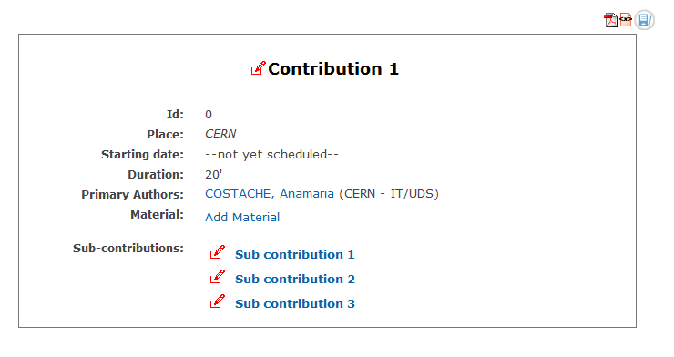
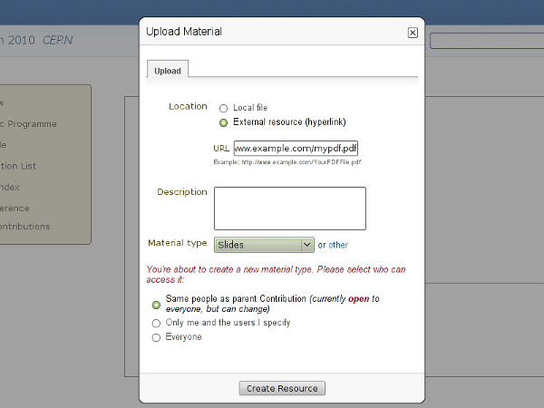

=================
Submitter's Guide
=================

--------------
Submitter
--------------

The Submitter is able to submit material for a
contribution. You are given Submitter access by either the
Conference Manager, Session Manager, Contribution Manager or
possibly the Session Co-ordinator.

|image1|

You can access the contributions for which you can submit material
by selecting *My contributions* from the menu in the event homepage.
This will take you to your submission area and will list the
contributions for which you can submit material.

|image2|

--------------

----------
Submitting
----------

Once in the My contributions area you can click on the
contribution name to view the contribution details and start
submitting material.

|image3|

--------------

Submitting Material
~~~~~~~~~~~~~~~~~~~

Once you have clicked on 'Add Material' you are presented with
a screen to let you submit.

|image4|

You can choose of which material type you want to submit,
upload a file, and enter a description or comment.

When the material has been submitted it will appear in the
contribution details

.. |image1| image:: QSPics/myconts.png
.. |image2| image:: QSPics/mycontslist.png

