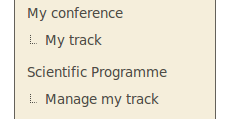
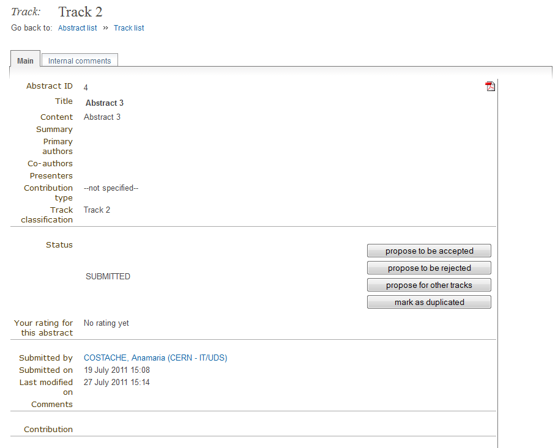
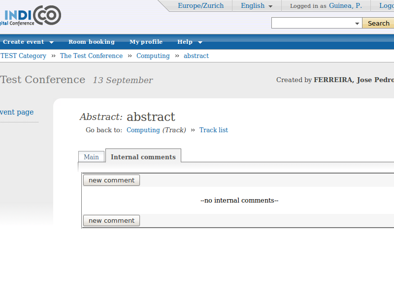

==========================
Track Co-ordinator's Guide
==========================

------------------
Track Co-ordinator
------------------

As a Track Co-ordinator you are able to propose the acceptance or
rejection of abstracts within your track. Your are given the Track
Co-ordinator's access by the Conference Manager.

|image1|

You can access your tracks by selecting *My tracks* or *Manage my
tracks* from the conference homepage menu under *My conference* or *Scientific
Programme*. This will take you to the list of tracks you are
co-ordinating or straight into your track if you co-ordinate only one
track.

|image2|

--------------

-------------------
Track Co-ordinating
-------------------

Once in the My tracks area you can click on the small red pen
to the left of the track name to access the co-ordination
area of that track.

--------------

Abstracts Tab
~~~~~~~~~~~~~

The Abstracts tab lists all the abstracts that have been
submitted for your track and their status.

|image4|

If you click on an abstract's name you will be taken to the
Abstract's Management area. From here you can view the abstract's
details and propose whether you want to accept, reject, mark as
duplicated, or suggest the abstract for another track.

|image5|

--------------

Internal Comments Tab
~~~~~~~~~~~~~~~~~~~~~

The Internal comments tab allows you to view and add any comments
attached to the abstract.

|image6|

.. |image2| image:: QSPics/mytracks.png
.. |image4| image:: QSPics/trackabs.png

