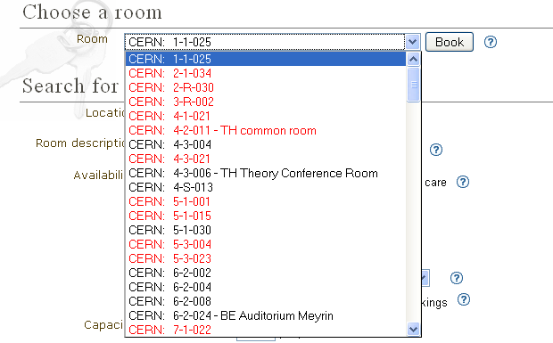
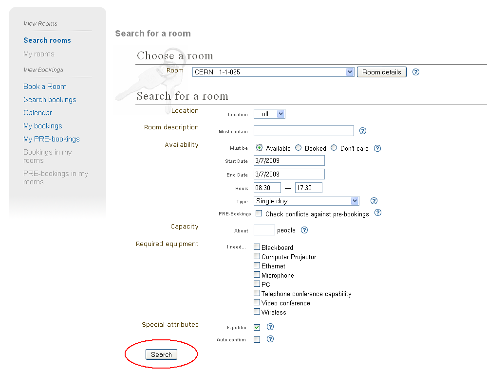
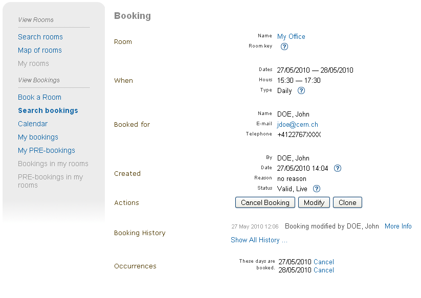

=======================
Conference Room Booking
=======================

Introduction
------------

This chapter describes the Indico module for booking conference
rooms.

Indico users can book conference rooms for their conference and
meeting purposes. Bookings can also be standalone - they
do not have to be bound to any event. Room managers can monitor and
moderate all bookings. Indico administrators can create rooms and
manage their data.

Instead of being a boring manual no one ever reads, this file is
an introduction. This assumes you have some intuition of how the web
works. The suggested way of learning is to start with a tutorial,
then play with the module on your own. Simply use the software as
any other Web page. Read context help along the way. Finally come
back for some tips.

--------------

The Tutorial
------------

You may want to read the Core Features listing to grasp the capabilities
of the room booking module capabilities. To summarize, it is for booking
conference rooms.

|image165|

--------------

Getting into Room Booking Module
~~~~~~~~~~~~~~~~~~~~~~~~~~~~~~~~

To use Indico::CRBS directly, just click *Room Booking* on Indico
home page. To book rooms for your event, go to the event management
page and click *Room Booking* option. In both cases you will be asked
to sign in. Use your Indico credentials.

--------------

The First Page
~~~~~~~~~~~~~~

The Room Booking Module first page depends on who is logged in. For
most people, it will show a list of their bookings. The *My bookings*
menu option will give you the same list. Room managers will see
bookings of rooms they manage, so they can quickly see what's going
on. If you are a room manager, use the *Bookings in my rooms* menu option to
show this page again. (This menu option is not visible for ordinary
users).

--------------

The Most Important Tip
~~~~~~~~~~~~~~~~~~~~~~

Feeling lost? Point at the question mark icon |image166| with your
mouse to see context help. Context help is meant to answer most of
your questions along the way. It is always there waiting for you.

--------------

Room Names
~~~~~~~~~~

If a room does not have a name, the default one is built according
to the following pattern:

"location: building-floor-room"

Examples: "CERN: 304-1-001", "Sheraton: 0-34-013".

|image167|

--------------

Three Kinds of Room
~~~~~~~~~~~~~~~~~~~

There are three kinds of room. They determine how much freedom
users have.

* *Public rooms* which do not require confirmation (black/green
   colour). This means all bookings are considered accepted.
* *Public rooms* which do require confirmation (orange colour). You can
   PRE-book them and wait for acceptance or rejection.
* *Private rooms* which cannot be booked at all (red colour). Only the room
   manager can book his/her private room. If you need such a room, you
   should ask this person to insert a booking for you.

|image168|

--------------

Six Types of Booking
~~~~~~~~~~~~~~~~~~~~

There are six types of booking. They allow you to define
different types of recurring reservation. A common example is a weekly
meeting (which takes place at the same time every week). You can
choose from:

* *Single day*: not recurring, one-time event
* *Repeat daily*: use if you want to book many subsequent days, like
  the whole week
* *Repeat once a week*: the booking will take place every week,
  always on the same day
* *Repeat once every two weeks*: as above, but repeats every two
  weeks
* *Repeat once every three weeks*: as above, but repeats every
  three weeks
* *Repeat every month*: allows you to do bookings like 'first Friday
  of each month', 'second Wednesday of each month', 'fourth Saturday
  of each month', etc.

--------------

Booking a Room
~~~~~~~~~~~~~~

Basically there are two steps: selecting a room and filling in a
booking form. More detailed steps are:

|image169|

* On the main Indico page, click the *Room Booking* menu option. This is
  your entrance to the Room Booking Module.
* Click the *Book a Room* menu option.
* If you know which room you want, simply select it and click
  [Choose]. You will be taken directly to the booking form.
* If you don't know, take advantage of room searching. Specify
  dates (click the orange calendar icon to choose the day with a mouse).
  Specify hours and booking type (single day or repeating). Specify
  also other criteria the room must meet, like capacity and necessary
  equipment. Then click the [Search] button (there are two for
  convenience, both will do the same).
* You will be presented with a list of available rooms meeting your
  criteria.
* Click the *Book* link on for the room of your choice.

|image170|

* Fill in a booking form. If you have searched for rooms, most fields
  are already filled in for your convenience. These data come from
  the searching form. After filling in the form, click the [Re-check for
  conflicts] button.
* Scroll the page down to have a look at conflicts. Scroll more to see
  the room availability calendar. Your booking is represented by a green
  bar or dark red bar if it overlaps with existing bookings, which
  are pink, by the way. This graphical room preview is useful mainly
  when you do a recurring booking. Give it a try: set the when/type
  attribute to *Repeat once a week*, set the end date to be at least 2
  months after the start date, and click the [Re-check for conflicts] again.
  See the room calendar in its full glory.
* If your booking conflicts with others, you have two options:

  - In general, you will prefer to resolve conflicts manually: by
    changing dates, hours or maybe trying another room.
  - The alternative is to automatically book everything except
    conflicting days. This may be useful if you do long-term, recurring
    booking, for example, *whole year, every week*. Imagine everything
    looks perfect, except for several weeks when the room is not available.
    In this case check the 'skip conflicting dates' option to book
    everything except problematic dates.

*  Click the [Book] button.
*  If your form is OK, the system will ensure your new booking does not
   conflict with others. When no conflicts are found, you will be
   shown the confirmation page which lists details of your booking.
*  Click *My bookings* from the menu. Your new booking now appears on
   the list.

|image171|

Note: some rooms require confirmation. These rooms are usually coded
in orange. In this case, you cannot directly book them. You
can only *PRE-book* such a room. PRE-booking works exactly the same
way as booking. The only difference is that you must wait for
acceptance from the room manager.

Note: you can always modify your booking (or PRE-booking). It
will again be checked for conflicts.

Note: you can always browse your own bookings and PRE-bookings
using the menu options *My bookings* and *My PRE-bookings*

--------------

View your Booking
~~~~~~~~~~~~~~~~~

You can view the bookings or pre-bookings that you made by going
under the 'My bookings' and 'My PRE-bookings' sections of the Room
Booking side menu. By selecting one of the bookings in the list, you
will get the following :

|image172|

This page contains all the information about a booking, and it allows
you to modify, clone or cancel the booking. If the reservation is
done for more than a single day, each of the occurences of the booking
can be canceled individually. In addition, this page lets you watch
the history of the booking (i.e. all the past actions that were performed
on this reservation) if you are the creator of the booking. Only the most
recent entry is partially displayed, but you can see the rest of it by
clicking on the 'Show All History...' link. Additional information about
a particular entry can be viewed by clicking the 'More Info' link.

--------------

Core Features and Constraints
-----------------------------

Introduction
~~~~~~~~~~~~

This section describes core capabilities and constraints of the Room
Booking Module. It may be useful to assess whether it meets your
needs.

Note that the Room Booking Module is NOT supposed to be a general-purpose
"room management" or "room booking" software.

It was built with conference rooms in mind. Its main purpose
is to make conference organization easier. We see room booking as a
part of conference organization (but you can book rooms
without defining an event).

--------------

Core Features
~~~~~~~~~~~~~

General
^^^^^^^

* Stand-alone and "in-conference" mode.

  - The stand-alone mode allows you to book, manage bookings and do
    administration stuff. You don't have to create an Indico event
    (the bookings will not be assigned to any Indico event).
  - The "In-conference" mode allows you to book rooms for your event. You
    can assign booked rooms to conference, lecture, meeting, session,
    contribution or break.

* Recurring bookings ('every day', 'every week', 'every 3rd Wednesday
  of a month', etc).
* E-mail notifications (to users and room managers, about every
  important action).
* Three user roles: (1) Indico administrator, (2) room manager and
  (3) ordinary user.
* Optional booking moderation. Each room may work in one of the
  following modes:

  - Bookings require explicit confirmation of room manager, *or*
  - Bookings are automatically accepted.

--------------

User
^^^^

* Book a room
* Manage own bookings (track, modify, cancel)
* Search for rooms
* Search for bookings (including archival)

--------------

Room Manager
^^^^^^^^^^^^

* Accept and reject PRE-bookings (for his room)
* Reject bookings (for his room)

--------------

Indico Administrator
^^^^^^^^^^^^^^^^^^^^

* Switch on/off Room Booking Module
* Configure room booking plugins in admin section
* Add/remove location
* Define room attributes specific to the location
* Define possible room equipment specific to the location
* Manage meeting rooms (add/modify/remove)

--------------

Constraints
~~~~~~~~~~~

The room must have its manager. It is not possible to define
multiple managers for a single room (you can work around this by
creating an Indico account shared by several people).

The room must have a defined building, which must be a number.
This is mandatory. If you do not need building, put any number there
(like '0'). If your building naming scheme has letters, we are
sorry - the software is not flexible enough for you.

The room must have defined floor (alphanumerical) and room
'number' (alphanumerical in fact).

--------------

Dictionary
----------

*Room*: meeting or conference room. Please note that the software is
not suitable for managing other rooms, like offices, corridors, etc.

*Location*: physical location of rooms. Room custom attributes
and possible equipment are defined on a location basis. Example:
rooms at CERN may have different attributes and different equipment
than rooms in Fermilab.

*Booking*: final reservation of a room. While considered final,
it still may be rejected in case of emergency.

*PRE-booking*: unconfirmed reservation of a room. PRE-booking
is subject to acceptance or rejection.

*Room responsible*: the person who accepts/rejects bookings.
Each room has exactly one person responsible. A person may be
responsible for any number of rooms.

*Room manager*: room responsible

--------------

.. |image165| image:: UserGuidePics/rb_main.png
.. |image166| image:: UserGuidePics/help.png

.. |image168| image:: UserGuidePics/rb_room_types.png

.. |image170| image:: UserGuidePics/rb_booking_form.png
.. |image171| image:: UserGuidePics/rb_conflicts.png

