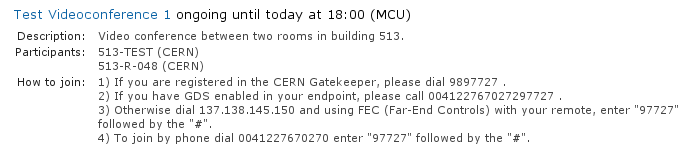
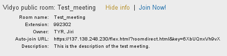
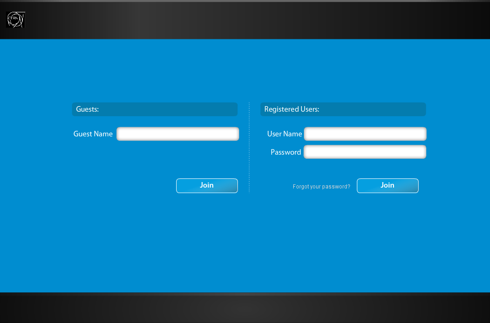

------------
Introduction
------------

Indico now allows event managers to book and program videoconferences associated
with their events. For example, the EVO, CERN MCU and Vidyo systems can be used.
Indico users can see information about these videoconferences in the public
pages of the events.

The goal of this guide is to show how to see information about videoconferences
which have been programmed for Indico events of type *meeting*, *lecture* and
*conference*, and how to join them.

For more information on the EVO, CERN's MCU and Vidyo services, please
visit the `Videoconferencing technologies at CERN <http://it-multimedia.web.cern.ch/it-multimedia/collaborative/technologies.php>`_
page.

----------------------------------------------------------
Videoconferences in events of type "meeting" and "lecture"
----------------------------------------------------------

If a videoconference has been booked for a meeting or a lecture, the page of
that event will look as shown in the next figure. You will notice there is a
*Video Services* section (marked in orange color).

|image01|

This Video Services section has a list of videoconferences that have been booked
for this event. If the last line reads something similar to: "*There are 2 more
scheduled bookings. **Show***", then you can click on *Show* to display all of
them:

|image02|

If you want to hide them to save visual space, click on *Hide additional
bookings*. In meetings and lectures, we only show two bookings in order to save
space for the timetable below.

In the previous list, each videoconference is
represented by a line of text. The contents of this line are:

- The title of the videoconference. If you click on it, you will see detailed
  information (see the figure below).
- The starting and ending times of the booking, expressed in your timezone (the
  one that is selected in the top right bar). If the videoconference is
  currently ongoing, the word *ongoing* will appear.
- The type of videoconference (EVO, MCU, Vidyo).
- If you can join the videoconference from your computer, a link to do so will
  be available. For example, you can see the *Join Now!* link next to the second
  booking in the previous screenshot.

The videoconferences are ordered by their start time. Thus, ongoing conferences
will be shown first, and then the scheduled ones:

|image03|

This detailed information will usually include:

- *Protection*: The videoconference is protected by a password / PIN.
- *Description*: The description given by the event managers.
- *Instructions* on *how to join*, in case you cannot join from your PC because you
  need another physical device to do so. For example, for a CERN MCU videoconference,
  you need to be in a CERN room equipped with an adequate videoconferencing camera
  and screen.

-----------------------------------------------
Videoconferences in events of type "conference"
-----------------------------------------------

In Indico, a conference has several display pages. The display page for the
*Overview* of a conference usually looks as shown in the next figure:

|image04|

You will notice that on the left there is a menu with several options. Clicking
on those options will bring you to various sub-sections of the conference page.

Click on *Video Services* (highlighted in orange in the next figure) to access
the Video Services section.

|image05|

The Video Services section has a list of videoconferences that have been booked
for this event. First the videoconferences that are currently ongoing will
appear, followed by the upcoming videoconferences. The upcoming videoconferences
will be grouped by day, which is useful if the event takes several days.

Each videoconference is represented by a line of text, identical to those
already described in previous section. Click on the title of the videoconference
to show detailed information, and on the *Join Now!* link to join it, if there
is one.

In the following screenshot we can see the detailed information of a booking.

|image06|

--------------
The EVO system
--------------

EVO is a videoconferencing system that can run on your PC as long as you have a
webcam connected to it.

An ongoing EVO videoconference associated with an Indico event will appear like
this:

|image07|

If the EVO booking is not yet ongoing, you will have to wait until its start
time for the *Join Now!* link to appear.

To launch an ongoing EVO videoconference associated with an Indico event, just
click on the *Join Now!* link:

|image08|

This will connect you to the EVO webpage and download Koala, the EVO client.
Koala is the program that will let you chat and videoconference with other EVO
users, or remotely view and participate in events that are being recorded and
streamed in EVO.

EVO may take some time to download and load, so be patient...

|image09|

You will be asked for your account name and password, unless you have already
checked the option *Save Password* in a previous session.

After EVO's Koala has started, wait a few seconds and Koala should automatically
go into the EVO meeting that you want to join. If it's a protected EVO meeting,
you will have to input your password.

|image10|

For more information about EVO or getting a free EVO account, go to
http://evo.caltech.edu/evoGate/ .

--------------
The MCU system
--------------

An MCU is a machine that allows **multiple videoconferencing-equipped rooms**
to have a **common videoconference**.

An MCU videoconference associated with an Indico event will look like this:

|image11|

Unlike EVO, MCU videoconferences cannot be joined from your PC; they are
room-to-room videoconferences.

Usually, the event managers will have defined a list of participants (rooms)
that will participate in the videoconference. When the videoconference starts,
the MCU will contact the videoconferencing systems of those rooms automatically.

However, if you want to join the videoconference from your room, by phone, etc.,
you have to follow the instructions in the detailed information. Here are the
different methods to join a MCU videoconference:

- Dial a number in the CERN Gatekeeper: you have to dial a prefix (in the
  example, 98), and then the Conference ID (97727 in the example).
- By GDS: call a phone number composed by a prefix (in the example,
  0041227670272), plus the Conference ID (97727).
- Using the Far-End Controls of your H.323 camera remote, dial the IP address of
  the MCU (in the example, 137.138.145.150) and enter the Conference ID (97727)
  followed by the # sign.
- Join directly by phone by dialling a prefix (00412276770270 in the example),
  and enter the Conference ID (97727) followed by the # sign.

For further instructions on how to join a MCU videoconference by yourself, you
can contact videoconference-support@cern.ch.

----------------
The Vidyo system
----------------

Vidyo is a videoconferencing system that can run on your PC or used with an
H.323 device. To use it in your PC,  you need the Vidyo client installed and a
webcam and audio device connected (please go to `recommendations page <http://it-multimedia.web.cern.ch/it-multimedia/collaborative/recommendations.php>`_
for videoconferencing PC hardware).

The ongoing Vidyo videoconferences associated to an Indico event (or sessions or contributions) will appear like
this:

|image16|

The information related to the Vidyo videoconferences associated to the event will be shown:

|image12|

If you are not the moderator of the Vidyo videoconference associated and you are manager of the event, the link *Make me moderator* will be shown:

|image17|

If the Vidyo meeting is not yet ongoing, the *Join Now!* button will not be
shown.

To launch an ongoing Vidyo videoconference associated with an Indico event, just
click on the *Join Now!* link:

|image13|

In the case of sessions and contributions a popup will appear when the mouse passes over the "Join Vidyo" link:

|image18|

The popup will also show the information related to the room and, if you are manager of the event and you are not the moderator a link *Make me moderator* will appear.

|image19|

These links will connect you to the Vidyo Portal where you will be asked for your
account name and password. For information about registration, please go to
http://cern.ch/vidyo-service/. If you are not yet registered in the system,
you can also choose a Guest name:

|image14|

If it's a protected Vidyo meeting, you will have to input your PIN.

|image15|

After logging in, the VidyoDesktop client will pop-up and you will receive/send
video and audio from/to the meeting.

.. |image01| image:: images/image01.png
.. |image02| image:: images/image02.png
.. |image03| image:: images/image03.png
.. |image04| image:: images/image04.png
.. |image05| image:: images/image05.png
.. |image06| image:: images/image06.png

.. |image08| image:: images/image08.png
.. |image09| image:: images/image09.png
.. |image10| image:: images/image10.png

.. |image13| image:: images/image13.png

.. |image15| image:: images/image15.png
.. |image16| image:: images/image16.png
.. |image17| image:: images/image17.png
.. |image18| image:: images/image18.png
