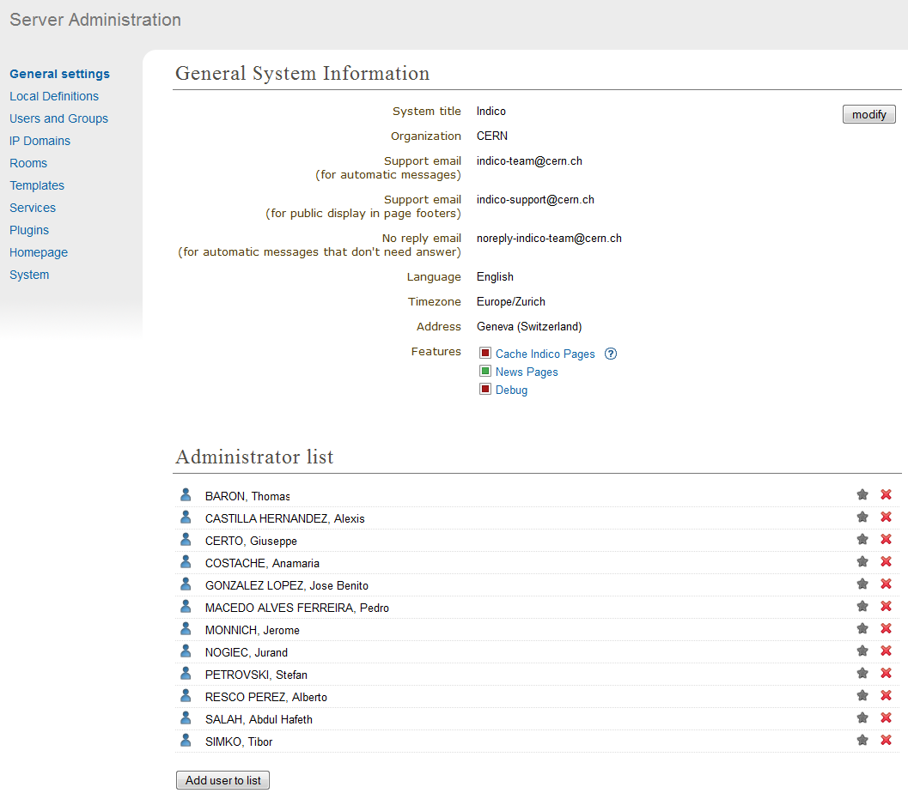

Starting with Indico
====================

Creating an Administration Account
----------------------------------

After installation the first screen presented to you will be:

|image1|

First you must create an user account by clicking on login.
You will be presented with a Log In screen and with an option to
create an account. A form will needs to be filled in with your
user details. Once this is complete an email will be sent to you
with a link to activate your account. Once activated, you will
then be able to login.
Now, it is the moment to add yourself as an Administrator.
In order to do so, click on *Server admin*, in the top blue bar, and you
will access the `Administration Area <#administration-area>`_.

|image2|

From here you need to add your account to the Administrator list,
to do this click on *Add user to list* under the title of *Administrator List*
and use the user search to find and select your account. You will
then be an Administrator and can start using all the features of
Indico. If there is no Administrator account anybody can access and
change all parts of Indico leaving it exposed with no access
control. Once someone adds himself as Administrator, nobody else will be able
to do it in the same way, but existing Administrators can add new Administrators.
Administrators will have access and modification rights to all categories and events.

Users can create their own accounts to use Indico, and they
can modify, delete and add extra logins manually. Administrators are also able
to create new accounts and assign users to be Administrators or
organise users into groups `(see Administration Area) <#administration-area>`_

--------------

Accounts Created by a User
--------------------------

When a new user wants to create an account, he can do so by
clicking on *login* in the top right-hand corner of Indico. From
here he can choose to create an account. A form will be presented
that needs to be filled in with the user's details. Once submitted
an email will be sent to the user.

--------------

Activating a User Created Account
~~~~~~~~~~~~~~~~~~~~~~~~~~~~~~~~~

A user activates his account by using the link that is sent in the
email he receives once he applied for a new account. The account must
be activated, otherwise he won't be able to log in.

--------------

Retrieving a Forgotten Password
~~~~~~~~~~~~~~~~~~~~~~~~~~~~~~~

If a user needs to retrieve his password, he can use the
login screen and its forgotten password option; the user will be
sent their password by email to the address registered with that
account.

--------------

Administration Area
==============================

The Administration Area controls the whole of Indico, anything
you modify or add from here can be used throughout the whole
program. From here you can change general information about your
version of Indico, manually add, activate and modify accounts, add
more than one login for a user, delete additional logins and
assign users to groups You can also define domains for use with
Access Control throughout Indico and you have control of any
maintenance.

--------------

General settings
----------------

From the *General settings* in the Administration Area, you are able to
modify the system title, the organisation, the support email, the no
reply email and address. You can also add or remove users from the
administration list; this means they have full administration access
throughout Indico.

|image3|

The Support email address you add in the General System
Information will appear as the overall general support contact.
However, if a problem occurs within the program and an error
report needs to be sent, this report will be sent to the developers not to
this support email.

--------------

Users
-----

The *Users and Groups* option allows you to control and modify any of
the users accounds and groups.

--------------

Manually Creating a User
~~~~~~~~~~~~~~~~~~~~~~~~

To manually create a new account use the *New User* button in the
*Users and Groups* menu, *Manage Users* tab. You will be presented
with the same form as a user creating his own account;
fill it in and submit it in order to create the account. You will still
need to activate the account.

--------------

Searching for Users
~~~~~~~~~~~~~~~~~~~

You can search for a user by surname, first name, email
address or organisation. If you are not sure of the full details you
can enter only one of the options or the first few letters and you will
be shown all the users that match your search. The Search filter is
found by clicking on *Users and Groups* > *Manage Users*.

--------------

Manually Activating an Account
~~~~~~~~~~~~~~~~~~~~~~~~~~~~~~

To activate an account from within the administration area, go to
the *Users and Groups* option, *Manage Users* tab and search for the user's
account using the filter. Then select the account you wish to
activate, this will take you to the user's details:

|image5|

If an account has not been activated its status will be *not
confirmed*. Click the button *activate the account* next to the status
in order to activate the account. The account status will then be
changed to *activated* and the user for that account will now be able
to log in.

--------------

Modifying a User's Account
~~~~~~~~~~~~~~~~~~~~~~~~~~

From the Account Details screen above you have the option to modify
the user's details. From here you are able to modify the user
affiliation, email address, postal address, telephone number,
fax number, default timezone, default language, etc.

--------------

Creating Additional Logins for a User
~~~~~~~~~~~~~~~~~~~~~~~~~~~~~~~~~~~~~

A user may have more than one login (username and password) on
their account, this can be useful if the user has certain access
rights with one login but not with another, they can then choose
which login to use when using Indico.

|image6|

To create a new login account for a user, click on the *create a new
account* button. This will take you to a screen where you can enter
a new username and password. Once the new account is added it will
show in the User Details screen as above.

--------------

Deleting Additional Logins
~~~~~~~~~~~~~~~~~~~~~~~~~~

To delete any additional account login select those accounts for
that user that you wish to delete and use the *delete selected
accounts* option from the User Details screen above. However, a user
must have at least one login account.

--------------

Groups
------

You can use the Groups section to categorise users if you wish.
You may want to use this feature to help with Access Control.
If, for example, you have more than one user that you would like to
manage an event, you could make a group of Managers for each event
and then assign each set to an event, as apposed to adding each
individual user.

To create a new group use the *New Group* feature in the *Users
and Groups* menu, *Manage Groups* tab. You will be asked for a
group name and a description.

|image7|

You can then start to add or remove users from the group.

|image8|

You can assign a group of users to Access Control in the same way
as you can add individual users. Once your group(s) is/are created
you can use the *Search Groups* option to find a particular group, to
continue adding and removing users, or to modify the group details.

--------------

IP Domains
----------

You can add sets of IP addresses called Domains to be used in
Access Control. To add a new domain use the *New Domain* option in
the *IP Domains* menu.

You can then enter a name, description, and the IP addresses you
which to use in this domain:

|image9|

Any domains you create can be viewed from the  *IP Domains*
menu, you can search for the domain name you want to look at it
and you will be shown its details.

|image10|

You can also modify the Domain by clicking on it, and then on the
button *modify*.

--------------

Maintenance
-----------

The maintenance area is accessible from the *System* menu, *Maintenance* tab.
From here you are able to:

-
   View the amount of Temporary files being used by Indico. Indico
   creates temporary files internally for example when a user submits
   a file or when creating a DVD, etc. These temporary files are
   stored until you delete them from here.

-
   Pack the Database. Indico periodically backs up your database and
   stores the older versions; you can choose to remove older versions
   to save memory by using the *pack* option, this will keep the
   current version of the database.

-
   Delete Websessions. The database stores temporary information for
   the period in which an end user is navigating Indico, for example,
   websessions. Websessions are stored in the database until you choose
   to delete them.

|image11|

You will be asked to confirm the deletion of temporary files and
websessions as well as packing of the database.

--------------

Plugins
-----------

The plugins area is accessible from the *Plugins* menu.
From here you are able to:

-
   Load the plugin types that are installed within Indico. This can be done
   manually by clicking in *Reload the plugins manually* button or
   automatically when you enter in the page by activating the checkbox
   *Reload all plugins every time you open*.

-
   Enable and disable the plugin types by clicking in the red/green square.

|image12|

Search plugin
~~~~~~~~~~~~~~~~~~~~~~~~~~

This plugin allows to choose which search engine to use in order to perfom a search action in Indico.
From here you can activate the different search engine adapters and choose the one to use
by default, if there are more than one.

Currently, the only search engine plugin is developed for *Invenio*. You need
to setup the Invenio server and select the mode:

* redirection to the search engine web server
* fetching, only PUBLIC, results from the search engine server and rendering them using Indico UI
* fetching, PUBLIC and PRIVATE, results from the search engine server and rendering them using Indico UI

You will also need to activate the corresponding Livesync plugin in `Livesync plugin <#livesync-plugin>`_ in order to
keep up-to-date the indexes and contents in the Search Engine Server.

|image13|

Outlook calendar notification plugin
~~~~~~~~~~~~~~~~~~~~~~~~~~~~~~~~~~~~~~

This plugin allows to synchronize information about Indico events with the participants personal Microsoft Outlook calendars.
If a user is added as a registrant/participant of the conference/meeting, a notification about the event is sent to his Outlook calendar.
The calendar notification is updated every time the event details are changed.

The calendar notification contains the following information about the event:

* title
* description
* time
* location
* link to event page

This plugin is enabled by default for each user but the user can disable it from the *User Personal Preferences* page.
The Synchronization is run at a specific interval by the indico-scheduler.

To run the scheduler task for synchronizing events witch the calendar, you have to put following commands in *incidico_shell*::

    from indico.ext.calendaring.outlook.tasks import OutlookTaskRegistry
    OutlookTaskRegistry.register()

|image14|

Livesync plugin
~~~~~~~~~~~~~~~~~~~~~~~~

Administration scripts
========================

Recover Administration Account
--------------------------------

*indico_admin* script allows you to recover any administrator account.
It can:

* grant administrator privileges to any existing user (by user id)
* revoke administrator privileges from any existing user (by user id)
* create a new user with administrator privileges

For more information type in console ::

    indico_admin --help

.. |image1| image:: AdminGuidePics/start1.png

.. |image5| image:: AdminGuidePics/admin3.png
.. |image6| image:: AdminGuidePics/admin4.png
.. |image7| image:: AdminGuidePics/admin5.png
.. |image8| image:: AdminGuidePics/admin6.png
.. |image9| image:: AdminGuidePics/admin7.png

.. |image11| image:: AdminGuidePics/admin9.png
.. |image12| image:: AdminGuidePics/admin10.png
.. |image13| image:: AdminGuidePics/admin11.png
.. |image14| image:: AdminGuidePics/admin12.png
