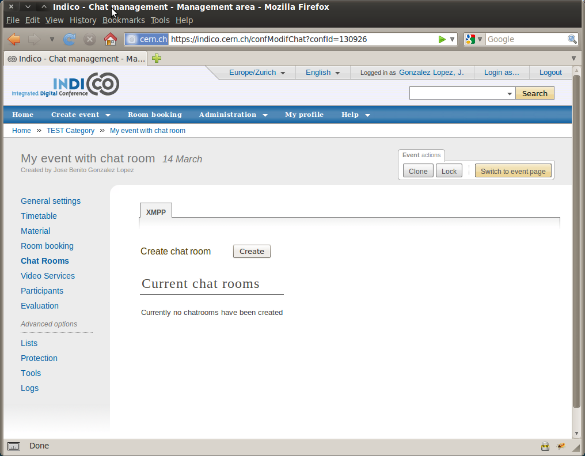
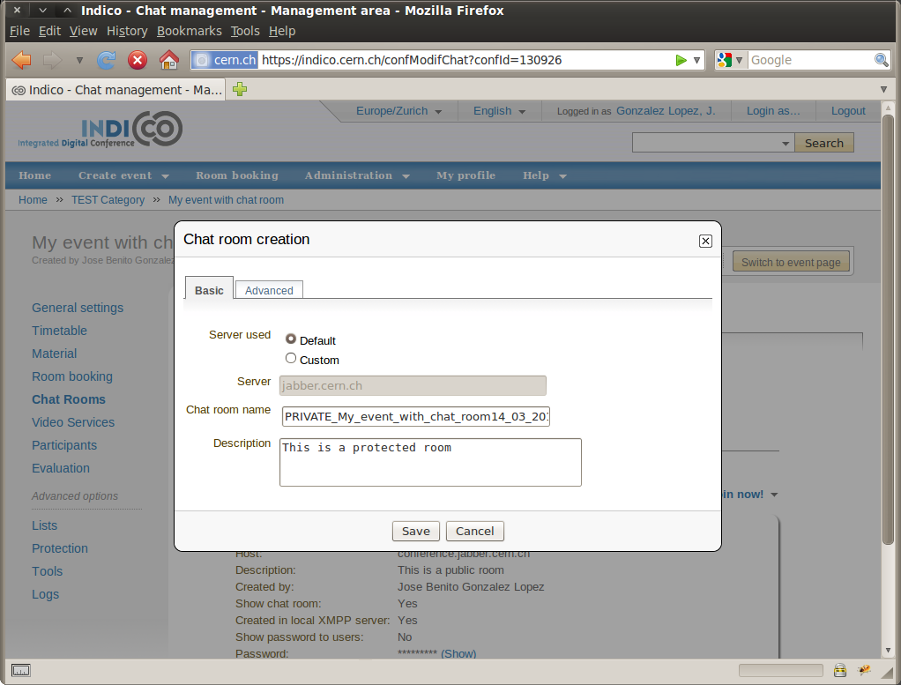
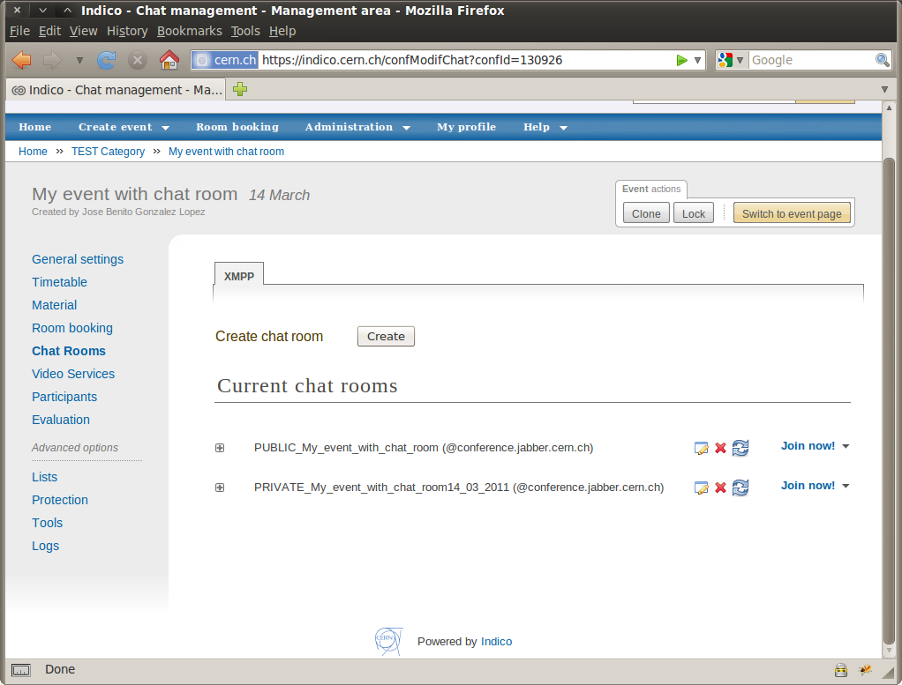
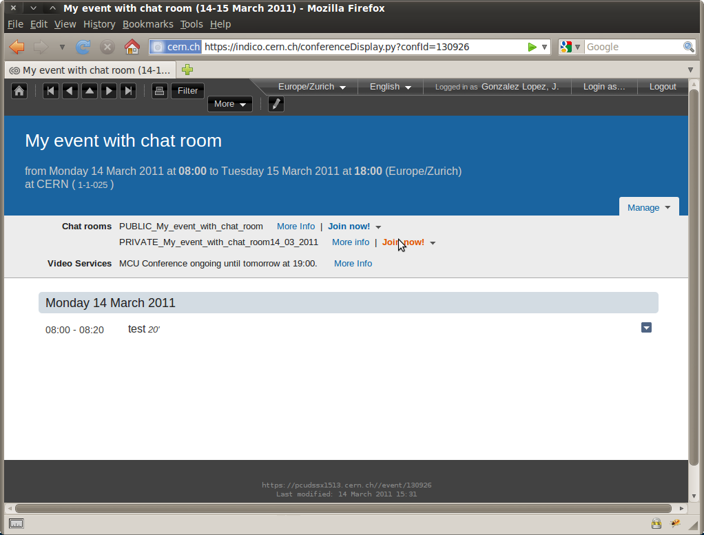
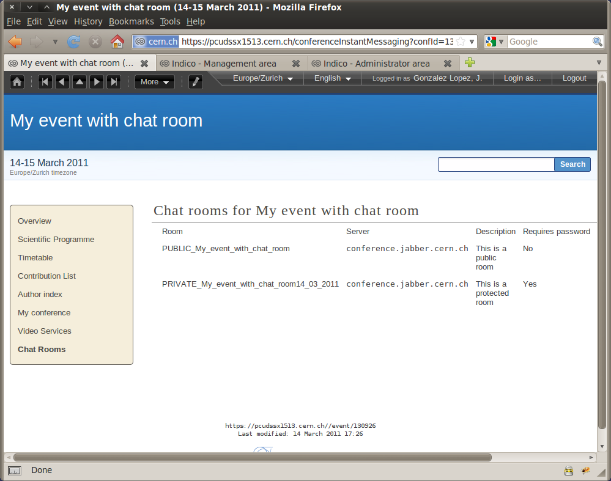
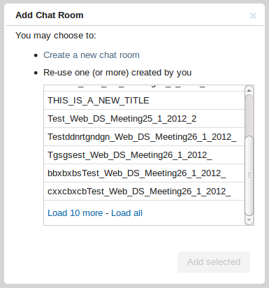

.. _chat_guide:

=================
Chat room service
=================

--------------------
What is XMPP/Jabber?
--------------------

XMPP (formerly known as Jabber) is an instant messaging system that
allows users to communicate with one another. XMPP also
supports creating and joining chat rooms for group communication.

-------------------
Recommended clients
-------------------

We recommend using our installation of the web client Jappix: http://jabber.cern.ch.
On the other hand, if you prefer to use your own local client, we recommend:

- Pidgin for Linux/Windows
- Adium for Mac OS

However, there are many other options, so feel free to check some other clients to choose the one you prefer.

See more in the chapter about `XMPP Clients <XMPPClients.html>`_.

=====================================
How to create a chat room from Indico
=====================================

In the management area for your event, you will find a new option, on the left menu, with the name **Chat rooms**. Click on it to access the chat room list.

|image0|

Click the button **create** in order to create or add a new chat room that will be attached to your event.

If you have previously created any chatrooms in any other events, you will be given the option to use one of these rooms or proceed to make a new one.

|image9|

This widget provide a scrollable list the rooms associated with your user account, the list can show more entries by clicking 'Load More' in the last entry,
alternatively you may click 'Load All' to retrieve all the rooms noted against your user account. Be aware, however, that depending
on your previous events and rooms, this operation may take some time to complete.

You may select one of more rooms from this list to add to the current event simply by clicking on them and then clicking the 'Add' button.

If you do not wish to use an existing room, select the option to add a new room.
A popup will ask you to fill in some basic information:

* Server used: you can choose default (recommended) or you can set your onw server name, in case you want to add a room from a different xmpp server.
* Chat room name: name given to your chat room.
* Description: short description for your room.

You will also see an advanced tab with:

* Password: use it if you want to protect your chat room, therefore just the users with the password will be able to access the room.
* Information displayed in the event page: you can choose to show or hide the chat room information and the password in the home page of the event.

|image1|

After the creation, the room will be listed and you can perform different actions, such as:

* |image3| editing a room,
* |image4| removing a room,
* |image5| synchronizing a room with the information in the server,
* joining the room using the link **Join now!**,
* and also you can see all the details of the room by clicking |image6|.

|image2|

===================================
How to join a chat room from Indico
===================================

The home page of your event will display a hyperlink to the chat rooms that you have previously created.
The display is a bit different for lectures/meetings and conferences.

Here how it looks like for meetings, notice the section **Chat rooms**:

|image7|

And here how it looks for a conference, notice that there is new item in the menu, **Chat rooms**:

|image8|

.. |image3| image:: images/chat_room_icon_edit.png

