.. role:: warning

===================
Recommended clients
===================

Here you can find some of the recommended clients for XMPP and how to use them.

Jappix
======

Jappix is a web client for XMPP and it is our default and recommended client at CERN. You can access from here https://jabber.cern.ch/.
Any user can connect using a CERN account or a CERN External Account.

|image12|

-----------------------
How to join a chat room
-----------------------

Normally, you will be able to access with a direct link from your Indico event. On the other hand, you can also connect to any chat room directly from Jappix.
Click on the icon |image13| and choose Groupchat, introduce the name of the chat room and press the ENTER key.

|image14|

And the chat room will look like this:

|image15|

Pidgin
======

--------------
What is Pidgin
--------------

Pidgin is an Instant Messaging Client for Windows & Linux. Pidgin
now supports Google Talk, MSN, ICQ, QQ, Yahoo! Messenger,
Jabber/XMPP and many more.

------------------------
Where can I download it?
------------------------

You can download *pidgin* from here: http://www.pidgin.im/download/

---------------------
How can I install it?
---------------------

- Choose the language that you wish to use with Pidgin and click OK.

|image1|

- The setup wizard starts. Click Next to continue.

|image2|

- Read the Pidgin license agreement (GPL2), and if you agree, click Next.

|image3|

- Select the components that you wish to install and click Next. The default selections should be fine.

|image4|

- In the Destination Folder box, type the directory you wish to use for Pidgin.

|image5|

- The Pidgin installation will begin. When the installation is complete, click Next to continue, then click Finish to run Pidgin and complete the configuration.

|image6|

- Click Add to add your chat accounts to your configuration.

|image7|

------------------------
How do I add my account?
------------------------

- In the Pidgin Login Screen, click Accounts, then click Add. The Add Account dialog appears.

|image8|

- Type your CERN username into the Username box.

- Type jabber.cern.ch into the Domain box.

- Type the name you want to give this account in the Resource box. For example, Work or CERN.

- Type your CERN password into the Password box. :warning:`DO NOT check "Remember password", since it will be saved in plain text and it could cause a security problem`.

- Click the Advanced tab.

|image9|

- Make sure that the port selected is the 5222 and that :warning:`Require SSL/TLS is enabled`.

--------------------------------
How do I enter into a chat room?
--------------------------------

- Click in Join a chat

|image10|

- Insert the name of the chat room, the server (conference.jabber.cern.ch), the nickname that you will use and, in case the room is protected, the chat room's password.

|image11|

---------
More info
---------

- `http://developer.pidgin.im/wiki/Using Pidgin <http://developer.pidgin.im/wiki/Using%20Pidgin>`_
- http://www.pidgin.im/

Adium
=====

--------------
What is Adium?
--------------

Adium is a popular instant messaging client for Mac OSX that supports multiple protocols through the libpurple library. It is written using Mac OSX's Cocoa API, and it is released under the free software GNU General Public license. Adium now supports AIM, ICQ, MSN Messenger, Yahoo! Messenger, and Jabber/XMPP (including Google Talk).

------------------------
Where can I download it?
------------------------

Directly from their website: http://adium.im/
Remember that it is a Mac OSX client. If you have Windows Or Linux please download Pidgin.

----------------------------
How do I perform the set up?
----------------------------

- Launch Adium by double clicking the Adium icon in your Applications folder.

- Click on menu "File → Add Account → Jabber". The Accounts dialog will appear.

- In the Jabber ID box, type username@jabber.cern.ch, where username is your CERN account.

- To connect to the CERN server, select "Connect" when Adium opens.

- Click on the "Personal" tab. In the Alias box, type your full name. If you wish to use a different icon than the one shown, select "Use this icon" and click on "Choose Icon..." to browse for an image that you wish to use.

- Click on the "Options" tab. In the "Connect Server" box, type jabber.cern.ch. The default port to use is 5222.

- Click on the "Privacy" tab. Select "Encrypt Chats Automatically" from the Encryption list.

- Click "OK" to complete the set up.

--------------------------------
How do I enter into a chat room?
--------------------------------

- You will need to be in a chat with someone else.

- In that chat window, click on File - Join Group Chat.

- Fill the fields with the name of the chat room, the server and the nickname that you will use (field Handle).

---------
More info
---------

- http://trac.adium.im/wiki/AboutAdium
- http://adium.im/

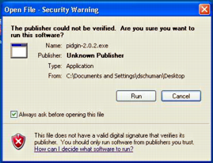
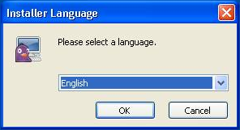
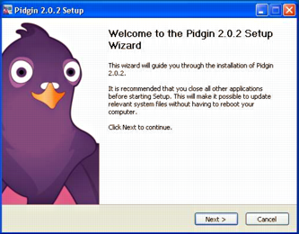
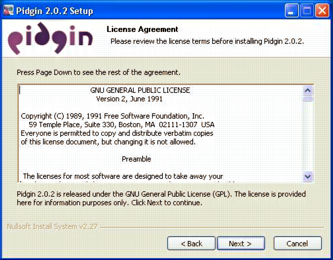
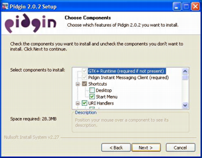
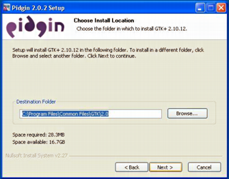
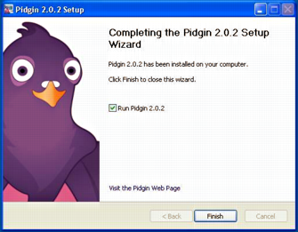
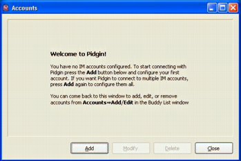
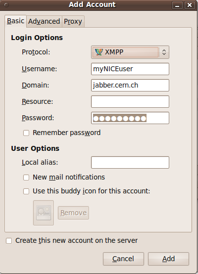
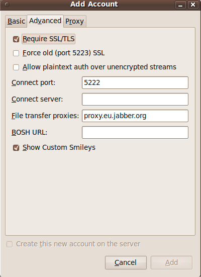
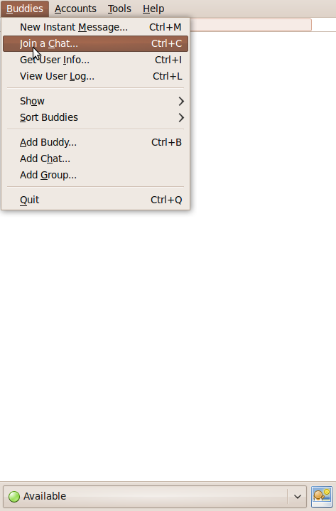
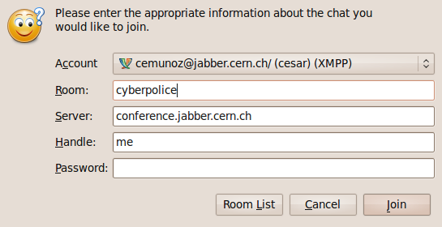
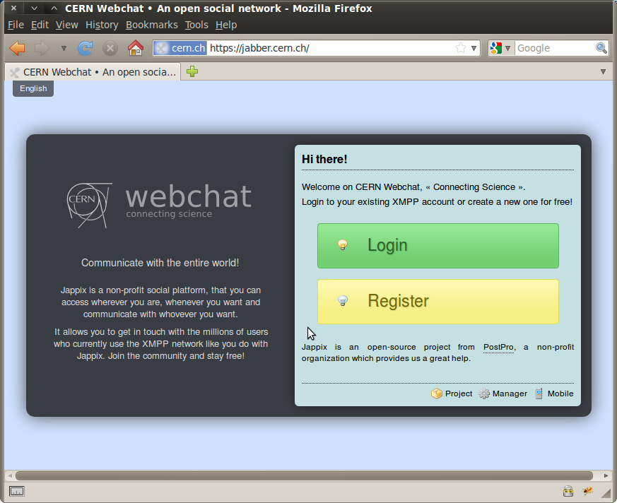

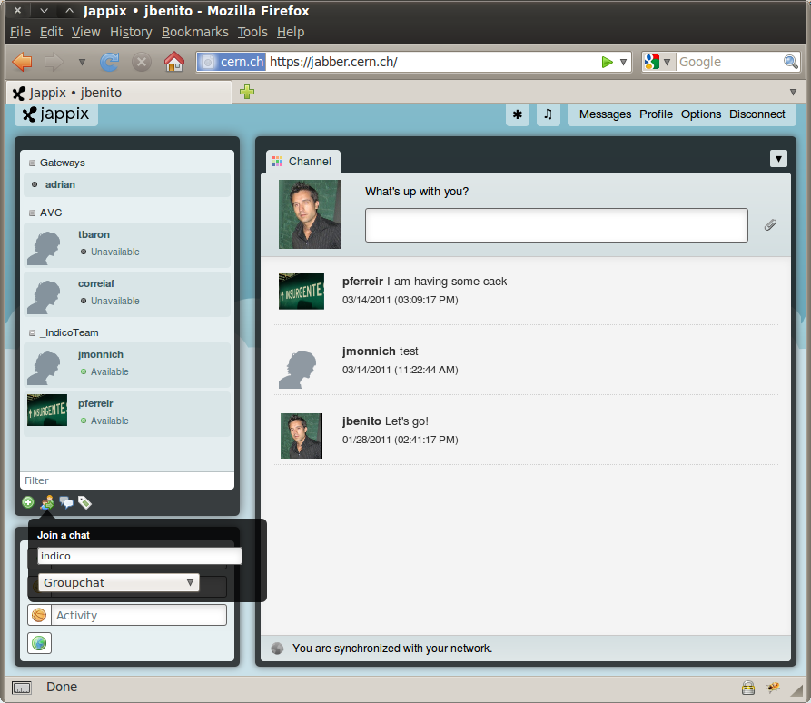
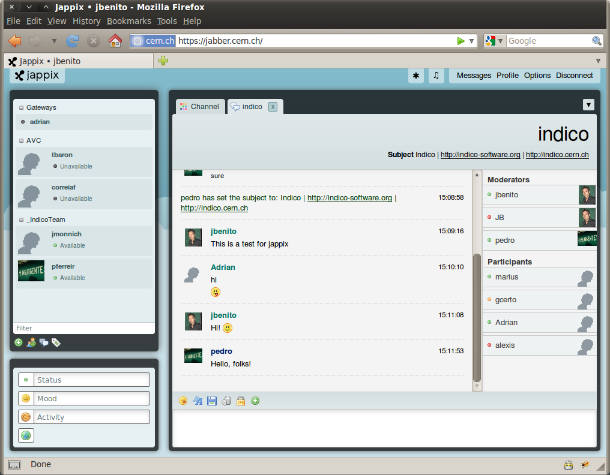

