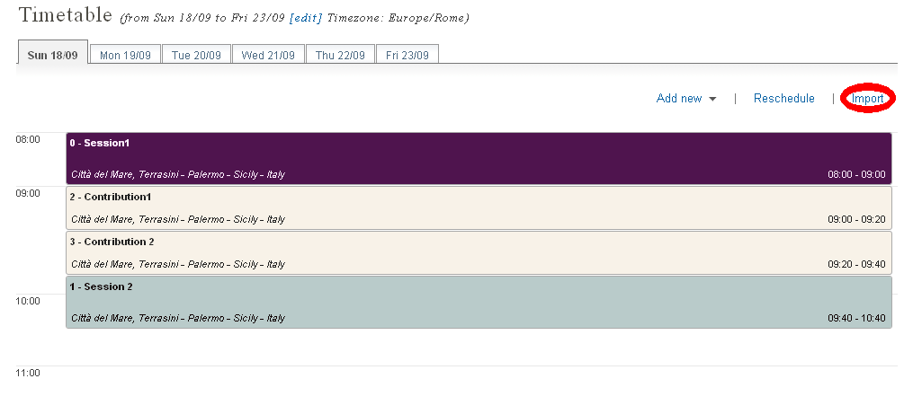
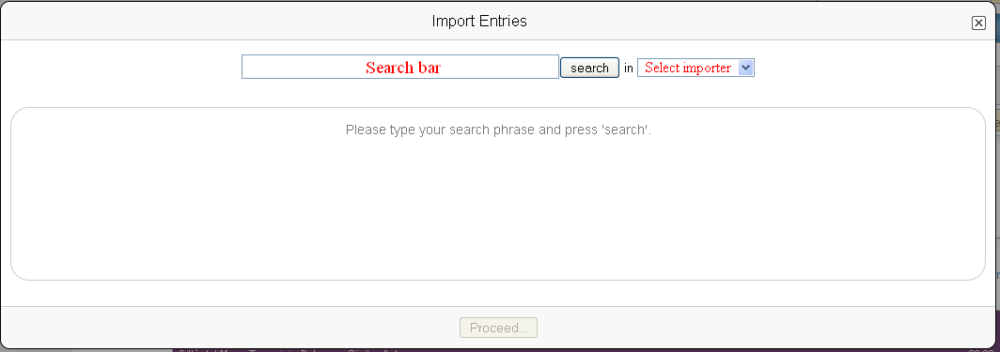
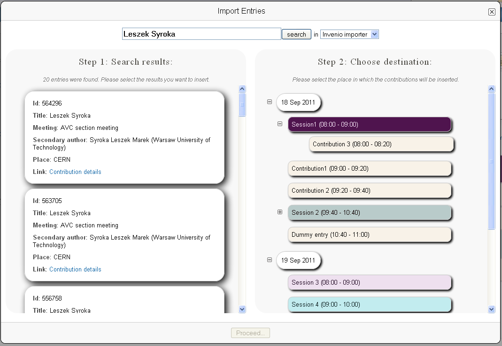
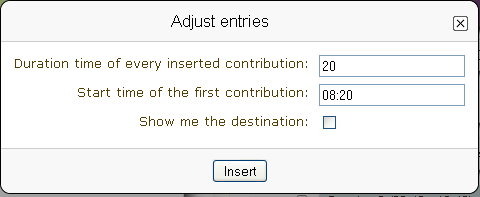
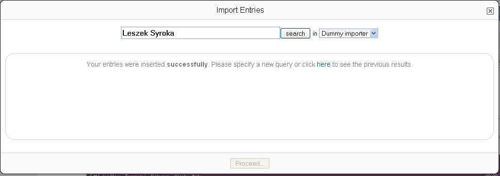

Importer plugin
===============

Introduction
------------

Importer plugins are used to fetch data from external sources and insert it to an event timetable
as contributions or subcontributions. The purpose is to save significant amount of time while
transferring information to Indico from other sources. Instead of arduous and time wasting manual
rewriting of data from one system to another, all the entries will be inserted automatically to the
selected place. Data sources that can be handled by Indico will depend on the installed importer plugins.

User guide
----------

If the importer plugin is installed, the 'Import' link appears at the tool bar of an event timetable.
Clicking on it opens the main importer dialog.

My first search
^^^^^^^^^^^^^^^

Initially, the dialog consist of the search bar, the place to type the search phrase, and a dropdown list
containing installed importers. After selecting an importer, writing the desired phrase into the search bar and
clicking the 'search' button (or pressing enter while the search bar is focused), Indico will import and display data
from the external source.

The left side of the dialog contains the data downloaded by a plugin. The right side is the list of all
days and entries listed in the timetable.

Selecting data
^^^^^^^^^^^^^^

The first step is to choose the results that will be inserted into the timetable. Selection is made by
clicking a left mouse button at the entry in the list at the left side of the dialog. After making
selection entry will be highlighted and a number will appear at the left side of it. This number indicates
the sequence in which the entries will be inserted to the timetable. Clicking a left mouse button at this
number, decrements it, which means that the entry will be moved to the front of the insertion sequence, while
clicking right mouse button, increments it, which means the entry will be moved to the back. Sometimes not
all the available entries are displayed. Clicking at 'more results' link at the end of imported entries list
will import more data from the external source.

Choosing the destination
^^^^^^^^^^^^^^^^^^^^^^^^

The second step is to choose the place in which the results selected in the first step will be inserted. The menu
at the right side of the dialog represents the structure of the event. The white fields represent days.
Contributions and sessions have the same color as in the timetable. Fields which contain subentries
have a '+' icon, which expands the list and shows them. Clicking at the '-' button, which appears instead of
'+' after displaying subentries, hides them. The destination entry of the results from the first step, can be
chosen by clicking one of the fields. When making selection the field becomes larger, its title is bold
and border is ticker. Only one destination cab be selected, so choosing another destination while one is
selected, cancels the previous one.

Adjusting new contributions
^^^^^^^^^^^^^^^^^^^^^^^^^^^

After successfully completing the steps above, the 'proceed' button at the bottom of the dialog should be
activated. It opens a dialog that adjusts the starting time and duration of the selected results.

The last step is to set duration time for every inserted contribution and the start time of the first one.
Entries will be inserted one after another in the order set in the first step of this user guide.
It's not possible to set different durations for contributions, the duration will be the same for everything.
Keep in mind that inserting contributions can change duration of the destination. If 'Show me the the
destination' checkbox is ticked you will be redirected to the destination webpage. Clicking at 'Insert'
button will start inserting contributions.

Further searches
^^^^^^^^^^^^^^^^

If 'Show me the destination' had not been checked, the main import dialog is displayed again. New data can be
imported (to do it go back to the first step of the guide) or the old results can be displayed by clicking the
link 'here'.

