==================================================
Paper reviewing module author's guide
==================================================

Getting started
---------------

 Firstly, you must log in to the system; you will find a link ``Download Template`` in the left
 menu under ``Paper Reviewing``.

        |image10|

-----------------

Download template area
----------------------

 If the paper reviewing manager provides you a template for the papers, you can download it by clicking on
 the template name.

        |image11|

Upload paper area
-----------------

 You can access the list of contributions and follow their status from ``View``:

       |image2|

   By clicking on the ``View`` link you can access the specific information for the contribution
   where you can upload a new paper.

       |image12|

How to submit the reviewing material
------------------------------------

 * The next step will be to submit your reviewing material. You can do this by clicking on the ``Upload paper`` link in the
   right of the page.

  When you click a popup will be opened in order to submit your paper. You have to follow these two steps to submit your paper.

   * Step 1: Use ``Upload paper`` link, in the right panel, under ``Call for paper`` in order to add the material to be
     reviewed.

       |image3|

     Choose the file(s) for your contribution. If you want you can add a description and a display name for the file(s) in
     the ``Advanced`` tab. After that click on ``Create Resource``.

       |image4|

       |image9|

   * Step 2: You have to submit the reviewing material by clicking on ``Submit`` button. You need to be sure that
     the material you are submitting is correct because you cannot modify it after submitting.

       |image5|

  * Now you can see the ``Reviewing status`` of your paper in the colored box placed in the right panel, under ``Call for paper``.

       |image6|

  * The reviewing process ends when the final judgement for your paper is ``Accepted`` or ``Rejected``.

     |image7|

  * The reviewing process will continue if the final judgement for your contribution is ``To be corrected``.
    You will have to send the material again, after correction. Then the reviewing process will start again.
    You can see the *Reviewing history* after clicking on the ``History`` link.

     |image8|

     |image13|

------------------------

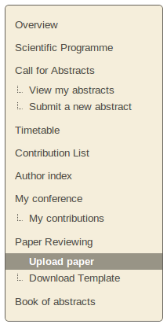
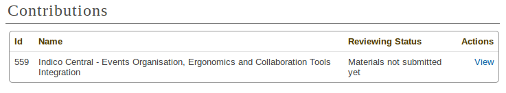
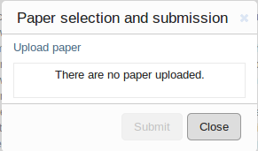
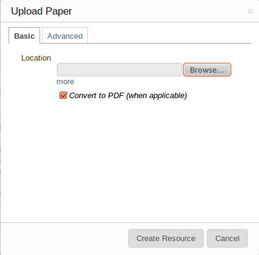
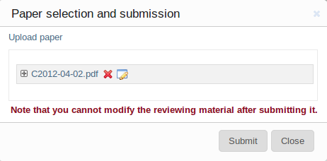
.. |image6| image:: PaperReviewingAuthorsPics/author6.png
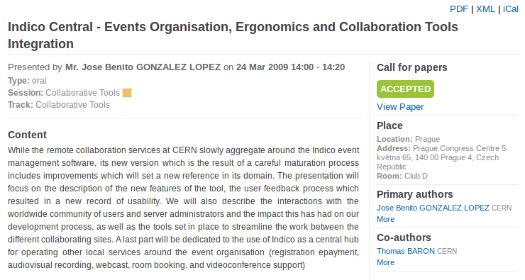
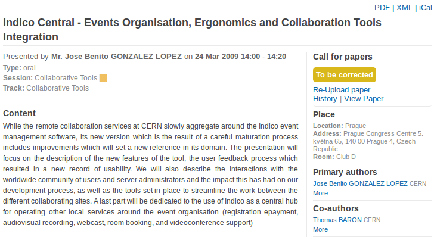
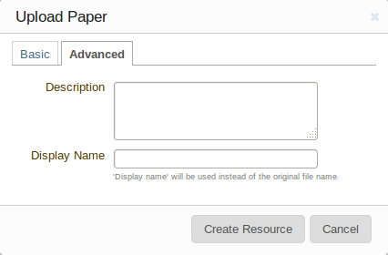
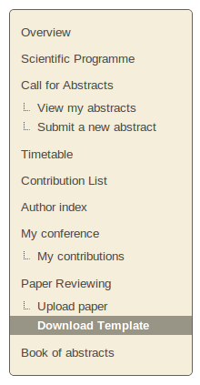
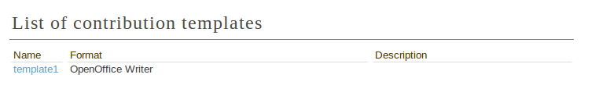
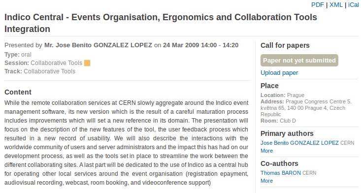
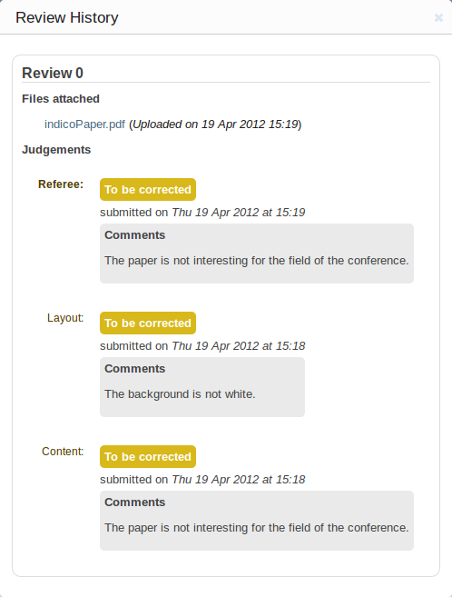

