=======================================
Paper reviewing module manager's guide
=======================================

Manager of the paper reviewing module
-------------------------------------

The manager of the module can modify all the settings and
is responsible for the paper reviewing process. He
creates the reviewing team and assigns
contributions to the team. If you are a manager
of the Paper Reviewing you can access it by clicking on the
``Manage Paper Reviewing`` link, after you are logged in
(see the following figure).

        |image19|

---------------

Paper reviewing management
--------------------------

Set up the module
~~~~~~~~~~~~~~~~~

The first step is to choose the type of
paper reviewing for your conference:

* *No reviewing*: no use of the reviewing module

* *Content reviewing*: paper's content will be checked only by the content reviewers

* *Layout reviewing*: paper's layout will be checked only by the layout reviewers

* *Content and layout reviewing*: both of the previous points

        |image7|

-------------------------

The second step is setting up the options depending on the type of
reviewing you have chosen:

Options for content reviewing mode
^^^^^^^^^^^^^^^^^^^^^^^^^^^^^^^^^^

- There are three statuses by default. You can add your own
  statuses that will be proposed to the content reviewers, when they have to
  give opinions about the paper's content, and to the referee when he has to give a judgement.

        |image8|

- There is also a way to add reviewing questions in order to help
  content reviewers and referees give their judgement for
  the paper's content. The referee will be able to see the content
  reviewers' answers and this will help him with the final judgement.

        |image9|

------------------------

Options for layout reviewing mode
^^^^^^^^^^^^^^^^^^^^^^^^^^^^^^^^^

- You can add questions in order to help layout reviewers to give
  their judgment. These questions are visible when they
  have to judge the paper. This will guide them to follow the
  layout criteria given by you (see figure as example).

        |image10|

----------------------

Options for content and layout reviewing mode
^^^^^^^^^^^^^^^^^^^^^^^^^^^^^^^^^^^^^^^^^^^^^

- You can set up all the options in the previous two sections - 2.1.2.1.1 / 2.1.2.1.2.

- You can set due dates for the reviewing team to give their
  judgments. They will not be able to judge the papers after the
  deadline.

        |image11|

  When saving the default due dates, one can choose to apply them to the current assigned contributions, or only to the new ones that will be added in the future.

        |image28|

- The system sends automatic e-mails in order to notify the reviewing
  team or the authors of the papers in several situations. You can enable
  or disable the e-mails by clicking on the check boxes.

        |image12|

- The paper reviewing module allows you to upload your
  own layout template which the authors can download and use. This will
  help them to follow the required layout criteria you impose. The template
  can be in the form of a document file.

        |image13|

        |image14|

------------------------

Assign team
~~~~~~~~~~~

Assign managers
^^^^^^^^^^^^^^^

The managers of the paper reviewing will be responsible for the
reviewing part of the conference. Their responsibility will be to
designate referees, layout and content reviewers who will be
responsible for paper reviewing and editing. The reviewing manager
will be able to set up the options for the reviewing module, to
specify the team's competences and to assign contributions to the
referees and reviewers. You can add paper review manager after
accessing the ``Team`` tab.

        |image16|

 From the ``Assign managers of paper reviewing`` area,
 click on the button ``Add Indico User`` to search for the user.

                 |image15|

------------------------

Assign reviewers
^^^^^^^^^^^^^^^^

You can create lists of referees, layout reviewers and content
reviewers.

When you add a user to be a referee, you are giving him the
rights to assign contributions to the layout and content reviewers.
Also, the referee has to give the final judgement for the
contribution - ``to be corrected``, ``accepted`` or ``rejected``. If the
contribution status is given to be corrected, then the referee will
be able to correct it by himself if necessary.

The layout reviewer has to judge the editing part of the contributions.
He will be able to access only the contributions that are assigned
to him for judgement. When layout reviewing mode is chosen, he will have to give
the final judgement of the contribution. If needed the layout
reviewer can correct the papers by himself.

The content reviewers have to give their opinion of the content of the contribution.
They will have access only to the contributions that are
assigned to them.

        |image17|

------------------------------------

Define competences for team members
~~~~~~~~~~~~~~~~~~~~~~~~~~~~~~~~~~~

The paper reviewing managers can specify the team's
competences, if necessary. The list of all designated
users will be offered after you access the ``Competences`` tab.

        |image18|

-------------------------

Assign papers to the reviewers
~~~~~~~~~~~~~~~~~~~~~~~~~~~~~~~~~~~~~

 You can assign papers by clicking on the link: ``Assign papers`` (see the figure below).

        |image20|

 The paper reviewing module gives you the
 opportunity to assign more than one paper
 to the same reviewers by selecting them using the check boxes.
 Depending on the chosen reviewing mode you need to assign different
 teams of reviewers (see section 2.1.2.1).

        |image21|

 When you click ``Assign``, a dialogue will appear.
 Use the dialogue popup to select the reviewer you wish to assign.
 If there are defined competences for him, they will be shown next to his name.

        |image22|

 If the paper reviewing mode is "Content reviewing" or "Content and Layout Reviewing", the referees
 you choose will be the responsibles for assigning layout and content reviewers to this
 contribution. The referee has also to give the final judgment for the contribution
 - ``to be corrected``, ``accepted`` or ``rejected`` and to correct it by himself if necessary.

 If you have chosen "Layout Reviewing" the layout reviewer should give the final judgement for
 the contributions.

Review option within Contribution Editor
----------------------------------------

How to access the "Reviewing" area for a contribution
~~~~~~~~~~~~~~~~~~~~~~~~~~~~~~~~~~~~~~~~~~~~~~~~~~~~~

 Click on the link ``Contributions`` from the side menu. The list of all contributions will be displaied.
 Click on the contribution's title and then the ``Paper Reviewing`` tab.

Assign reviewers for a paper
~~~~~~~~~~~~~~~~~~~~~~~~~~~~

 You can assign reviewers by clicking on ``Assign Team`` tab. A lists of referees, layout and content reviewers
 will be offered. Click on the button next to the user's name and then click the ``Assign`` button.
 In order to remove an already assigned reviewer use the ``Remove`` button.

        |image23|

Judgement details for a paper
~~~~~~~~~~~~~~~~~~~~~~~~~~~~~

 You can see the reviewer judgement details for the current review.

        |image24|

Reviewing materials for a contribution
~~~~~~~~~~~~~~~~~~~~~~~~~~~~~~~~~~~~~~
 The material which is the subject of reviewing is also accessible for the managers from the ``Material to Review`` tab. The managers
 can edit, delete the current material and upload more files only if the files are submitted and under review.

        |image25|

 Otherwise the file list will be disabled for editing, removing and adding.

        |image27|

Reviewing history for a contribution
~~~~~~~~~~~~~~~~~~~~~~~~~~~~~~~~~~~~

  If there are more than one reviews for a single contribution,
  the system keeps the reviewing history for each contribution.
  You can access it by clicking on the ``History`` tab.

        |image26|

-------------------------

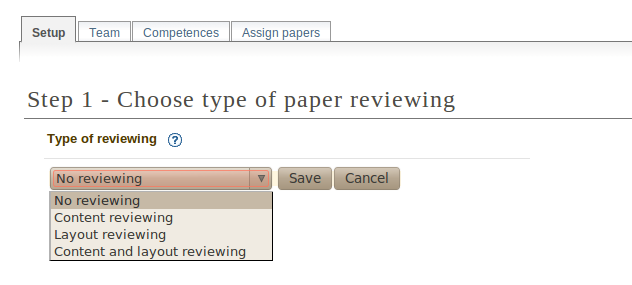
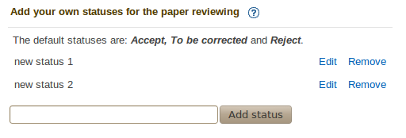
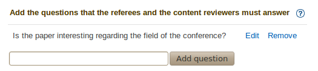
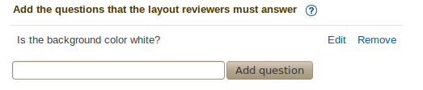
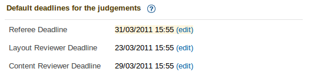
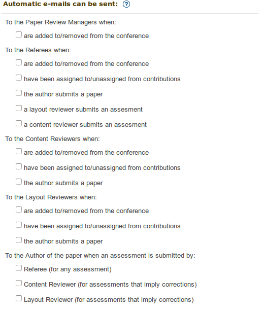
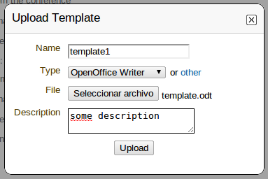
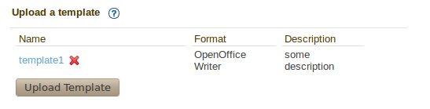
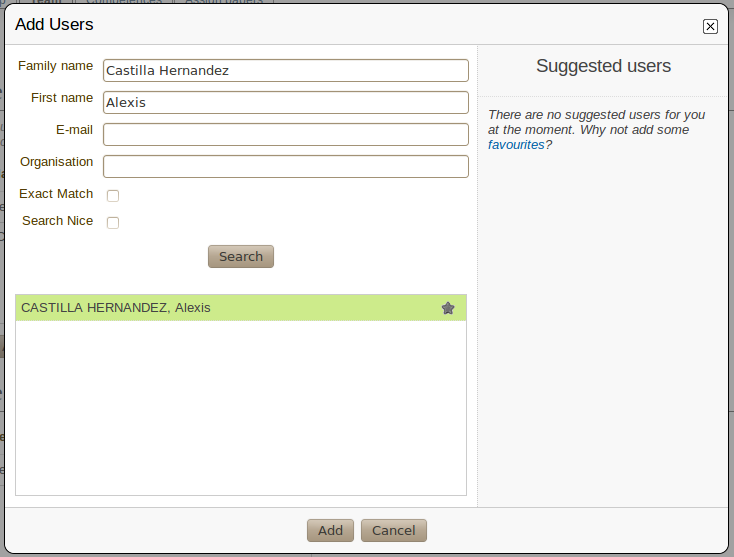
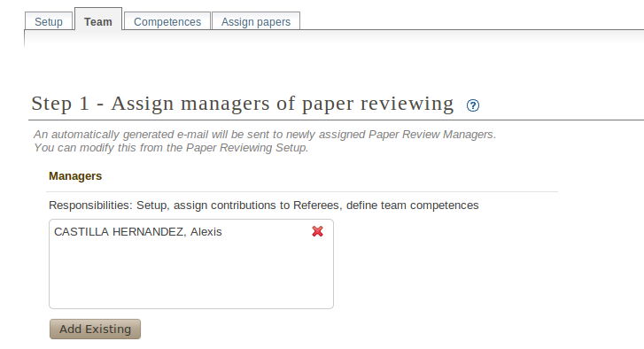
.. |image17| image:: PaperReviewingManagersPics/confmanagers12.png
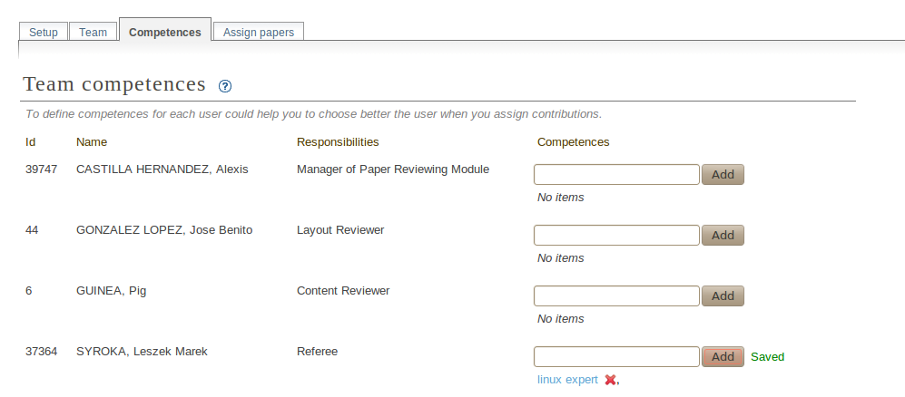
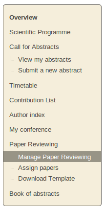
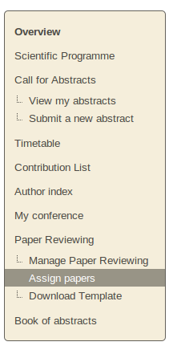
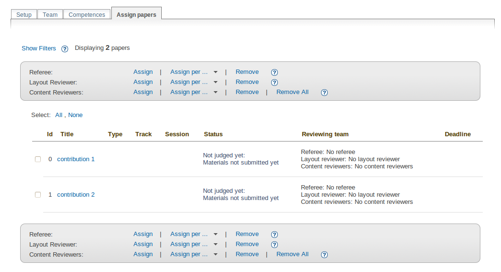
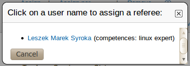
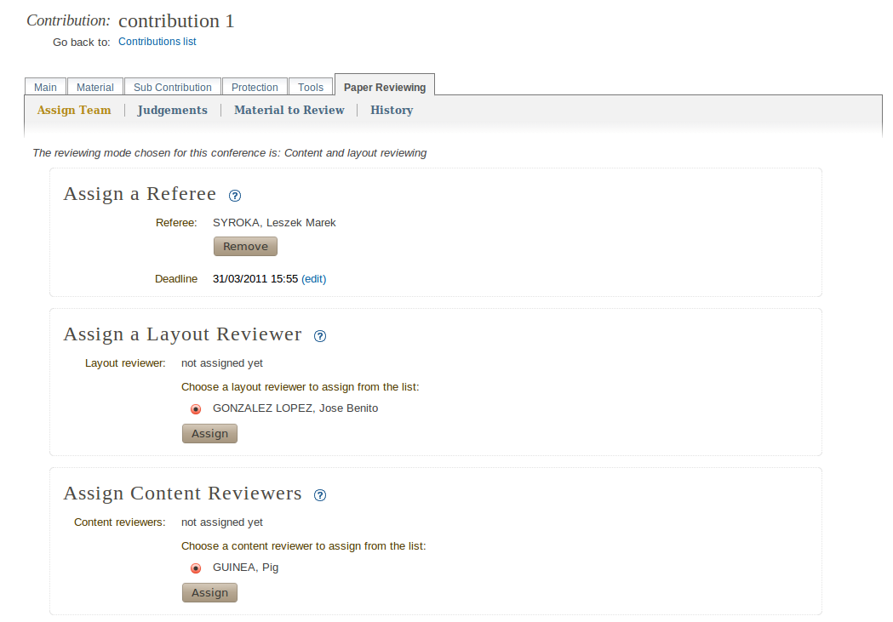
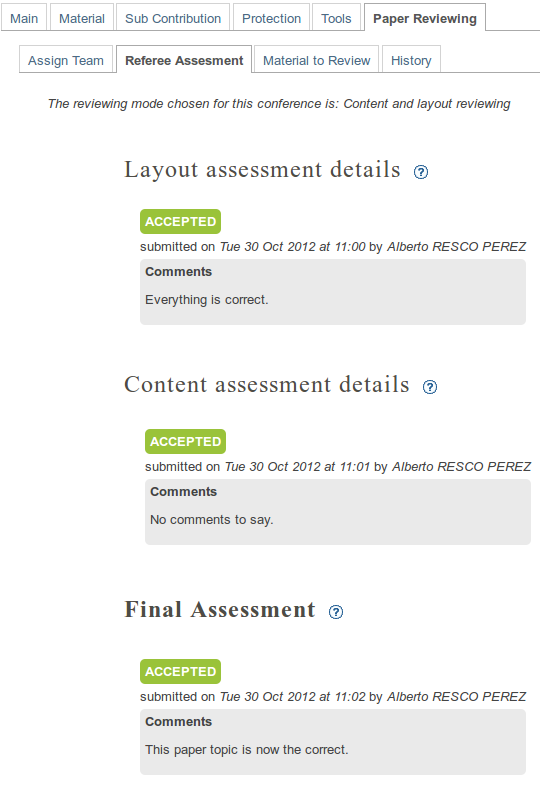
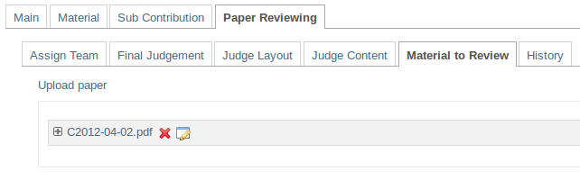
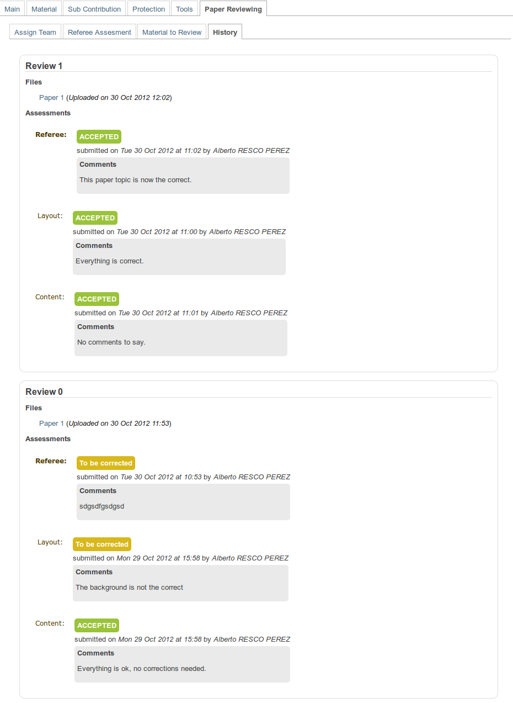
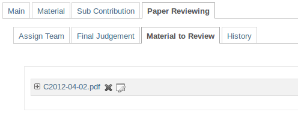
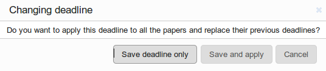
