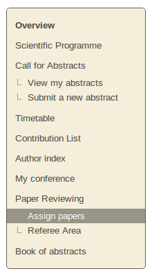
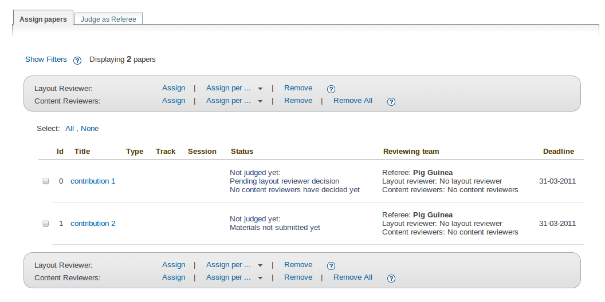
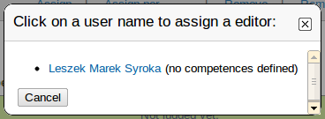
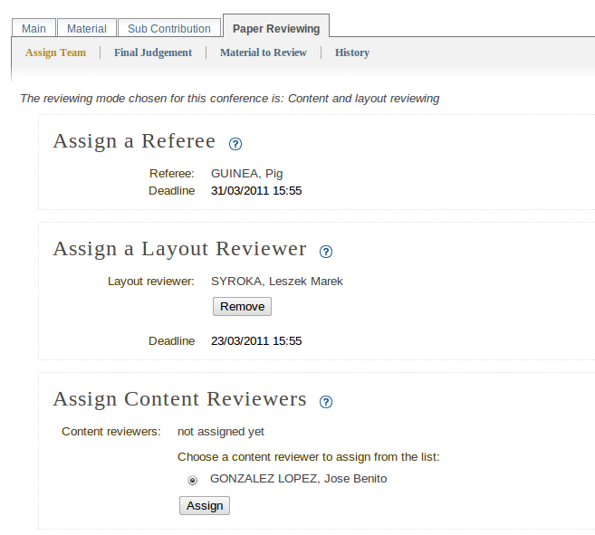
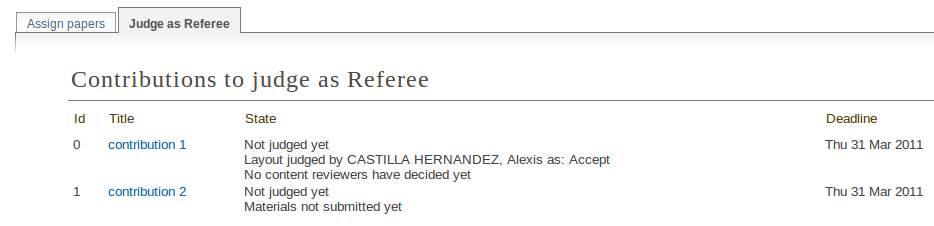
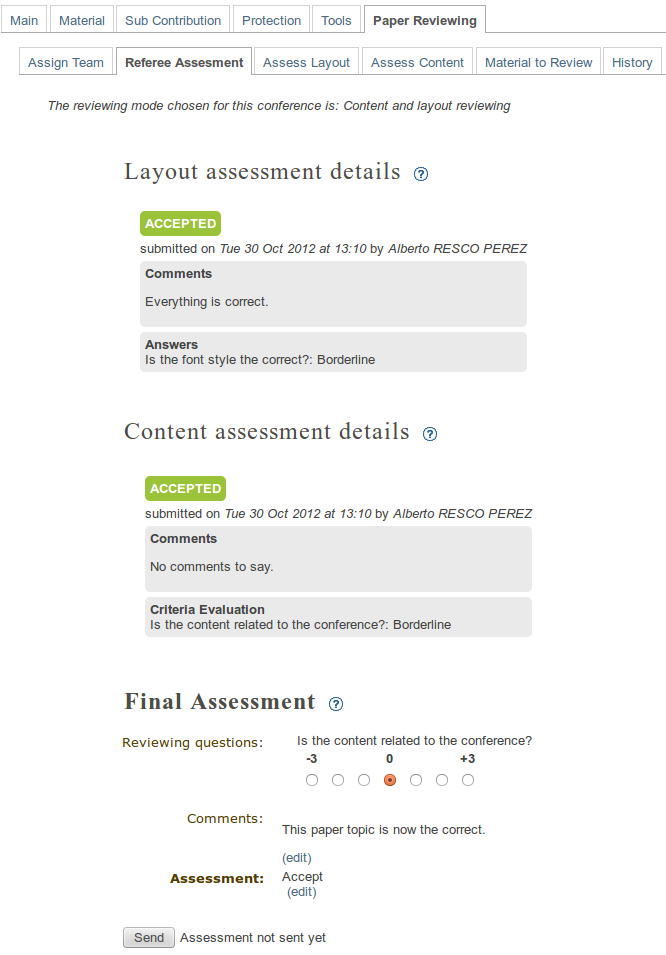
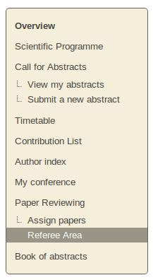
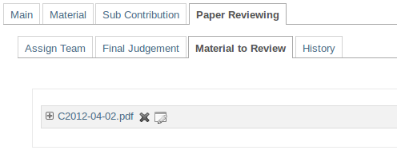
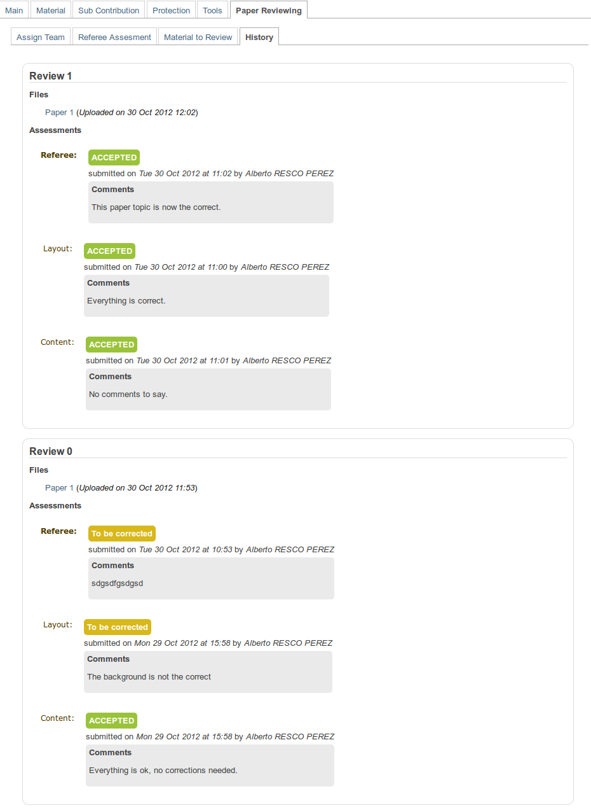
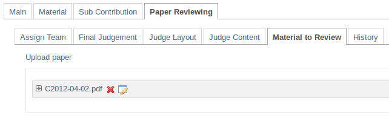

.. _referee_guide:

========================================
Paper reviewing module - referee's guide
========================================

Getting started
---------------

 As a referee, your responsibilities are to assign papers to the reviewers and to give the
 final judgement for all of the papers that have been assigned to you. You may log in to the system
 and you will find in the left menu two links under ``Paper Reviewing``, ``Assign papers`` and
 ``Referee Area``.

        |image1|

-----------------

Assigning papers to the reviewers
----------------------------------------

 You can assign more than one paper to the same reviewers by selecting them using the check boxes.
 Depending on the chosen reviewing mode (``Content reviewing`` or ``Content and layout reviewing``) you need to
 assign different kinds of reviewers.

        |image2|

 After checking the check boxes and clicking the ``Assign`` button, a dialogue will be displayed.
 Use the popup dialogue to select the reviewer you wish to assign to the selected contributions.
 If there are pre-defined competences for him, they will be shown next to his name.

        |image3|

 Also, you can click on the name of a contribution and assign a reviewing team for it.

        |image4|

-------------------------

Referee area
------------

        |image7|

 When you access the referee area you will find a list of all the papers that are assigned
 to you for judgement. You can follow

  * if the author of the contribution has submitted the materials for reviewing
  * the state for every contribution, whether it is judged by the content reviewers or by the layout reviewer,
    or by both.

  |image5|

 Your responsibility as referee will be to give the **final judgement** for the paper: ``to be corrected``,
 ``rejected``, ``accepted`` or one of the customized status added by the Managers. Accessing again the reviewing
 area (by clicking on the contribution's title) you will be able to see the judgements and the opinions on
 the layout and the content given by the reviewing team.

 In order to submit your final judgement, click on the ``Send`` button. The authors of the contribution will receive
 automatically generated e-mail notification containing your comments and judgement, if the managers of the
 paper reviewing set this option.

        |image6|

 The material which is the subject of reviewing is accessible for the referees from the ``Material to Review`` tab. The referees
 can edit, delete the current material and upload more files only if the files are submitted and under review.

        |image10|

 Otherwise the file list will be disabled for editing, removing and adding.

        |image8|

 The system gives you the opportunity to follow the reviewing history for every contribution.
 The reviewing history is built when there is more than one review per paper. You can access
 it from the ``History`` tab right after sending your final judgement.

        |image9|

------------------------

