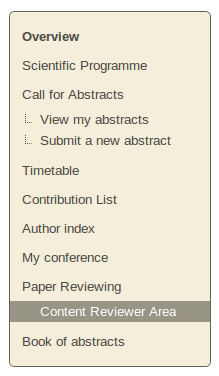
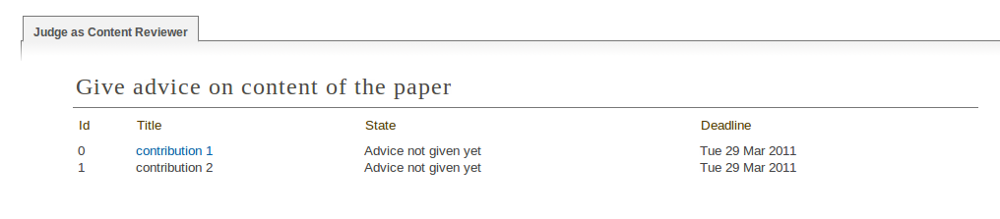
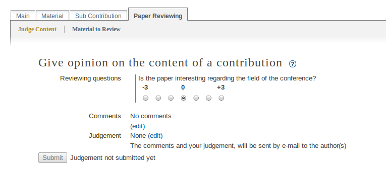
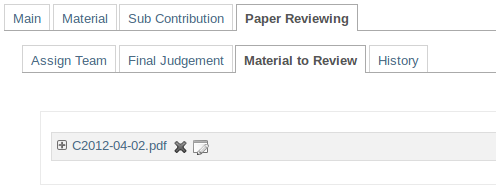

.. _content_reviewer:

==================================================
Paper reviewing module - content reviewers's guide
==================================================

Getting started
---------------

 As a content reviewer your responsibility is to give your opinion about the papers' content.
 Firstly, you must log in to the system, then you will find a link ``Content Reviewer Area`` in the left
 menu under ``Paper Reviewing``.

        |image1|

-----------------

Content reviewer area
----------------------

 When you access the content reviewers area you will find a list of all the contributions that are
 assigned to you for judgement. You see the state of every contribution - if you have already
 judged a contribution or if the assigned referee has given the final judgement.

        |image2|

 From the list you can click on a contribution's title and access the page which will allow you to judge
 that contribution. Once in that page, you should fill in the questions provided by the paper review manager.
 The comments that you write should help the Referee to give his judgement. As a final step, give
 your judgement of the content of the contribution: to be ``corrected``, ``rejected``, ``accepted``. The authors of the
 contribution will receive an automatic e-mail notification containing your comments and judgement, if the
 Managers of the paper reviewing set this option.

       |image3|

 The material which is the subject of reviewing is accessible for the reviewers under ``Material to Review``. The reviewers
 do not have access to modify the material, therefore the the files list will be disabled for editing, removing and adding.

        |image4|

------------------------

