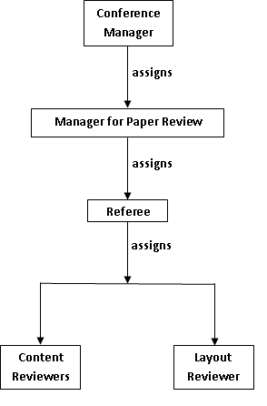
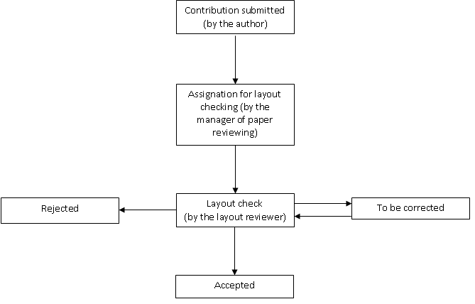
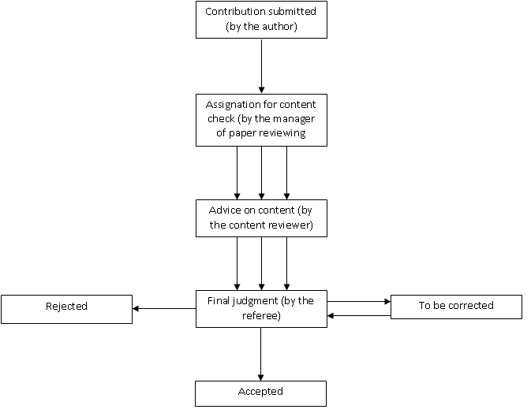
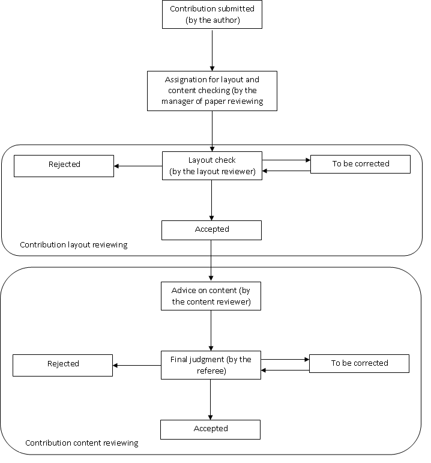
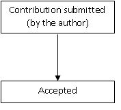

=======================================================
Main actors and workflows in the paper reviewing module
=======================================================

Main actors
-----------

The module provides a reviewing tool for Indico conference
organizers. In general, it consists in checking that the submitted
papers are coherent with the layout and content requested by the
organizers of the conference and, if not, to discuss with the
author of the paper or to correct the paper directly. For a better
understanding of the reviewing module we will now introduce the
main actors involved in it:

* The **Conference Manager** is the creator of the conference and he is responsible for it. He can enable or disable the reviewing module and modify all its settings.

* The **Manager of the Paper Review Module** is responsible for the paper reviewing part of the conference.

* The **Referee** is responsible for the contributions assigned to him by the paper review manager.

* The **Layout Reviewer** is responsible for the layout of the papers, if they are coherent with the criteria given by the manager of the conference.
 

* The **Content Reviewer** has the responsibility to give an opinion on the content of papers that are assigned to him, in order to help the referee with his judgment.
 

        |image1|

--------------

Workflows
---------

Depending on the choice of the conference manager we can determine four kinds of workflow:

--------------

Layout reviewing workflow
~~~~~~~~~~~~~~~~~~~~~~~~~

 In this case the conference manager has chosen to judge only the paper's layout. 
 The contribution is assigned to a layout reviewer who will judge the layout as 
 ``accepted``, ``rejected`` or ``to be corrected``. If it is accepted or rejected the workflow is finished. 
 If it has to be corrected then the layout reviewer has two choices
 
  * to send it back for correction by the author
  * to correct the layout himself, if needed

        |image2|

--------------

Content reviewing workflow
~~~~~~~~~~~~~~~~~~~~~~~~~~

In this case the
conference manager has chosen to judge only the paper's content.
The contribution is assigned to a set of content reviewers who will
give their opinion on the content. Then the referee
will give his final judgment by setting it as ``accepted``,
``rejected`` or ``to be corrected``. If it has to be corrected, the
contribution is sent back to the author with the referee comments.
Once it is corrected and submitted, the contribution is judged
again.

        |image3|

--------------

Content and layout reviewing workflow
~~~~~~~~~~~~~~~~~~~~~~~~~~~~~~~~~~~~~

The conference manager has chosen both the contribution's layout and content to be checked. 
The first step is to assign the contribution; the referee chooses the content and the layout 
reviewers for each contribution. Then the layout reviewer must check the layout, and if it is 
judged as ``to be corrected`` the contribution is sent back for correction to the author with the 
layout reviewer's comments, or the layout reviewer can correct it, himself.

        |image4|

--------------

Workflow with no paper reviewing
~~~~~~~~~~~~~~~~~~~~~~~~~~~~~~~~

The conference
manager has chosen no layout check and no content check of the
contributions. After the paper is submitted, it is directly
accepted.

        |image5|

--------------

