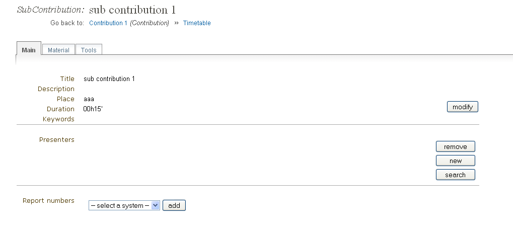
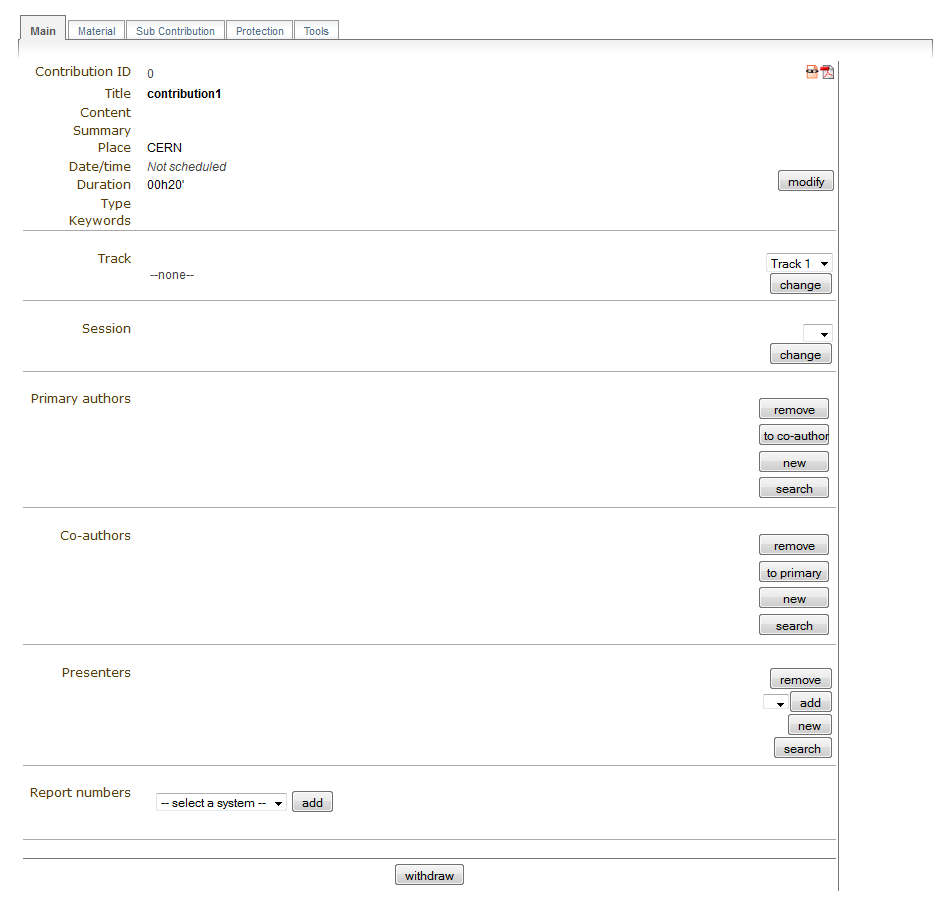
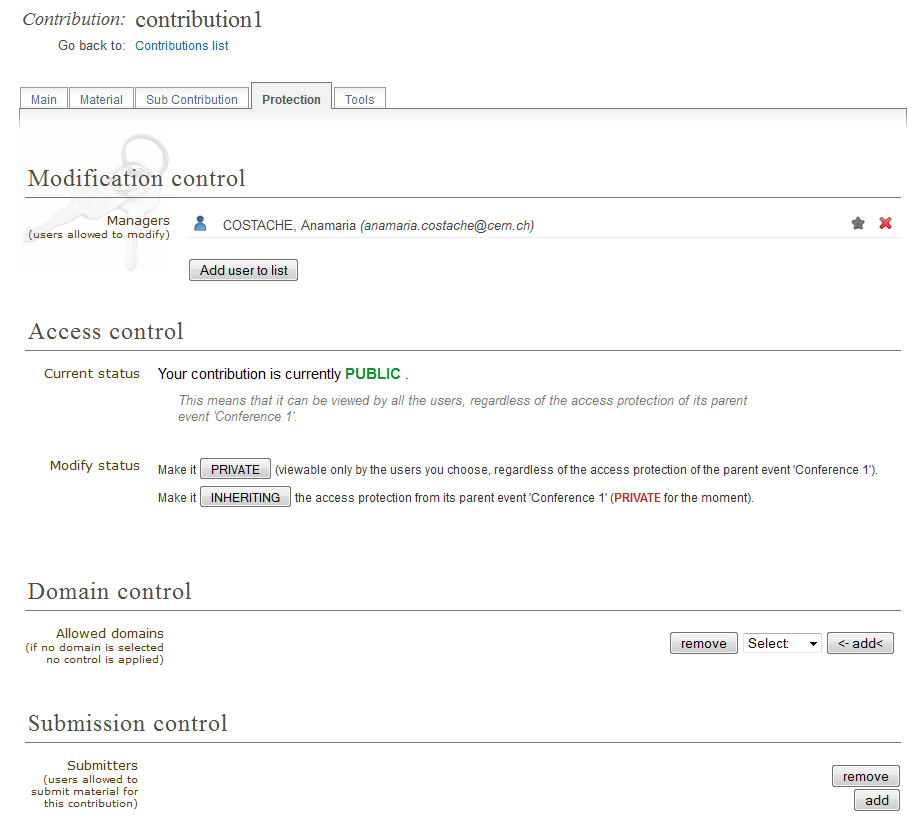
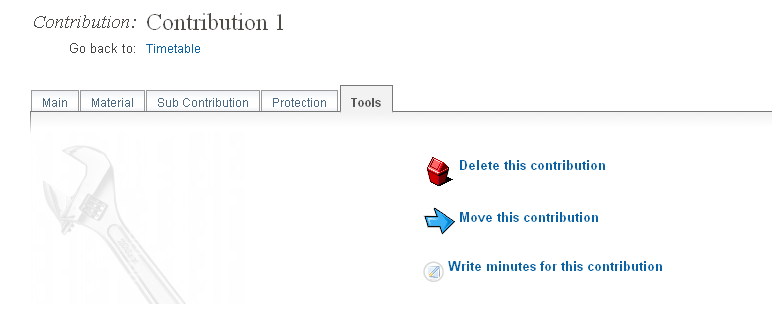
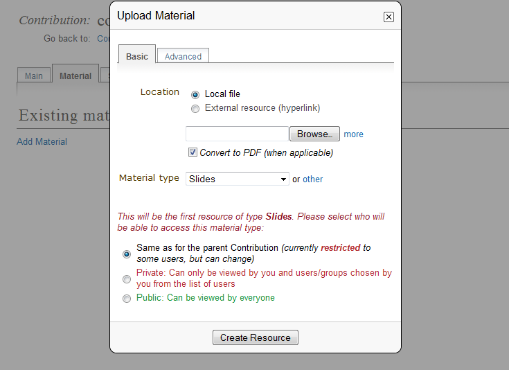
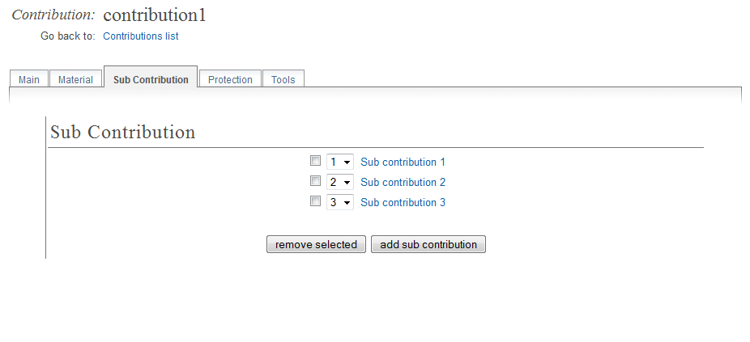
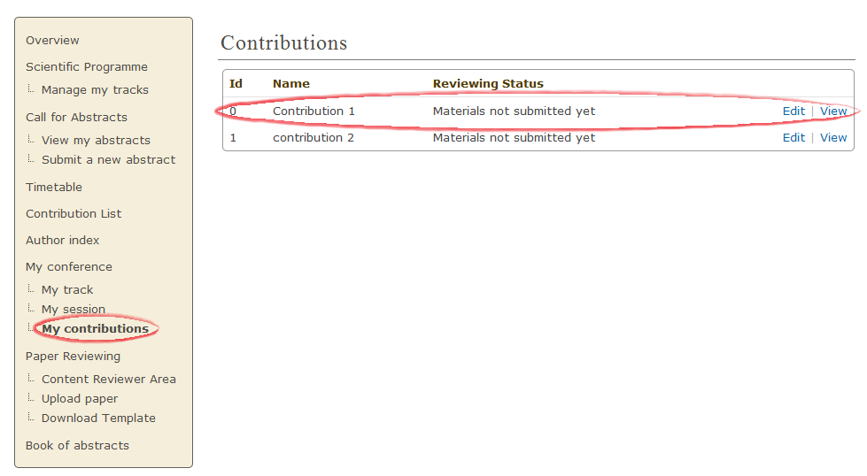

============================
Contribution Manager's Guide
============================

--------------------
Contribution Manager
--------------------

The Contribution Mananager is responsible for managing
the information in a contribution. Your are given contribution
management access by either the Conference Manager, Session
Manager, the existing Contribution Manager and possibly the Session
Co-ordinator.

You can access your contribution by selecting *My contributions* under
*My conference* in the left menu in the event home page. You will see
a list of your contributions. To access the contribution page in the event
page, click on *View*. To access the contribution management area, click
on *Edit*. Both will be to the right of the contribution's name.

|image10|

--------------

-----------------------
Contribution Management
-----------------------

Once in the contribution management area you can start managing
your contribution using the following tabs.

This is just a quick start guide for contribution management, for
an in-depth explanation please see `Contributions in the Indico
User Guide <../../UserGuide/Conferences.html#contributions-management>`_.

--------------

Main Tab
~~~~~~~~

In the main tab, you can manage the main information about the contribution;
its ID, title, content, date and time etc. You can assign the contribution
to a track or a session, and select the authors, co-authors and presenters,
as you can see below.

|image4|

--------------

Material Tab
~~~~~~~~~~~~

This is where you add or manage any material belonging to the contribution.
To add material, click on *Add Material*. You will need to upload the material
(video, slides etc.) as seen below.

|image8|

Sub Contribution Tab
~~~~~~~~~~~~~~~~~~~~

The sub contribution tab allows you to add and remove sub
contributions.

|image9|

Clicking on the title of a sub contribution will take you into
its management area, where you can add material, change the its main
information, delete it or write minutes for it.

|image3|

--------------

Access Control Tab
~~~~~~~~~~~~~~~~~~

The access control tab allows you to add other contribution
managers, set the access control (private, public, inheriting) and to give
permission for users to submit material for your contribution.

|image5|

For more on Access Control, see :ref:`access_control`

--------------

Tools Tab
~~~~~~~~~

The tools tab allows you to delete, move and write minutes for the
contribution.

|image7|

