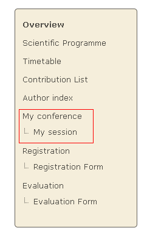
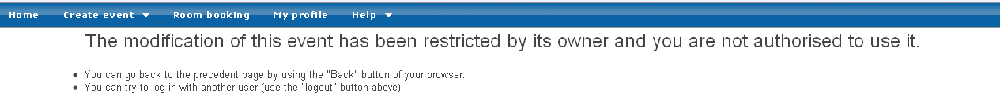
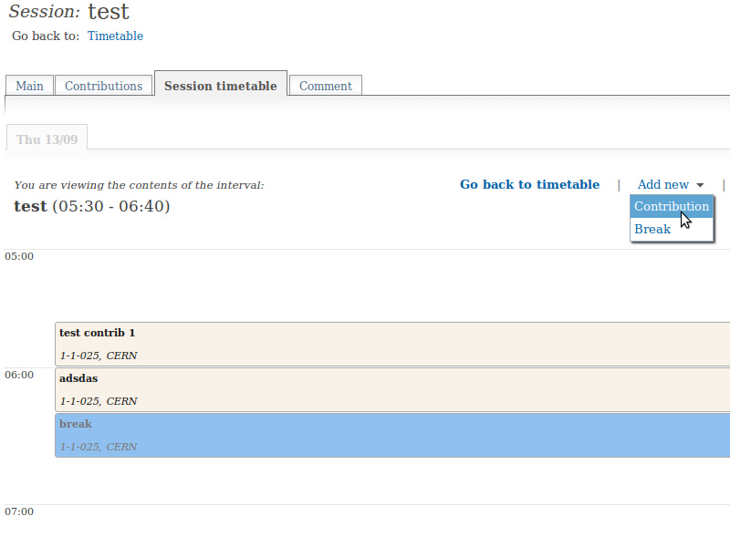
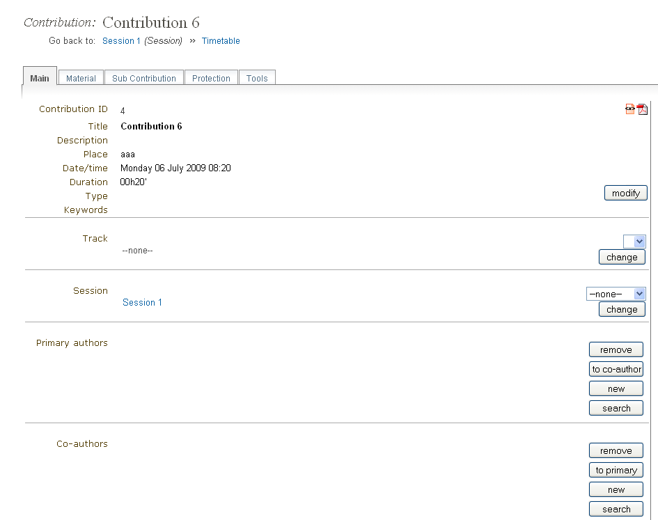
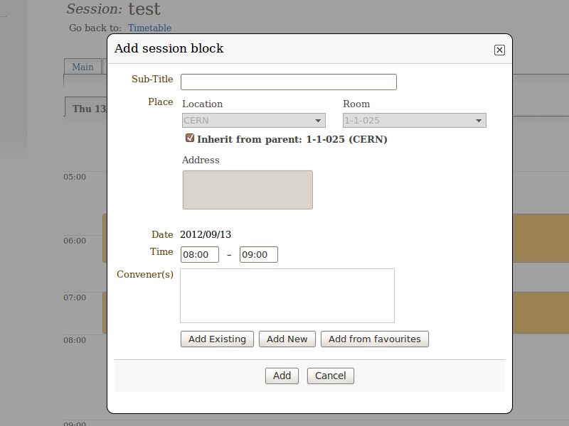

==============================
Session Co-ordinator's Guide
==============================

--------------------
Session Co-ordinator
--------------------

The Session Co-ordinator is responsible for scheduling
contributions and breaks within his session. These contributions
need to be imported by the Session Manager or Conference Manager
before you can add them to your session.

You are given this co-ordinator access by either the Session
Manager or the Conference Manager. The Conference Manager sets the
level of modification rights for all of the Session Co-ordinators.
You can access your session by selecting *My session* from the
conference menu.

|image1|

--------------

---------------------
Session Co-ordination
---------------------

There are three levels of co-ordination modification that the
Conference Manager can give to Session Co-ordinators, as we will
see in the following sections.

If you do not have access or the rights to any part within your
session you will be presented with this page:

|image2|

If you are not allowed access and you think you should, please contact a
conference manager immediately.

--------------

Basic Rights
~~~~~~~~~~~~

All Session Co-ordinators can:

-
   Manage the timetable with restrictions: it is allowed to add contributions,
   create breaks, reschedule contributions and breaks; but, for instance, it
   is not allowed to create new sessions, new blocks, etc.
-  View contribution list (cannot modify contributions)
-  View the sessions' main information (cannot modify)
-  View comments from the Conference Manager (cannot modify)

Your co-ordination will mainly take place within the *Session timetable*
tab of your session:

|image3|

--------------

Contribution Modification Rights
~~~~~~~~~~~~~~~~~~~~~~~~~~~~~~~~

If the Conference Manager has allowed contribution modification
rights you can:

-  Modify the main data of the contribution.
-
   Set the access controls for the contribution, i.e., give
   submission rights to presenters or allow others to manage the
   contribution.
-  Add/remove sub-contributions.

To modify the contribution click on its entry item from either the
timetable or the contribution list.

The contribution management area (for a more detailed explanation
please see `Contributions in the Indico User Guide <../../UserGuide/Conferences.html#contributions-management>`_):

|image4|

--------------

Unrestricted Timetable Management
~~~~~~~~~~~~~~~~~~~~~~~~~~~~~~~~~

If the Conference Manager has allowed you unrestricted timetable
management rights you can:

-
   Add contributions and breaks, reschedule contributions and breaks
   as before
-  Add, Edit and Delete session blocks

The timetable management area will be the same as with the
basic rights with the options to manage the blocks:

|image5|

