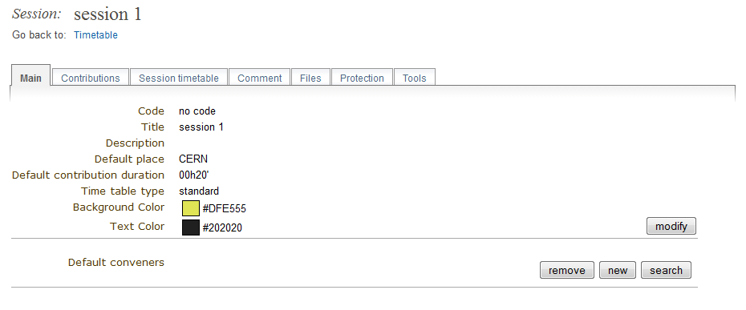
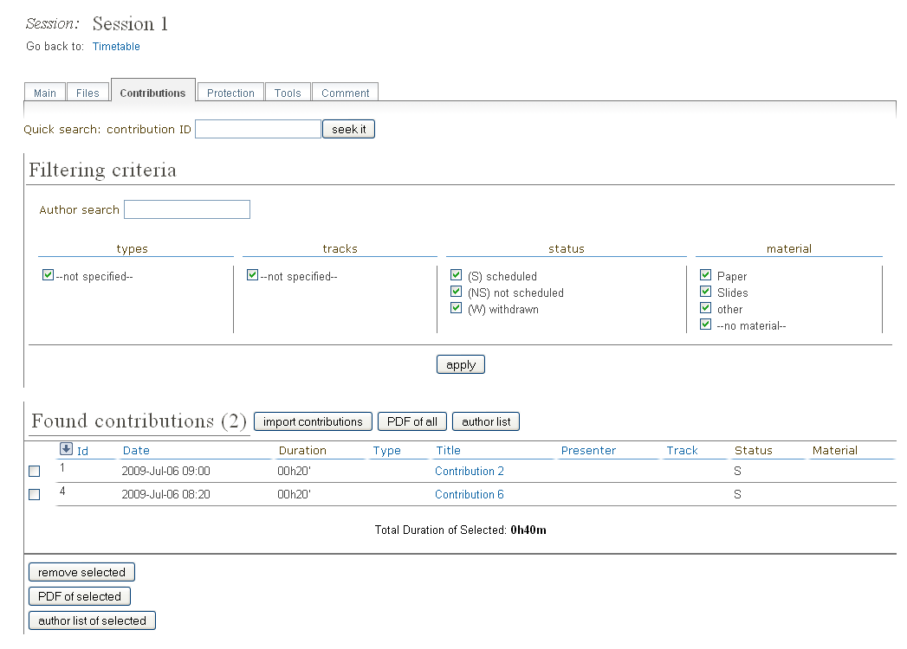
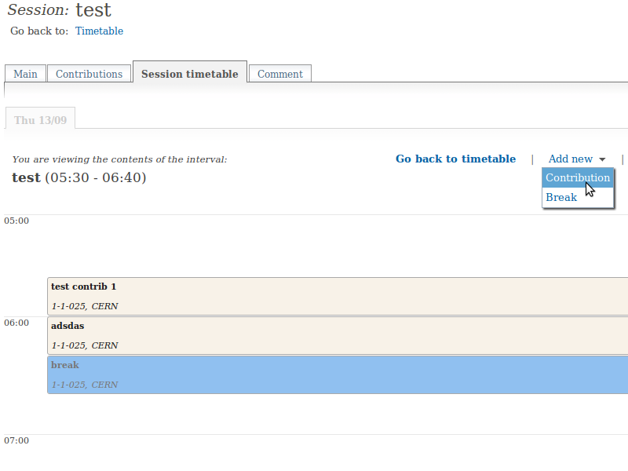
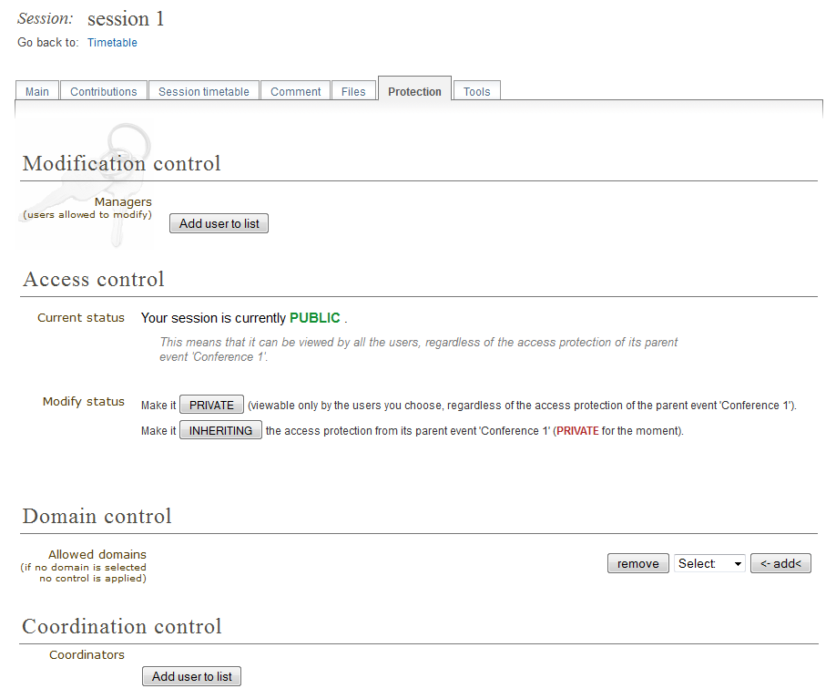
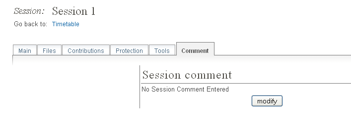
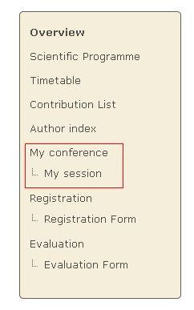

=======================
Session Manager's Guide
=======================

---------------
Session Manager
---------------

The Session Manager has full control of a session.
However, your Conference Manager may request you not to edit some
parts of the session. You are given the Session Manager rights by
your Conference Manager.

You can access your session by selecting *My session* from the
conference menu.

|image8|

--------------

------------------
Session Management
------------------

Once in the session management area you can start managing your
session using the following tabs.

This is just a quick start guide for session management, for an
in-depth explanation please see `Session Management in the Indico User Guide <../../UserGuide/Conferences.html#session-management>`_.

--------------

Main Tab
~~~~~~~~

The Main tab contains all the data about the session itself

|image3|

--------------

Contributions Tab
~~~~~~~~~~~~~~~~~

The Contributions tab gives a list of all the contributions
associated with your session.

|image4|

Contributions need to be imported into your session before you
can schedule them. By clicking on the contribution name you can
then enter the modification area of that contribution.

--------------

Session Timetable Tab
~~~~~~~~~~~~~~~~~~~~~

The Session Timetable tab lets you arrange the scheduling for your
session, you can add/edit/delete session blocks, organise when your
contributions are going to take place, and include breaks within
your session.

|image5|

To change the start times of each entry, click on the entry and a balloon
with the timing info will be displayed; close to the time there is an [edit]
link that allows you to modify it.

--------------

Access Control Tab
~~~~~~~~~~~~~~~~~~

The Access Control tab is the area in which you can set access
rights for your session. Please check with your Conference Manager
before changing anything in here as he may wish to set all the
access rights himself.

|image6|

You can assign users the rights to be Session Co-ordinators or to
be Managers alongside yourself. A co-ordinator can schedule
contributions and breaks, he can only change slots if they
Conference Manager has given him that right. A session
co-ordinator cannot change details of the session itself.

--------------

Tools Tab
~~~~~~~~~

The Tools tab allows you to delete and to write minutes for the session.

--------------

Comment Tab
~~~~~~~~~~~

The Comment tab stores any comments about your session. You can
view this comment but only the Conference Manager can modify the
comments.

|image7|

--------------

Files Tab
~~~~~~~~~

Click on *Add material* in this tab to attach material to the session.
You can also edit (data and protection) and remove all the material
(slides, videos etc.) attached to the session.

--------------

