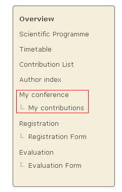
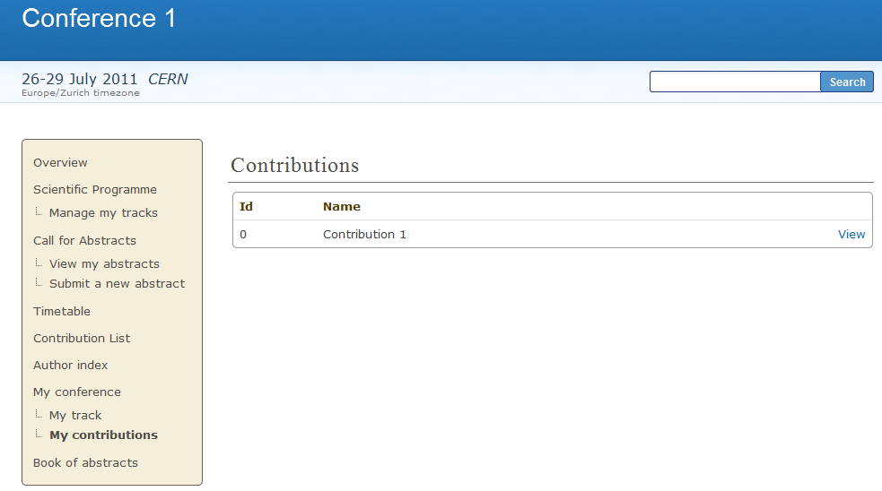
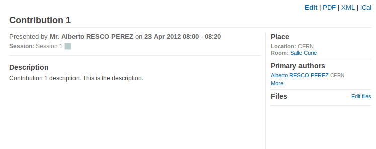
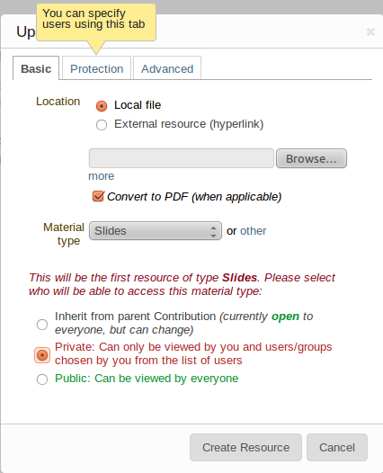
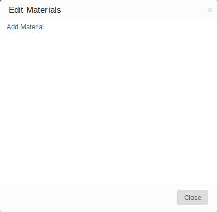

=================
Submitter's Guide
=================

--------------
Submitter
--------------

The Submitter is able to submit material for a
contribution. You are given Submitter access by either the
Conference Manager, Session Manager, Contribution Manager or
possibly the Session Co-ordinator.

|image1|

You can access the contributions for which you can submit material
by selecting *My contributions* from the menu in the event homepage.
This will take you to your submission area and will list the
contributions for which you can submit material.

|image2|

--------------

----------
Submitting
----------

Once in the My contributions area (previous screenshot) you can click on
*View* in order to display the contribution details and start submitting
material.

|image3|

To submit material, click on *Edit Files*. A popup will appear, where the
attached files can be seen.

|image5|

By clicking on *Add Material* link a new popup will appear from
which you can choose the material type (slides, video etc.) and upload it.
You also need to set the protection level, (see :ref:`access_control`), and
you can add a description and display name. If you set the material to be private,
a *Protection* tab will appear, where you can add users or groups that
are allowed to access your material, set the visibility (hidden, visible)
and if you wish, set an access key.

|image4|

Once the material has been submitted it will appear in the
contribution details

