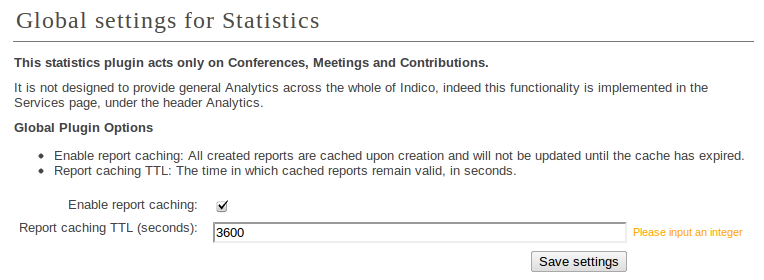

=======================
Statistics Introduction
=======================

Indico includes a plugin which deals exclusively with the tracking of statistics for event page views and material downloads. When installed and activated, the plugin injects JavaScript code into the pages for Conferences, Meetings & Contributions allowing specific tracking of those requests separately.

Furthermore, the downloading of material can also be tracked separately.

Plugin Administration and Configuration
~~~~~~~~~~~~~~~~~~~~~~~~~~~~~~~~~~~~~~~

Navigate to Server Administration in the usual manner, from here select the Plugins option from the left-hand menu. If this is your first encounter with the Statistics plugin, it would be a good idea to refresh all plugins here before you begin, to ensure that all handlers are correctly registered.

From here, click on the 'Statistics' tab, usually located on the right of the plugin tabs (installation specific configuration may cause this order to be altered), you will be presented with the following global plugin options:

|image01|

- Enable report caching - If checked, this means that all reports generated via the 
  Statistics module are cached upon creation and have a life defined by the following
  option.
- Report caching TTL - This represents the time to live for the caching of reports if
  enabled.

