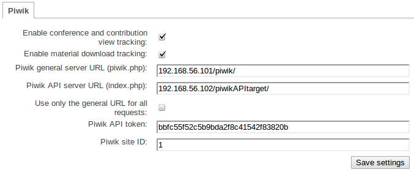

=================
Configuring Piwik
=================

Provided with the Statistics plugin is an implementation which wraps around the Piwik statistics platform. This guide explains how to configure your Indico instance to interface with your Piwik installation of choice. It assumes that you have access to a Piwik server and the ability to login and retrieve both the ``siteId`` and ``token_auth`` variables which the Piwik API provides. For more information on how to obtain these values, please refer to the current Piwik documentation.

The Piwik implementation provided wraps around the native Piwik API providing methods for serverside tracking and retrieval of information relative to the current request. It consists of two components:

- Pageview Tracking

Configuration
~~~~~~~~~~~~~

Underneath the global plugin options you will see each implementation has a tab for its unique configuration specifics. Piwik exposes the following options:

|image0|

- Enable Conference & Contribution View Tracking: if enabled, the Page Tracking
  Component is enabled, injecting JavaScript hooks into the Conference, Meeting and Contribution display pages, along with the Conference ID and/or Contribution ID depending on the page itself.
- Enable Material Download Tracking: if enabled, the File Download Tracking Component
  is active, a listener on Material downloads will then track the download in the Piwik instance.
- Piwik Server URL: The URL to your Piwik instance in format `xxx.xxx.xxx.xxx/$path` (
  `$path` is optional, the URL should be the directory where `piwik.php` is located).
- Piwik API Server URL: If your configuration requires a separate URL for API queries (targetting index.php), you may specify the address here in the same format as the Piwik Server URL here.
- Use Only General URL: If this is enabled, only the first URL (Piwik Server URL) is used for *all* requests. If disabled, the plugin will use the latter URL (Piwik API Server URL) for all API requests.
- Piwik API Token: The full API token provided by Piwik for your username & site ID
  combination.
- Piwik Site ID: The integer ID assigned to each site in Piwik as a method of internal
  tracking. This information is also available in Piwik.

*NOTE:* It is recommended that you create a separate site specifically for Indico statistics tracking in Piwik if you are also using Piwik for general analytics also as having both general analytics and these specific statistics utilising the site ID will result in duplicated, non-sensical results.

The two components provided are mutually excluse and, therefore, may be enabled / disabled independently at your convenience. A server restart is not required for the change to go into effect, it is instantaneous upon saving settings.

-----------------------
Page Tracking Component
-----------------------

*IMPORTANT:* By design, the scope of this implementation extends only into injecting the tracking code into Conference, Material and Contribution display pages. It is *not* a general purpose, site-wide tracking utility. If this is the functionality that you seek, please refer to the Analytics options offered by Indico.

This component determines if the page being viewed is a Conference, Meeting or Contribution and dyanmically creates the relevant JavaScript required to track remotely with the unique identifiers associated with the Conference and/or Contribution. The code is based on the asynchronous version provided in the Piwik documentation to ensure compatibility amongst browsers in testing.

*NOTE:* To modify the JavaScript hook, modify the contents of ``piwik/tpls/JSHook.tpl``

--------------------------------
File Download Tracking Component
--------------------------------

This component consists of a listener which sends a tracking REST query to the Piwik instance on every file download or material display. It is entirely serverside and, therefore, is subject to a timeout condition as it relies on the Piwik instance defined in the plugin configuration being available.

