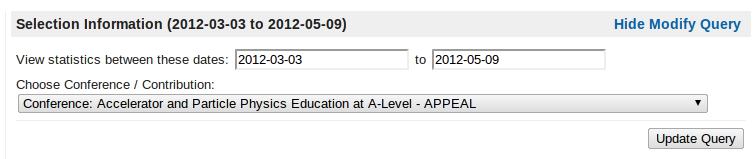
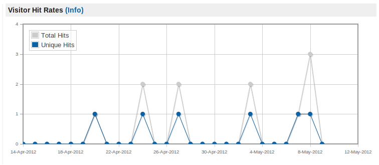
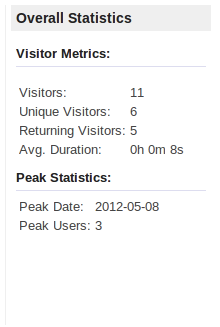
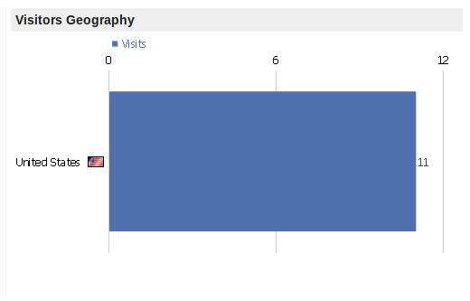
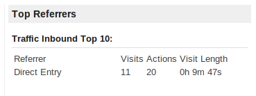
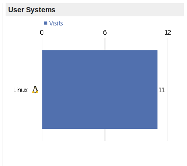
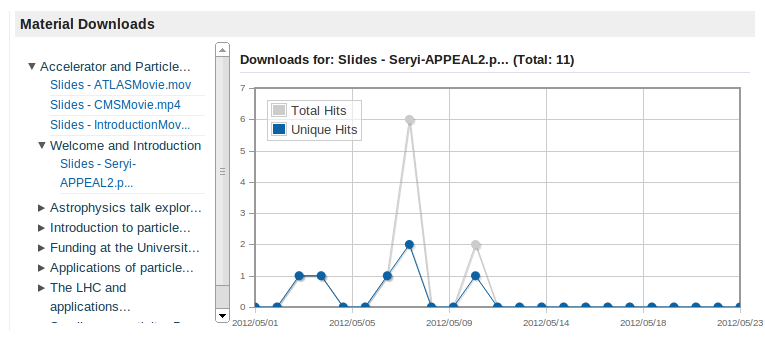

===========
Using Piwik
===========

Indico features a statistics plugin which, if enabled by your server administrator, permits you to view statistics specific to your events and / or events to which you have modification privileges. This enables you to view where your traffic is coming from, peak dates and track downloads of material - depending on server configuration.

The Statistics Interface
~~~~~~~~~~~~~~~~~~~~~~~~

Navigate to the modification page for the event you wish to query, if the statistics plugin is enabled on your server, you will see a link in the left-hand menu entitled 'Statistics'. Simply click here to view the report for the event in question. Be aware that it may be the case that the data you are viewing is cached, you will see the report creation date at the page footer.

The page compartmentalises the data for easy digestion, the components and their roles are detailed below.

Modifying The Query
~~~~~~~~~~~~~~~~~~~

When loading the statistics page for the first time, an appropriate date range is computed. You may, however, modify this as desired by clicking on the `Modify Query` link in the page header. You are presented with several options:

|image0|

You may change the date range by using the pop-up calendar widgets for start date & end date, alternatively you may manually enter them using the format `YYYY-MM-DD`. You then have the option to view the statistics for individual contributions or revert back to the conference as a whole.

Components
~~~~~~~~~~

The compartmentalisation of data is such that it should be unambiguous to find that which you are searching for. Each component's purpose and interactivity (if any) is noted below.

-----------------
Visitor Hit Rates
-----------------

This graph shows both the unique and total hits, per day for the current selection (conference / contribution) over the date range specified. This graph is interactive, hovering your mouse over the points of data will present further information relating to the point's value.

|image01|

Furthermore, by clicking and dragging the mouse pointer anywhere within the graph area, a selection  box is created. Upon releasing the mouse button, the graph will recompute its axis such that the selection is 'zoomed' into, providing easier extraction of information in certain circumstances. To reset the zoom level to default, simply double click in anywhere in graph area.

------------------
Overall Statistics
------------------

Certain metrics are computed through Indico which are presented in the Overall Statistics widget.

|image02|

For the date range and contribution / conference specified, the average duration on the page is displayed, as well as number of visitors (unique & total) and the peak date in the range where the most activity was recorded.

------------------
Visitors Geography
------------------

This graph is a non-interactive representation of the visitor's origin within the date range and event specified, ordered in descending order of traffic.

|image03|

-------------
Top Referrers
-------------

This widget provides information as to where your visitors are reaching the event from. Metrics provided include the number of total visits, amount of actions taken on the page and the average visit length from each source.

|image04|

------------
User Systems
------------

The User Systems graph provides you with a view as to which operating systems your viewers are originating from, this can be useful if you wish to guage specfic OS usage in your target domain (mobile usage proleration, for example).

|image05|

------------------
Material Downloads
------------------

If enabled in your Indico installation, you are able to view individual statistics for material downloads in your event. The widget is constructued of two panes, the left-hand pane contains a tree which hierarchically builds the path to material based on the session / contribution etc to which they are assigned. Only elements of the conference which have material will be displayed in this tree. Click the arrow to the left of the element you wish to expand in order to view its contents.

|image06|

Clicking on the material name, denoted in light blue, will load the logged download data in the graph on the right, as well as the total number of downloads alongside the material title. As with the Visitor's Hit Graph, hovering over the two plot points will show the value for each entry and you may click & drag a subsection of the graph to view in more detail. Double clicking in the graph area will reset this zoom level.

Final Note
~~~~~~~~~~

The integrity of these results depends on the configuration set by your Indico administrators, this means that both the page-tracking and material-tracking components are mutually exclusive and may be enabled / disabled as required. Due to this, it is possible that gaps in either statistics may occur if such tracking is disabled.

