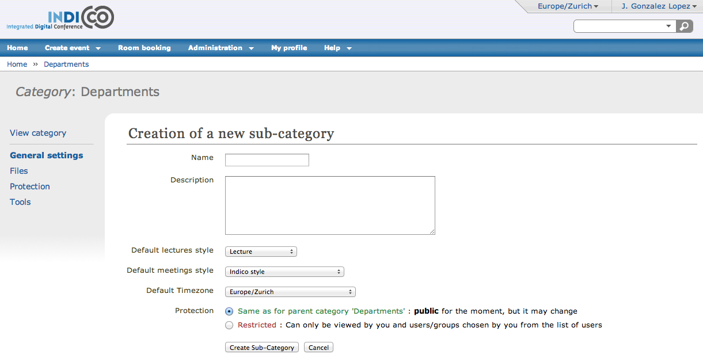
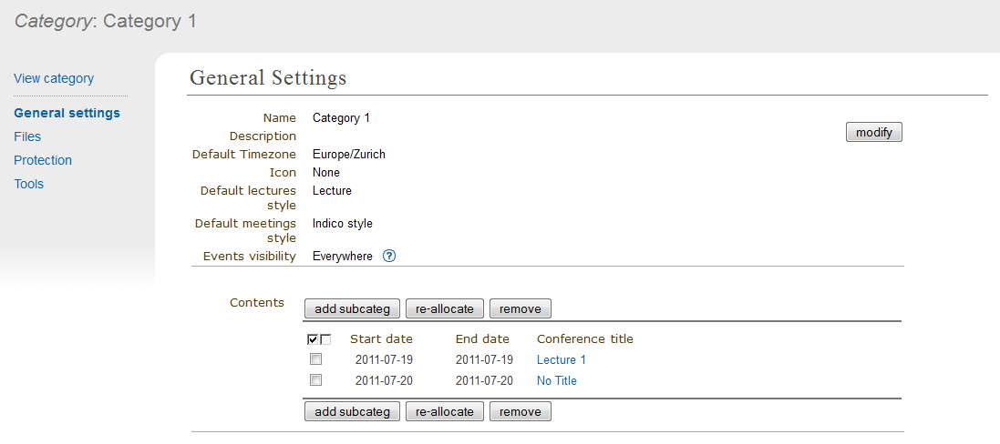
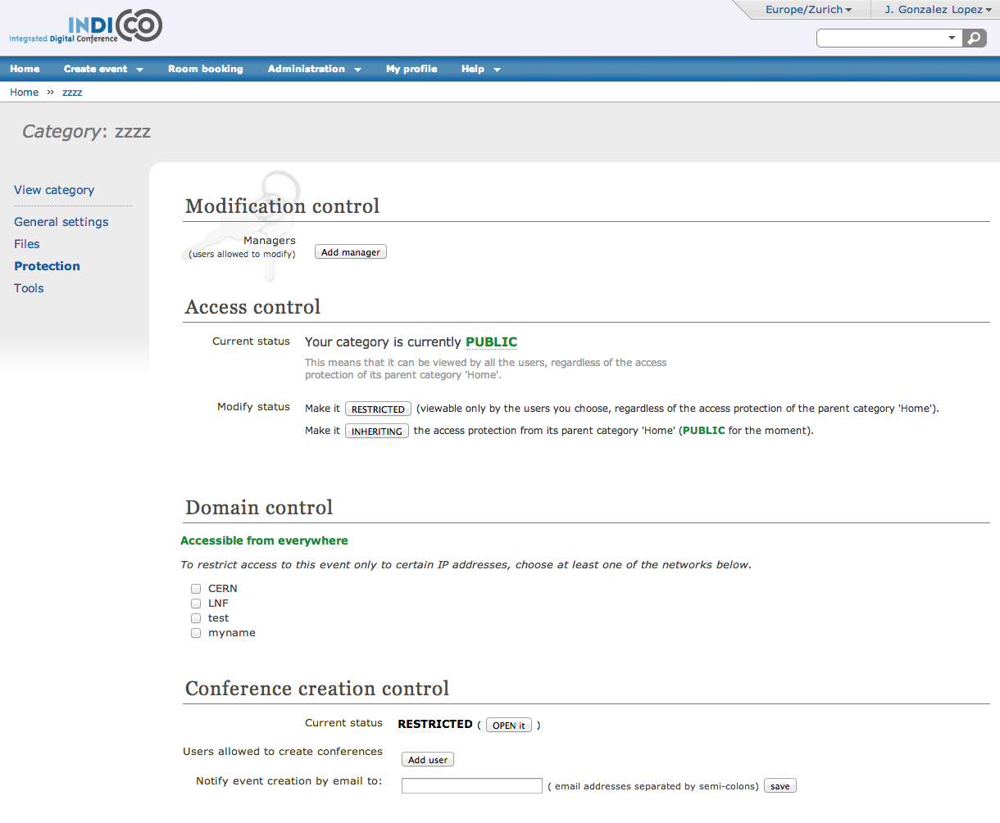
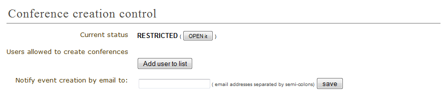
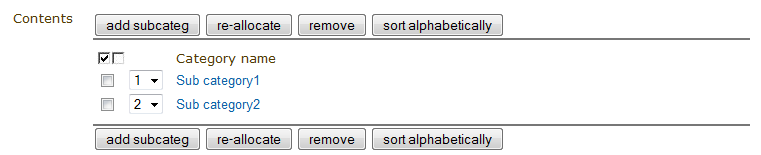
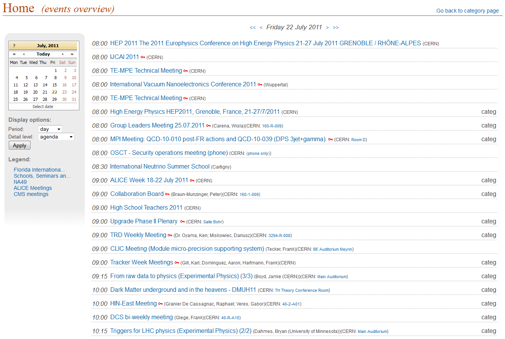
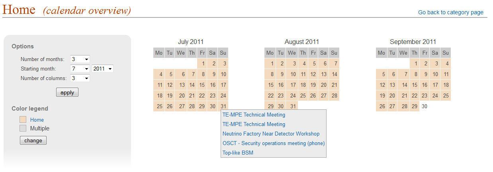
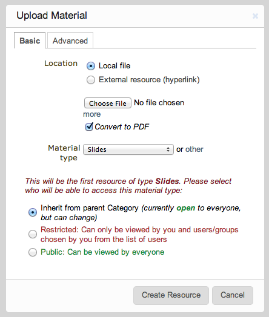

==========
Categories
==========

Category
---------

A Category is a means of grouping your events or other Categories
together. In Indico, *Home* is the top level category from where you
start. Inside a category you can:

* add events or other sub-categories,
* set access rights to say who can access or modify,
* re-allocate the sub-categories,
* remove the sub-categories,
* and also delete the current category and everything inside it.

These features are accessible through the menu *Manage* (you must be logged in
and with modification rights in order to see it), that you can find to the right
of the title "Main categories". After clicking *Manage* (more specifically its inner
option *Edit category*) you will be accessing the Management area for Category.

Creating a Category
-------------------

You can create a new category from the menu *Manage* and then by clicking
on *Add subcategory*.
You will need to have an Administrator's account or be listed
in the modification list `(see Protection) <#protection>`_
for the category.

You can also create a subcategory from the Management area, which you
access from the menu *Manage*, option *Edit category*. In *General settings*,
`(See General Settings) <#general-settings>`_ , click on the button
*add subcateg*.

|image1|

Setting the protection for your category is important. You can set it
to Inheriting, Restricted or Public, see :ref:`access_control` .

-----------------

.. _category_overview:

Category overview
-----------------

In the display page of the categories, the option *View* > *Today's events* allows you to see
the category's event overview. Events that belong to the category and
its subcategories from the specified period will be displayed.

It is possible to exclude some categories from the event overview, and
hence control the visibility of the events belonging to the category
in *General settings* `(See General Settings) <#general-settings>`_ .
Categories have three event visibility levels:

* *Everywhere* - events are shown in the event overview webpage for this category and the parent categories.
* *Category name* - events are shown only in the overview webpage for current category.
* *Nowhere* - events are not shown in any overview webpage.

|image6|

As you can see in the previous image, it allows you to see all the events
happening in one specific day. You can then view the other days by clicking on the
arrows on top, or by choosing the day on the calendar on the left.
Underneath the calendar, you can also choose the display options. You can
choose to display the events over a day, a week or a month.
You can also choose the detail level: *agenda* will show you all the events
occuring over that period of time, *sessions* will only display the sessions
and *contributions* will only display the contributions.

|image7|

**Calendar overview webpage** : Another option for *View* is the calendar view. It gives you an overview of all the
events over several months. You can access it by clicking on *View* -> *Calendar*.
You can see all the events happening in one specific day by pointing with
your mouse on the day you wish to view (see image above). On the left menu,
you can choose the number of months you wish to view (up to 12), the starting
month and the number of colums displayed. You can also change to color legend.

Category Management Area
------------------------

General settings
~~~~~~~~~~~~~~~~

In the Category Management Area, the first option in the menu is *General settings*:

You can modify the details of the category:

* Name
* Description
* Timezone
* Icon
* Default style (layout) for meetings created within this category `(see Meetings) <Meetings.html>`_
* Default style (layout) for lectures created within this category `(see Lectures) <Lectures.html>`_
* Event visibility for this category `(See Category overview) <#category-overview>`_

and you can modify its content:

* Add a new sub-category
* Re-allocate (move to another category) some events or categories
* Remove the inner events or categories

|image2|

--------------

Files
~~~~~

In this option, you can add material to a category. To do so, click on
the link *Add Material*. A window will appear:

|image8|

When uploading material, in the *Basic* tab, you can select its access
protection and set it to inheriting, private or public
(for more details, see :ref:`access_control` ).
In the *Advanced* tab, you can add a description and a display name. The
display name will be used instead of the original name of the file.

--------------

Protection
~~~~~~~~~~

From the Management Area you can protect your category using the
three controls for access levels: Modification control, Access control
and Domain control. You can add Users or  Groups to the Modification and
Access control lists. Conference creation control controls the users who
are able to add events to this category.

|image3|

*Modification Control*: Category Managers can be added to a
category to allow access to the Management Area for modification.
Category managers are either those listed in the modification
control list or Indico administrators. The creator of a category
will be able to modify its category without being listed.

*Access Control*: A category can be public, inheriting or private;
Public: Anyone can view a public category and any user can add events to it.
However, users will only be able to see the events inside the
category to which they have access.
Restricted: Only those users in the access list or administrators can
access the category and add events. When a Category is made private,
the option for domain control is omitted and any event or
category made inside it will also be private. The category will be
displayed with "(protected)" after its name to show it is private.
As well, if the category access is  RESTRICTED the category manager will be able to set a
'Contact in case of no access', so users with no access will know who to contact
in order to request access.
Inheriting: The category will have the same access protection as its
parent category. This means that changing the parent's protection
will change the protection of tha category.

*Domain Control*: The access to the Category can be restricted by domain.
Therefore, just the users from the chosen domain will be able to access
(e.g. If we choose the domain CERN, just users from inside CERN will
be able to access the category and its content).

*Conference creation control*: You can restrict who is able to add
events to the category. If you do so, you will need to add
users or groups to the list in order to allow them to add events.

|image4|

`See Protection System <Protection.html>`_
in order to know more about Protection in Indico.

--------------

Detail Modification & Sub-Category/Event Organisation
~~~~~~~~~~~~~~~~~~~~~~~~~~~~~~~~~~~~~~~~~~~~~~~~~~~~~

The details of a Category can be modified and sub-categories can
be organised from the option *General settings* in the management area.
Details can be modified by clicking on *modify* inside the main menu.
Sub-categories and events can be organised in the particular order
in which you wish to view them by using the order drop down box next
to each sub-category.

|image5|

You can re-allocate a sub-category or event by selecting the one
you wish to move using the tick box and clicking on re-allocate,
you will then be asked to where you would like to reallocate this
sub-category/event.

To remove a sub-category and anything it contains or an event,
select it and click *remove*. If it contains anything you will be
asked confirmation of the deletion.

--------------

Deleting a Category
~~~~~~~~~~~~~~~~~~~

To delete the current category you can go to the Tools menu in the
Management Area and select 'Delete this category'. There is no undo tool
so far, but you will be asked to confirm the deletion first.

--------------

.. |image0| image:: UserGuidePics/logo.png

