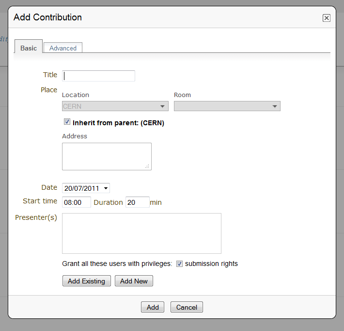
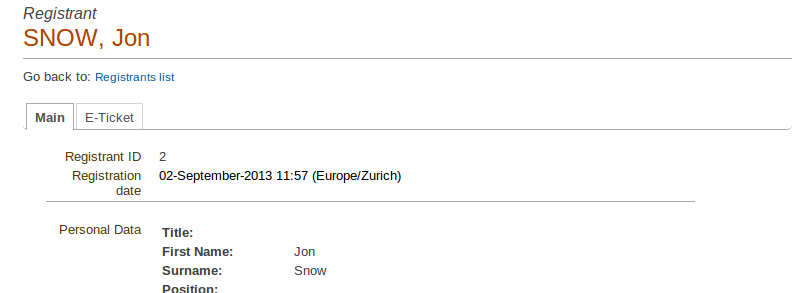
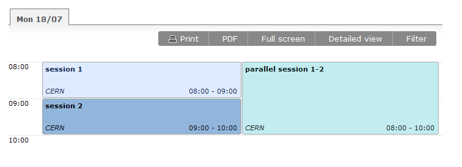
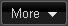
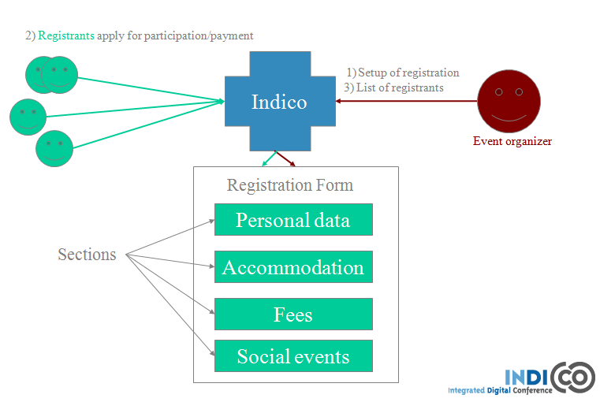
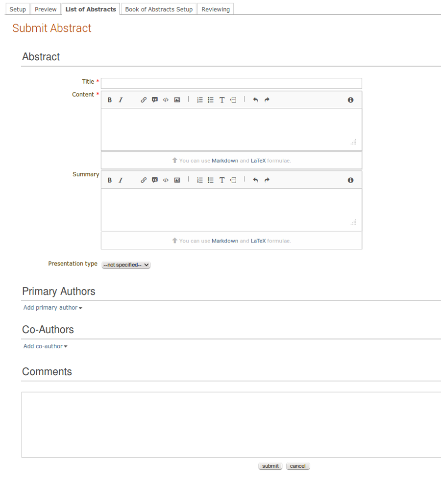
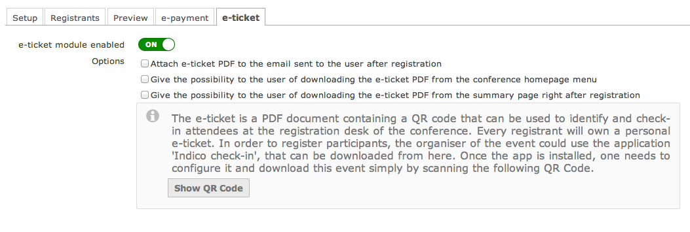
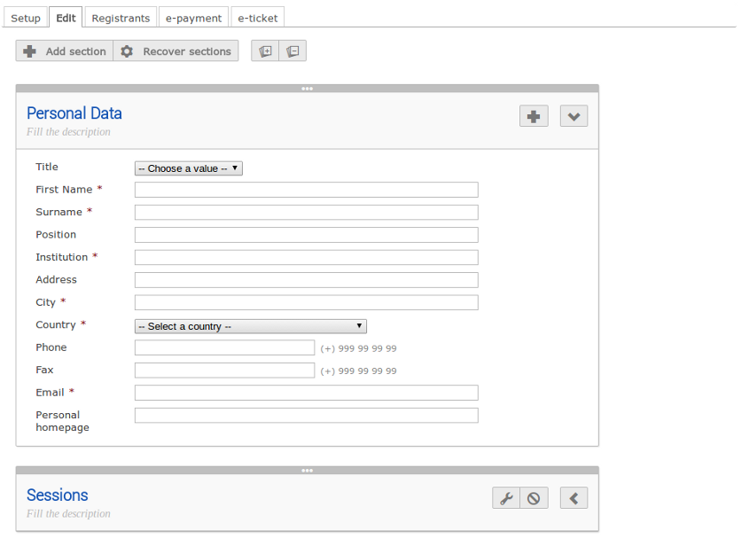
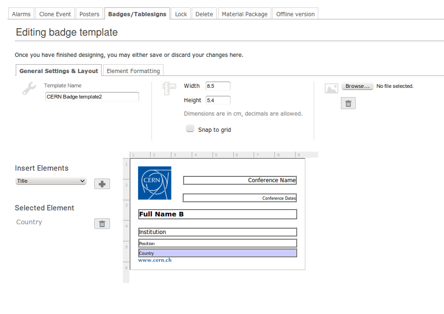

===========
Conferences
===========

Conference
----------

A conference is the most complex form of event in Indico.
You should be able to manage its complete life-cycle,
for instance, among other functionalities you can setup:

* a conference web portal fully customizable
* the programme definition (with themes/topics/tracks)
* a registration form with e-payment capabilities
* possibility to print badges; from the list of participants, Indico initializes badges for each of them
* abstracts to be submitted
* an abstract review process
* a timetable with many sessions and presentations
* slides and papers submission by authors
* an evaluation form in order to get feedback after the conference
* notification emails to participants
* paper reviewing

--------------

Creating a Conference
---------------------

In order to create a conference, you just need to click on
*Create event* and *Create conference*, in the blue bar at the top of
the page. You will be presented with a form in which you:

1. choose the category where you want to place your conference
2. fill the details of the conference you wish to create
3. set the access protection of the conference to inheriting, public or
   private (see :ref:`access_control`)

Once this is done your conference will be created and you will be
redirected to its Management Area. If you want
to see the Home page of your conference, click on the button
*Switch to event page* on the top right of the page.

The creator of this conference will by default have modification
rights to it and is referred to as a Conference Manager as is anyone
else listed in the Modification control list.

Remember that the category in which you want to create your conference
must be public or you must have access rights to it.

To access the Management Area of a conference you need to
click on the modification icon |image7| in the top bar of the event
home page.

--------------

Setting up a Conference
-----------------------

Once your conference has been created the Conference Manager can start
setting up the conference from the Management Area.

* Set up your Access Control to restrict or allow users the rights to access or modify the conference `(see Access Control Management) <#protection-management>`_.
* Look at customizing the look of your conference when users come to view it `(see Layout Management) <#layout-management>`_.
* Start adding Tracks to your conference to define areas to help with organisation. A Track Manager can be assigned to each track to co-ordinate which abstracts to accept into these tracks `(see Programme Management) <#programme-management>`_.
* Starting abstract submission process. Abstracts are proposed contributions to your conference. By default, when you first create a conference, abstracts management is disabled. You can enable this in *Abstracts* `(see Abstracts Management) <#abstracts-management>`_.
* Start looking at which submitted abstracts you wish to accept into your conference, they will then become contributions `(see Contributions Management) <#contributions-management>`_.
* Start setting up a Timetable to organize what will be happening where, and when, and what contributions, materials, etc. will be included `(see Timetable Management) <#timetable-management>`_.
* If those that will attend your conference need to register, give details concerning their needs while at the conference or pay the fees; you can set up a registration form `(see Registration Management) <#registration-management>`_.
* There are options to clone your conference, and to perform other tasks on the whole of your conference once you set it up `(see Conference Tools) <#conference-tools>`_.

--------------

Conference Management Area
--------------------------

The Management Area allows you to control, manage, setup and
modify the different parts of your conference. The following
sections will show each area of the Conference Management.

Clicking on the link *Switch to event page* to the top right of the page
will take you to the home page of the event.

--------------

.. _general_settings:

General Settings
~~~~~~~~~~~~~~~~

From the option General Settings in the left menu you can:

|image10|

* **Title**: Title of the conference .
* **Description** : The description that will appear on the event page .
* **Place** : Edit the location, address and room of the conference.
* **Start/End Date** : Edit the start and end dates of the conference.
* **Timezone** : Timezone of the conference.
* **Additional info** : Additional information that will appear on the event page overview.
* **Support** : Modify the support email along with the caption. This will change the support email link located at the bottom of the menu that is displayed on the home page of the conference `(see Conference Display) <#conference-display-area>`_. You can specify more than one email address for the support. Just make sure of separating each of the addresses by a comma (",").

|image11|

* **Default style** : Choose the default layout style for the timetable.
* **Visibility**: This changes the visibility of the event in the events overview. If you choose everywhere, the event will be visible eveywhere. Choosing a category will make it visible only in the category's events overview. Choosing nowhere means that the event won't be visible in any events overview, see :ref:`category_overview` .
* **Event type** : Changes the event type. You can choose between lecture, meeting and conference. The difference lies in the different features which are accessible to you. A conference has more features than a meeting, a meeting has more features than a lecture.
* **Keywords** : Keywords of the conference.
* **Short display URL** : Create a URL shortcut to the event page, for instance: http://indico/event/my-conf
* **Chairpersons** : Add or remove the chairpersons of the conference.
* **Screen dates** : Set the Screen dates. These are the dates that will be displayed in the home page of the conferences. The screen dates are useful when we want to have different dates in the display than in the timetable.
* **Types of contributions** : Create all the types of contributions for your conference, for example, oral presentation and poster. This contribution type can be chosen for any abstracts or contributions added to the conference.

--------------

Timetable Management
~~~~~~~~~~~~~~~~~~~~

You can organise your conference from the Timetable tab in the conferece
management area. When you start with a timetable it will look like this:

|image38|

You can modify the start and end dates of the timetable, and you
can start adding sessions, breaks, and contributions to your
timetable.

|image39|

In order to edit the entries in the timetable, you just need to click
on the entry box and edition balloon will show up.

--------------

Sessions
^^^^^^^^

A session is essentially a time interval within which you organise many
presentations of your conference. You can create sessions based on different reasons:

* You could use a session for each track, for example.

* There can also be more than one session scheduled at the same time (parallel sessions).

To create a new session, click on *Add new* and *Session* at the top
right of the timetable. When doing so, you have the option to create a
new session or add a block to an already existing session (if there is
already at least one session in your timetable).

* Create a new session: You will need to give it a title, choose the duration and a date and time. You can then complete the following criteria (optional): you can add a description, change the location, add conveners etc.

|image116|

* Add another block to: You can choose to add another block to an already existing session. You will first need to choose to what session you want to add a block. You can then choose the time, date, location, add a convener, etc. This means the same session will be happening in different time intervals. For example, you can have a morning interval, then a break, then an afternoon interval within the same session. Another example is having a session on a particular subject one day, and on another subject a few days later.

|image117|

Session Blocks
''''''''''''''

A session can happen in different intervals of time.
If you already have a session (which will be like the first block)
and you want to add more blocks for that session, you can do it from
the menu (in the top bar of the timetable)  *Add new* > *Session*  >
*Add another block to:* an already existing session.

However, this is optional, blocks can be used when the session takes
place over more than one period of time. For example, you may have a
morning block, then a break, and then an afternoon block within the
same session. Also, you may have one day you have a session on a particular
subject for a couple of hours and then two days later you may have another
session on that subject.

--------------

Adding Breaks to a Timetable
^^^^^^^^^^^^^^^^^^^^^^^^^^^^

To add a break to your timetable, use the menu *Add new* -> *Break*
at the top right of the timetable.
You will be presented with a form where you can modify the name,
description, date and time of the break. You can also modify the address
where the break will take place and the color in which it will appear in
the timetable. Once the break is created it will appear in your timetable.

|image40|

In order to modify your breaks, you need to click on the entry and an
edition balloon will be displayed. Click on Edit to access the edit menu.
By doing so, you can edit all the informations entered in the form when
you created the break.  If you quickly want to modify the duration or location
of the break, click on the pencil to the right of **Duration**, **Room**
and **Location**.
You can also click on *Move* in the edition balloon. From this option,
you can choose to move the break, inside a session or to another day.

If you delete a break, unlike a contribution, it will not
remain anywhere. You will however be asked to confirm deletion.

--------------

Adding Contributions to a Timetable
^^^^^^^^^^^^^^^^^^^^^^^^^^^^^^^^^^^

To add a contribution to your timetable use the option *Add new* > *Contribution*.
Here, there are two possible situations:

1. If there are already some unscheduled contributions `(see Contributions
Management) <#contributions-management>`_, Indico will show a list of
the contributions in which you select the one(s) you want to add. You
can also choose to create a new one.

|image41|

2. If there are no unscheduled contributions, a form for the creation
of a new contribution will appear.

|image42|

If you choose to delete a contribution and this contribution has been
created/added from the *Contributions* option on the left menu, then it
will be deleted from the timetable, but will remain in the contributions
list under the *Contributions* option.

To edit a contribution:

Click on the entry in the timetable, an edition balloon will show up. You
then need to click on *Edit*. You will be redirected to the  contribution's
page, where you have six tabs, where you can edit the main options, the
material, the sub-contributions, the protection, the tools and the paper
reviewing.
You can also choose in the edition balloon to *Move* the contribution.
This allows you to move the contribution, into a session, or to another day.

--------------

Session Management
^^^^^^^^^^^^^^^^^^

You can access the Management area for a session from the edition
balloon (this is the balloon that appears when clicking on the entry),
by clicking *Edit* > *Session properties*.

|image97|

This new page will allow to modify everything within that Session.
You will see different tabs from which you can:

* Edit the general settings.
* Manage the list of contributions for that session.
* Modify the inner timetable for that session.
* Write some comments that other session coordinators can read.
* Attach files.
* Set its protection and the coordinators (people with rights to
  schedule talks).

|image98|

To edit a session, click on its entry in the timetable and an edition
balloon will show up. From this, you can add a new block to the session
(which you can also do by clicking on *Add new* -> *session* -> *Add another block to*).
You can delete the session, but please note that if you do so,
it will not remain anywhere else, unlike contributions. You will however
be asked to confirm deletion first.
From the edition balloon still, you can change the color of the entry
in the timetable, or change the duration and location of the session by
clicking on the pencil to the right of **Duration**, **Room**, **Location**.
By clicking on *Edit* in the edition balloon, you have three options that appear.

* Block timetable: You can edit the timetable of this block, i.e. you can add contributions and breaks inside the session itself

* Block properties: You can edit all the information given when you created the session. You will be presented with exactly the same form

* Session properties: You will be presented with six tabs: main, contributions, session timetable, comment, files, protection and tools. All these tabs are explained below

--------------

Main Tab
''''''''

From the Main tab in Session you can modify the general session
information. You can modify the code,
title, description, default place, default duration and layout (in the timetable)
of the session. You can also add/remove any conveners.

In this tab, all the default values will be used as default values when creating
a new block for the session. This default values are taken from the creation of the first
block for the session.

--------------

Contributions Tab
'''''''''''''''''

From the Contributions tab you can see all the contributions that
are part of your session. These contributions will only be shown
once they have been added
`(see Adding Contributions to Sessions) <#adding-contributions-to-sessions>`_.
Here, you can also add contributions to your session. If you know the contribution’s
ID, you can make use of the *Quick search* option; type in the ID, and
then click on *seek it*.
Otherwise, you can search for it. You can search by author, or by any of
the filtering criteria.  It is also possible to import a contribution,
to get the PDF or author list of selected contributions. You can also
remove contributions, by selecting them and then clicking on *remove selected*.

--------------

Session timetable Tab
'''''''''''''''''''''

Each session can have an inner timetable. You can add new blocks,
contributions and breaks inside this timetable.

--------------

Files Tab
'''''''''

This is the tab where you can view all the material belonging to the
session. You can add , remove, edit or delete any material.

------------

Protection Tab
''''''''''''''

From the Protection tab in Session you can set the access
rights for modification, access, and domain control in the same way as you
can for the conference `(see Protection Management) <#protection-management>`_.
The only difference is the Co-ordination control in which you can assign
someone to be the Co-ordinator, which means they can add and remove contributions
and breaks to the timetable of that particular session.

--------------

Tools Tab
'''''''''

From the Tools tab in Session you can delete, close the session or
write minutes for it.

--------------

Adding Contributions to Sessions
''''''''''''''''''''''''''''''''

Inside sessions, you can create new contributions from the timetable
or add unscheduled contributions (which have already been created
and will be placed in the timetable later on). Here, we will see
how to add/import contributions that have already been created.

To add contributions to a session you first need to import them
from the main conference. To do so, use the *Contribution* tab
inside the session:

|image46|

Click on *import contributions*, this will take you to a screen
where you can select the contributions you want to include in your
session.

|image47|

Once you have selected the contributions they will appear inside
the Contributions tab in the session. You can then use the option
*Add new* > *Contribution* from the Session timetable and select
from the contributions you imported. When you have added a contribution
to your session timetable you can edit the times, duration, room and
location  by clicking on the contribution box.

|image48|

--------------

Room Booking
^^^^^^^^^^^^

If there are rooms booked for the conference they will be shown at the
top of a selection list during creating/editing sessions, slots, breaks
and contributions. If the name of the booked room is green, it means it
is not used in any other event in the current conference. Otherwise the
name will turn red and information about event using this room will be
shown while pointing this name.

|image101|

------------

Rescheduling
^^^^^^^^^^^^

This option is available on the top right of the timetable, to the right
of the option *Add new*.

Step 1: Choose the type of rescheduling you want

* Adjust time of all entries will move all the entries in the specific days by changing their **starting times**. The first entry will start when the event starts and the other will follow consecutively after it. The durations will not be changed.

|image114|

* Adjust **duration** of all entries will adjust the duration of the entries of the selected day to fill the gaps between them, so that their starting times don’t change. If a gap time is specifies, the duration will be extended up to the value of this time gap before the starting time of the next entry.

|image115|

Step 2: Choose the time gap between entries

You need to type a duration in minutes

Step 3:  Choose to fit sessions to their content

You can choose to tick the option to fit all the sessions contained in the specific day to their content. This will change the start and end times of the session blocks occurring on that specific day in order to fit their respective content **before** performing the rescheduling.

-------------

Drag & Drop
^^^^^^^^^^^

You may also manipulate existing entries in the timetable by interacting with
them directly using your mouse pointer, various functions are available to
you whilst using this tool.

Moving a Contribution, Break or Session
'''''''''''''''''''''''''''''''''''''''

By clicking on the desired contribution, break or session slot and dragging it around
the timetable area, you will notice that the selected item moves with your
pointer whilst showing where the new start time will be once the movement ends.

|image151|

*The proposed new start time of the item item is displayed to the left whilst
dragging it.*

Upon releasing the mouse button, the item dragged will have its start time
(and, subsequently, its end time) altered to where it has since been positioned.

*Note: The duration of the event is not modified in this operation.*

Moving Multiple Contributions, Breaks or Sessions
'''''''''''''''''''''''''''''''''''''''''''''''''

Whilst performing a move of a contribution, break or session item, as denoted
above, you may also hold the `SHIFT` key to modify all *following* contributions,
breaks and sessions with the same difference applied to the item being dragged.

For example, if you were to drag an contribution starting at 10:00 to start
an hour earlier at 09:00 and the `SHIFT` key was held, the difference of one
hour earlier would be applied to all (and *only*) contributions and sessions
of the same day.

Changing Contribution, Break or Session Duration
''''''''''''''''''''''''''''''''''''''''''''''''

Positioning your pointer at the lower edge of any contribution, break or session item
will display the resizing cursor, clicking here and dragging the line in an
upward or downward direction will alter the end time by decreasing or increasing
the item's duration respectively.

|image152|

Moving a Contribution or Break into a Session
'''''''''''''''''''''''''''''''''''''''''''''

It is possible to move a contribution or a break into a session slot by simply dragging
the contribution/break in question over the session slow into which it is desired
to go.

|image153|

Once the contribution/break is over the session slot, the contribution's (break's) size
will change to indicate that it may be moved into the session slot designated.
Simply releasing the mouse button will commit the action and perform the move.

Undo Action
'''''''''''

As all interactions performed via the drag and drop interface are instantly
written to Indico, the facility exists to Undo any incorrect action simply
by pressing the `Undo last operation` button which appears at the top of the
timetable following any such action.

|image154|

Upon clicking this button, the previous action will be totally reversed and
you may proceed to continue with the originally intended action.

*Note: The undo function supports only the last operation applied, you cannot
step through this session's interaction history with the button.*

-------------

Material Management
~~~~~~~~~~~~~~~~~~~

This is where you upload and manage the material attached to the conference.
The material can be minutes, papers, posters, slides, etc. You can control the
access protection of the material by choosing it to be public, private
or inheriting (see :ref:`access_control`).

|image136|

-------------

Programme Management: Tracks
~~~~~~~~~~~~~~~~~~~~~~~~~~~~

From the *programme* option (on the left menu) you can add/remove tracks
and access each of them by clicking on their name.

|image12|

Tracks are parts of the conference to which abstracts and
contributions can belong. For more on tracks, see
:ref:`indico_glossary` (section about tracks).

Inside tracks you can do the following:

* General settings:

  - Modify the Code: a code can be used if you prefer to use codes as opposed to long titles. These codes will be used in listings for contributions and abstracts.
  - Modify the Title and the Description of the track.

|image13|

* Coordination Control: Assign Track Manager(s) who can propose what is accepted into their Track. Track Managers do not have modification access to the rest of the conference, they only have access to the modification of their Track, see :ref:`track_coordinators_guide`

|image14|

* Abstracts: Show any abstracts which have been submitted to the Track, the Track Manager can then propose to accept or reject it. Only the Conference Manager can have the final say in whether an abstract is accepted or rejected `(see Abstracts Management) <#abstracts-management>`_.

|image105|

* Contributions: Show any contributions that belong to the Track `(see Contributions Management) <#contributions-management>`_.

|image106|

--------------

Registration Management
~~~~~~~~~~~~~~~~~~~~~~~

You may wish to have some kind of registration process for those
attending your conference. Here you can give the registrants
options such as accommodation or any specific needs. The Registration
Management comes in two parts: the Registration Form and the
Registrants.

These are the steps in the registration process:

1.  The conference manager enables the registration. To do so, go on
the *Registration* option in the left menu, and click on the button
*Enable*. He can set the registration deadline, the maximum number of
participants, to set e-mail notifications etc. (see :ref:`registration_setup`).

2. The registrants apply for participation. To do so, they fill in a
form that is found on the event’s page.

|image118|

This form is set by the conference manager (see below). He can choose
all the options that will be available to registrants, such as social
events, accommodation etc. The conference manager will have the option
to make certain events billable (such as lunches, expeditions organized
within the conference etc.) and then to enable the e-payment. E-payment
can be enabled in the *Registration* option in the left menu, under the
tab *e-payment* (see :ref:`epayment`).

3. The conference manager has access to the final list of participants,
which he can manage.

4. Once the list of participants has been established, Indico automatically
generates printable badges for each participants. The conference manager
can customize them by going to the tab *Registrants*, selecting registrants and then clicking
on *Print badges* (see :ref:`registrants`, section *Print badges*), sending emails, exporting
to excel, pdf, etc.

|image138|

--------------

Registration Form
^^^^^^^^^^^^^^^^^

You can access the registration module from the option *Registration*
in the menu on the left.

--------------

.. _registration_setup:

Setup tab
'''''''''

From the Setup tab you can control the main features of the registration form: enable or disable the registration, modify the period of registration, the maximum number of registrants you will take, any announcements and if you wish to receive an email when a new registrant applies. Click on *Modify*, on the right side of the setup tab, to access the configuration page.

The last part of this tab is *Custom statuses*. This is the status of the
registrant; you can add or delete statuses.

|image51|

Here is an exhaustive list of the parameters that can be configured:

* Current status: this is where you enable/disable the registration.

* Registration start/end date: choose the registration start and end dates. You can also allow late registrations by choosing *Allow x days/weeks late*.

* Modification end date: If you want the registrants to be able to modify their registration after the end date of the registration, you can set a modification end date.

* Title: you can change the title of the registration form.

* Contact info: Type here any information you wish to appear under the option *Registration* in the event page.

* Announcement: You can enter any announcement that you wish to appear in the registration form.

* Max no. of registrants: You can limit the number of users who can register for your conference.

* Email notification sender address: The FROM address that will appear in any email notification sent.

* Email notification: If you wish a notification to be sent when a registration is submitted, enter here the addresses of the persons you want to receive the notification.

* Email registrant: Choose when/if to email a registrant (e.g. after registration, after successful payment etc).

* Must have account: You can choose if the registrants to your conference must have an account or not to be able to register.

--------------

.. _registration_edit:

Edit tab
''''''''

Within this tab resides all edition capabilities of the registration form content. You will be presented with an interactive editor of the registration form. Whatever change you make on it, it will be instantly saved.

|image167|

The registration form is organized in *sections*. Each one is an essential part of the registration form, and it may contain several *fields* to be filled in by the user later on. The edition view allows you to edit, disable, recover and sort sections, create new ones, and delete them. Also, they can be expanded and collapsed to have a more comfortable view.

The first thing you will find above the sections is a floating toolbar with buttons to create new sections, recover disabled ones (if applies), and extend/collapse all. In order to modify the order of the sections, if you grab the 3 horizontal dots on the upper part of the section box, you can drag and drop it to the desired location. Should you need to finally dispose of any custom section that is disabled, you can do so from within the recover sections dialog.

|image168|

In the header of each section you can modify the title and description simply by clicking on the text to start editing it and saving it by pressing ENTER. On the right side there are some buttons that allow you to add new *fields*, open the configuration dialog, disable the section, or collapsing/extending it. Please, note that not all the sections allow the same actions, as some don't accept new fields or can't be disabled nor have further configuration options. Some of their peculiarities are as follows.

* **Personal Data**: Personal data registrants will be asked. Any number of fields can be added. There are several types of fields available from the *Add Field* button, covering the most common use cases. Also, these fields will have the option to be billable, meaning that they can have a price attached. Therefore, the form can be used with an online payment system.

|image169|

A highlighted field can be removed, disabled and configured by clicking on the icons that appear on the right side. Depending on the type of field, different options will appear in the configuration dialog. Disabled fields will be moved to the bottom of the section and they won't be displayed in the registration form. You can sort the fields by grabbing the 3 dots on the left side of the row and drag & dropping it on the desired location. Here is an example of how it looks a configuration dialog.

|image170|

* **Reason for Participation**: The Reason for participation form allows you to ask the
  registrant why he or she wants to participate. From this page you can
  modify the question and title of the form.

|image53|

* **Sessions**: The Sessions form allows you to add which sessions from your
  conference you would like people to register for. From the form you
  can also change the title, description, and the type of session's form
  (2 choices, they can choose just two sessions; multiple, they can choose
  any session).

|image54|

* **Accommodation**: The Accommodation form lets you add or remove the different types
  of accommodation available to your registrants. You can also add a maximum number of places, price, etc.

|image55|

* **Social Events**: The Social Events form allows you to add/remove any social
  events for which registrants can sign up. When you add an event you
  need to add the title of this event.

|image56|

* **Further Information**: The Further Information form gives you the opportunity to add any
  additional information for the registrants.

|image57|

* **General Sections**: These are custom sessions created by the manager of the conference. As with the *Personal Data* section, you can add as many fields as needed.

-------------

.. _registrants:

Registrants
'''''''''''

The Registrants tab will show a list of all the registrants
for your conference.

|image58|

From this list you can perform several actions on the registrants, as for example:

* **Add new**: It will open the registration form `(see Registration Form) <#registration-form>`_.
* **Remove**: It will remove the selected registrants.
* **Check in**: It will mark the selected registrants as checked in. *(This option is only available if the e-ticket module is enabled)*
* **Email**: It will allow to send an email to the selected registrants. Indico will send one email per participant. Also, you can profit from the Available tags to make it personal; Indico will replace the tag with the real value of the registrant, e.g. {registrant_family_name} will be Smith.

|image102|

* **Print badges**: It will open a new page that will allow you to print the badges of the selected registrants.

|image103|

You may then select which template you which to use for your PDF by selecting the radio button to the left of it and then clicking 'Download Badges PDF'. You also have the option to edit, clone and delete the templates you have stored at will.

Furthermore, clicking the 'PDF Layout Options' button provides access to further fine-tune your badges before downloading:

|image158|

* **Show stats**: It will show the statistics about the registrants.

|image104|

* **Export -> CSV**: It will create a CSV file with the selected registrants and the columns displayed.
* **Export -> PDF**: It will allow you to create a PDF in two styles: *Table style* and *Book style*. If you want to print a large quantity of fields the *Book Style* is recommended.

Also, beware that clicking on Select *All* or *None* will select or unselect all the registrants checkboxes.

Moreover, clicking on the registrant's name will show you all his details
and the information he provided in response to the form's
questions. And you can also modify them.

|image59|

Additionally, if the e-ticket module is enabled an e-ticket tab will be shown.
Where you can download the generated ticket for this registrant, as well as
mark/unmark him as checked in.

|image166|

-------------

.. _epayment:

E-payment
'''''''''

You can choose to enable or disable e-payment by clicking on
*Enable*/*Disable*. From this tab, you can customize the text to display
in the payment page, the payment conditions, the email bodies related to epayment
and the currency to use. See in the image below all the options.

|image119|

.. _eticket:

E-ticket
'''''''''

You can choose to enable or disable the e-ticket module by clicking on *On*/*Off*.

|image164|

Once enabled, Indico will be ready to generate a unique electronic ticket for every
participant. The e-ticket is a PDF document containing a QR code that can be used to
check-in attendees at the Conference Registration Desk. In order to read the QR codes,
Indico provides a mobile app named 'Indico check-in' that will list all the registrants
and provides the necessary tools to check them in.

Managers can choose how Indico will distribute the e-tickets. Currently, there are three options:

1. The e-ticket can be attached to the email sent to the user after registration.
2. The e-ticket can be downloaded from the conference homepage menu.
3. The e-ticket can be downloaded from the summary page right after registration.

|image165|

-------------

Abstracts Management
~~~~~~~~~~~~~~~~~~~~

The Abstracts option has 5 tabs:

* **Setup**: Where you can enable/disable the abstract submission process, change the start/end submission dates, set a modification deadline, enable email notifications etc

* **Preview**: Preview of the submission form, with the content, the author and co-author, but also other options such as track classification etc.

* **List of Abstracts**: Display the list of abstracts. Here you can add/delete abstracts, apply filters in order to view certain abstracts only etc.

* **Book of Abstract Setup**: Where you can customize the book of abstract and print it too

* **Reviewing**: Where you can set questions, assign reviewers by track and set notification templates

See below for more details about each tab, :ref:`abstracts_setup`

--------------

Abstracts
^^^^^^^^^^^^^^^^^^

The Abstracts process works in the following way:

1.	The event organizer needs to enable the abstract submission process. You can do in the *Abstracts* option, in the tab *Setup* ; see :ref:`abstracts_setup`

2.	All the authors submit their abstract. To do so, they need to go to the event page. If the abstract submission process has been enabled, under the *Call for Abstracts* option there will be a sub-option *Submit a new abstract*. Click on this link, complete the form and then click on *Submit*. The abstract will need to belong to a track if you want to use the review process

3.	The abstracts are now reviewed by the track coordinators. Each Track Coordinator has a list of abstracts to review. He will propose to accept, merge or reject each abstract

4.	The final decision belongs to the event organizer. He will decide whether to confirm the track coordinator's decision or to do otherwise

|image137|

--------------

.. _abstracts_setup:

Abstracts Setup
^^^^^^^^^^^^^^^^^^^^^^^^

|image23|

The different tabs are explained below:

-------------

Setup
''''''

The options you can find inside the setup tab are the following:

* **Current status**: From here you can enable and disable the abstract submission

* **Dates**:  Choose the submission start and end dates

* **Modification deadline**: You can let the users modify their abstract after they’ve submitted it. You can choose the modification deadline to be after the submission end date, which means the users will still be able to modify their abstract (once submitted) after the submission deadline

* **Announcement**: Any comments you wish to make that will appear in the event page under the option *Call for Abstracts*

* **Email notification on submission**: An email message is automatically sent to the submitter after submitting an abstract. You can specify other email addresses you wish to receive a notification

* **Late submission authorised users**: If you want, you can allow certain users to submit their abstracts after the deadline.

* **Misc. Options**: Other options available, such as enable/disable multiple track selection

* **Abstract fields**: The fields that will appear in the form to submit abstracts. You can add more and also select the order in which they appear.

Different types of abstract fields can be added by clicking in the *add* button.

|image161|

Fields can be configured at creation time or at any moment by clicking on the name of the field. These dialogs will appear. For changes to take effect the *add*/*update* must be clicked.

|image162| |image163|

--------------

Preview
'''''''

Click on this tab to get a preview of the abstract submission form.
Feel free to try this form, any submitted abstract from this tab will not be recorded.

-------------

List of Abstracts
'''''''''''''''''

The List of Abstracts tab shows all the abstracts that have been
submitted to the conference:

|image25|

* **Quick Search**: If you are looking for an abstract and know its ID, type it in the box next to *Abstract ID* and click on *seek it*; this will get you directly to the abstract you are looking for.

* **Apply filters**: Clicking on this link will open a box with many filters. Enabling or disabling any of them will have an impact on the abstracts shown in the list below. For example, you can choose to display only the abstracts belonging to a particular track or session.

* **Columns to display**: Clicking on this link will open a box with the columns to display for each abstract.

* **Add New**:  Submit a new abstract. This will bring you to a page similar to the one any user will see. For further information about the abstract submission form, please see :ref:`submit_abstract`.

* **Accept**: If you have the correct rights, you can accept abstracts (if not, you can only propose to accept). Tick the corresponding box, and then click on *Accept*.  A new page will appear, where you can choose the destination track, session, the type of contribution and if you wish to send an email notification or not. Once you have chosen all the options, click on *accept*.

|image110|

* **Reject**: If you have the correct rights, you can reject abstracts (if not, you can only propose to reject). Tick the corresponding box, and then click on *Reject*. A new page will appear, you will need to give a reason for rejecting. You can also choose whether to send an email notification or not.  Once you have completed the form, click on *reject*

|image111|

* **Merge**: If you have the correct rights, you can merge abstracts (if not, you can only propose to merge). Tick the corresponding box, and then click on *Merge*. You will need to specify the abstract IDs to be merged and the target abstract ID. You can choose to include authors in target abstract and whether to send or not an email notification. You can also add comments. Once you have completed this, click on *submit*

|image112|

* **Author List**: You can get an author list for the abstracts. You first need to select at least an abstract, by ticking the corresponding boxes. A list will then be displayed showing the submitters, primary authors and co-authors.

* **Export to**: You can export the abstracts of your choice. You can choose between XML, PDF or Excel

You can also access each abstract by clicking on its name (`see Abstracts <#abstracts>`_).
An abstract can be in one of 10 states:

* Submitted |image31|

	- Abstract has no judgement yet.

* Under Review |image32|

	- Abstract has at least one judgement but not for all tracks.

* Proposed Acceptation |image34|

	- Abstract has at least one judgement for each track and exectly one track has all proposals for acceptance.

* Proposed Rejection |image28|

	- Abstract has at least one judgement for each track and there is proposal for reject and there are no proposals for acceptance.

* Accepted |image26|

	- Abstract has been accepted.

* Rejected |image27|

	- Abstract has been rejected.

* Withdrawn |image29|

	- Abstract has been withdrawn.

* Duplicated |image33|

	- Abstract has been marked as duplicated.

* Merged |image30|

	- Abstract has been merged with another.

* Conflict |image35|

	- Abstract has at least one judgement for each track and there is more then one track proposed for acceptance.
	- Abstract has different judgments within at least one track (e.g one reviewer proposed to accept abstract and another proposed to reject it).
	- Reallocation proposals are in conflict for the abstract.

-------------

Book of Abstracts Setup
'''''''''''''''''''''''

From here you can customize the book of abstract:

* Additional comments for the fist page.
* Enable showing Abstract ID in the table of contents
* Sort by id, name, session, etc

You can also generate the PDF Book of abstracts.

Also, this is PDF file will be available from the conference home page
`(see Conference Display) <#conference-display-area>`_ containing all the
abstracts, unless you disable it from the *Layout* menu, the *Menu* tab.

-----------------------

Reviewing
'''''''''

* **Settings**: You can add questions you wish abstracts reviewers to answer, the number of answers per question and the scale for each answer (e.g. 1 to 10). There is also a preview of the question box on the left

* **Team**: This is where you assign reviewers to each track. Click on *Add Indico User*, a search box will appear. Search for the user(s) you wish to add, select them and click on *Add*

* **Notification Template**:

A notification template is an email template that the conference organizer
can pre-define and that will be automatically used by Indico under certain
circumstances (when an abstract is accepted, rejected or merged).

In order to create a Notification Template you have to:

* Go to *Abstracts* menu, click on the tab *Reviewing* and then on the option *notification templates* beneath it.

* Click on the *add* button and fill the form as following:

Step 1:
        - Title: title of the notification template.
        - Description: write a description of the notification template.

Step 2:
        - From address: the FROM address in the automatic email.
        - To address: who will receive the notification. You have to choose between the submitters and the primary authors, or both.
        - CC addresses: additional people who will receive the notification
        - Subject: subject of the notification
        - Body: body of the email. You can customize the body by adding special tags on it. This tags will be replaced with the information of the abstract like: title, id, URL, submitter family name, etc. Be careful to write perfectly the tags or the email will not work.

Step 3:
        - Choose the condition that triggers the email. This can be if it is in status ACCEPTED, REJECTED or MERGED.
        - Click on the *save* button.

*  If the condition is ACCEPTED, you need to specify if this appplies to any contribution type and track, none, or a specific one, and then click on the button *submit*. Click on preview to preview the template.

* If the condition is REJECTED or MERGED, or if you have done step 3, you are finished. This template will be sent under condition chosen at 2.3.1. . Therefore, Indico will automatically send the email when accepting, rejecting and merging abstracts.

|image24|

--------------

Abstracts
^^^^^^^^^

An abstract is either submitted by an author or manually
added by a Abstract Manager (conference organizers). It is then reviewed
by the track coordinator of the track it belongs to. The track coordinator
will propose to accept, reject or merge the abstract. If it is accepted,
it will automatically become a contribution, `(see Contributions Management) <#contributions-management>`_ ,
which you can then place
in the timetable `(see Timetable Management) <#timetable-management>`_.
Here are the different tabs:

* **Main**: From here, you can change the main information about the abstract such
  as the author, co-author, contribution type etc. The Conference Manager can change
  the status of an abstract, for example, by accepting it or marking it as a
  duplicate.

|image36|

* **Track judgments**: Any comments made by the Track Manager or Conference
  Manager while changing the status of the abstract can be viewed
  from this tab.

|image37|

* **Internal comments**: Here, conference organizers can add any comments they may have about the abstract.

|image113|

* **Notification log**: A notification log, with the emails sent to the author, can also be viewed from inside this tab

* **Tools**: From here, you can delete the abstract

Back to submitted
'''''''''''''''''
When the abstract has been accepted or rejected it exists the possibility of undo the action and come back to the status
*Submitted*.

It will be shown the button *back to submitted* in order to make the action.

|image156|

In case of the status *Accepted*, a popup will open in order to confirm the action because the associated contribution will be deleted.

|image157|

--------------

Contributions Management
~~~~~~~~~~~~~~~~~~~~~~~~

The Contributions menu shows all the contributions to the
conference. These may be either accepted abstracts or
abstracts added by the Conference Managers.

|image15|

From the contribution menu you can:

* **Apply Filters**: Clicking on that link will open a list of criteria which allows you to filter the contributions. For example, you can choose to only display contributions included in one specific track or session.

* **Static URL for this result**: Gives you the URL to access this page with the filters that you have applied until that moment.

* **Add new**: Add a new contribution.

* **Delete**: Delete the selected contributions. Beware that once deleted, you cannot restore them.

* **Move**: Assign one or more specific contributions to a session.

* **Author list**:  This will show you a list of the primary authors, the co-authors and presenters.  You need to select at least one contribution before clicking on *Author list*.

* **Material package**: This allows you to export all the material from the contributions into a zip file[

* **Proceedings**: Get a zip file with all the papers and a table of contents. To generate this, the conference organiser should go through all contributions, and mark the wanted papers as main resource (click on the |image133| icon. When the star is yellow, the material is marked as main resource). Once this is done,  Indico will generate a table of contents  for all the papers and organize all PDF files by chapters into a zip file.

* **PDF icon**: This will create a PDF of the contributions  in the three following ways: you can export it as a contribution list (which contains more details), as a book of abstracts with less details or as a book of abstracts which is sorted by board number (useful for posters). To select a contribution you wish to export, you must first tick the corresponding box (clicking on the name will redirect you to the contribution's page) and then on the PDF icon |image107| .

--------------

Contributions
^^^^^^^^^^^^^

Each contribution has its own management area.

From inside the Main tab you can:

|image16|

* Modify the main details of the contribution, for example, name,
  duration, etc.
* Change the track to which this contribution is assigned.
* Change the session in which this contribution is included
  `(see Timetable Management) <#timetable-management>`_.
* Add/change authors and co-authors.
* Add/change the presenters of the contribution.
* Withdraw the contribution from the Conference.

From the Material tab you can access the material of the
contribution and add or remove documents `(see Material) <#material>`_.

|image108|

From the Sub-contributions tab you can:

|image17|

* Add/remove a sub-contribution.
* Change the order of sub-contributions by using the drop down
  priorities.
* Access each sub-contribution by clicking on its title
  `(See Sub-contributions) <#sub-contributions>`_.

From the Protection tab you can:

|image18|

* List the users that can submit material `(see Material) <#material>`_
  to the contributions. By default nobody can submit material, it needs
  to be specified.
* List the users that can modify the contributions.
* Make the contribution Public, Restricted or Inheriting (see :ref:`access_control`):

  - *Public*: Any user can view (not modify) the contribution.
  - *Restricted:* Only users listed in the access/modification/submission
    control can access the contribution.
  - *Inheriting*: It will have the same access protection as its parent
    event. Changing the access protection of the parent event will change
    the access protection of the contribution.
* List the domains (e.g. CERN domain) that can access the contribution
  (this is only available if the contribution is public)

From the Tools tab you can:

|image19|

* Delete the contribution.
* Assign the contribution to a session
* Write the minutes for the contribution; these will be attached to
  the material for the contribution `(see Material) <#material>`_.

--------------

Sub-contributions
^^^^^^^^^^^^^^^^^

Sub-contributions can be added to a contribution to organize the
contribution further.

|image20|

From inside each sub-contribution you can modify the general
details, add or remove presenters, and attach material in the same way as
you can for contributions. From the Tools tab in a sub-contribution
you can delete that sub-contribution or write the minutes for it;
these will be attached to the material for the sub-contribution.

--------------

Material
^^^^^^^^

Material can be submitted by a user once the abstract has been
accepted and made into a contribution. Material can also be added
by the Conference Manager directly to the conference, or to a
contribution or sub-contribution.

You can upload files or simply add URL links.

|image21|

* **Location**: Choose the type of location of your file and upload it
* **Material type**: Select the material type (e.g. slides, poster etc.)
* **Access Control**: Choose the protection for the file. You can choose between inheriting, public and private; for more information, see :ref:`access_control`

Access rights can be set for each material. From inside Access Control
you can list those users that can view the material.

|image22|

Protection:

* **Allowed users and groups**: When you set the material to be private, enter there the users or groups that are allowed to consult it
* **Visibility**: Set the visibility of the material (see :ref:`category_overview`)
* **Access Key**: You can choose to protect the material with an access key. This means anyone who has the access key has access to the material

Advanced:

* **Description**: You can enter a description of the material
* **Display Name**: You can choose a display name for the material you upload. This name will be showed instead of the file name

--------------

Paper reviewing
~~~~~~~~~~~~~~~

When you click on this option (and if you haven’t chosen the type of
reviewing yet) you will see this:

|image144|

You will therefore need to choose a type of reviewing process. There are four options:

* **No reviewing**: This means the conference will have **no reviewing process**.

* **Content reviewing**: This means only the **content** of the contributions will be reviewed (and not the layout).  You will only be able to appoint Referees and Content reviewers.

* **Layout reviewing**: This means only the **layout** of the contributions will be reviewed (and not the content). You will only be able to appoint Layout reviewers.

* **Content and Layout reviewing**: This means both the **layout** and **content** of the in the conference will be reviewed. You will be able to appoint Referees, Content reviewers and Layout reviewers.

For more information about:

Referee, see  :ref:`referee_guide`

Layout reviewer, see :ref:`layout_reviewer`

Content reviewer, see :ref:`content_reviewer`

-----------------

.. _content_reviewing:

Content reviewing
^^^^^^^^^^^^^^^^^

* Setup tab

|image145|

This is where you set up the options for the content reviewing. Here, you
can add your own statuses, questions that referees must answer, set default
deadlines, set automatic email notifications and upload templates.

* Team tab

|image146|

This is where you can assign managers, referees and content reviewers.

* Competences tab

|image147|

Here you can define competences for each user. This can be helpful while
assigning contributions.

* Assign papers

|image148|

Here you have a list of all the contributions and their information.
Depending on your role, you can assign them to reviewers (referee) or
remove them (manager).

---------------

.. _layout_reviewing:

Layout reviewing
^^^^^^^^^^^^^^^^

* Setup tab

|image149|

This is where you set up the layout reviewing. You can add the questions
that must be answered by the layout reviewers, set the default deadlines
for the judgments, set automatic email notifications and upload a template.

* Other tabs

See :ref:`content_reviewing`

--------------

Content and Layout reviewing
^^^^^^^^^^^^^^^^^^^^^^^^^^^^

This is where you set up the reviewing for the conference. The tabs
contain all the options described above put together; see :ref:`content_reviewing`
and :ref:`layout_reviewing`

--------------

Chat room
~~~~~~~~~

See :ref:`chat_room` in Lectures.

--------------

Video Services
~~~~~~~~~~~~~~

See :ref:`video_services` in Lectures.

--------------

Evaluation
~~~~~~~~~~

You can set up an evaluation form to be completed by the participants.
To enable/disable, click on *Show*/*Hide*. For more on the evaluation
process, see :ref:`event_evaluation`

--------------

.. _lists_management:

This area gives you access to all the lists of pending users, dependent upon their pending actions. The default view presented is that of all contribution speakers.

--------------

List Management
~~~~~~~~~~~~~~~~

List of all contributions' speakers
^^^^^^^^^^^^^^^^^^^^^^^^^^^^^^^^^^^

You are again presented with the corresponding list of users. You can send
e-mails to selected users.

|image143|

The same options are available in the three different tabs.

--------------

Pending people to become Indico users
^^^^^^^^^^^^^^^^^^^^^^^^^^^^^^^^^^^^^

By clicking on this link, you will be presented with 3 tabs: *Pending Submitters*,
*Pending Managers* and *Pending Coordinators*. In each of them, you will
find a list of the corresponding users. From these tabs, you can remove
selected users or send reminders.

|image141|

--------------

List of all sessions' conveners
^^^^^^^^^^^^^^^^^^^^^^^^^^^^^^^

You are presented with a corresponding list of users. You can send e-mails
to selected users.

|image142|

--------------

Protection Management
~~~~~~~~~~~~~~~~~~~~~

Protection in a conference is similar to that in a Category `(see
Protection) <Categories.html#protection>`_.
There is Modification Control, Domain Control and Access Control.
When adding to the Access and Modification lists, you can also add
Groups of users if any have been defined by Administration.

*Modification Control* Only the Managers listed in the
Modification Control, the Creator of the conference, and any
Administrators can access the Management Area of the
conference. However, you can add a Modification Key which means
anyone with this key can modify the conference without logging in.

*Access Control* When the conference is public, anyone can view
the conference including the programme, timetable, abstracts, etc.
When the conference is private, only those in the Access List,
Conference Managers and Administrators can view the conference.
When it is inheriting, it will have the same access protection as its
parent categoy. Changing the parent's access protection will change
the conference's access protection accordingly; see :ref:`access_control`.

If the conference access is  RESTRICTED the event manager will be able to set a
'Contact in case of no access', so users with no access will know who to contact
in order to request access.

|image49|

Restricted events can have an Access Key, meaning that anyone
with this key will be able to access the conference without logging in. Users
will see a message such as the following:

|image50|

Whenever an event contains elements (sessions, contributions, ...) that have
different protection statuses (i.e. the even is private but there is a protected
element within, or conversely) a corresponding warning message will be shown.

|image160|

*Domain Control* This option is only for public events. It allows
to specify which domain (e.g. CERN) can access the conference.
Therefore, only users from inside this domain will be able to access.

*Session coordinator's rights* This informs you of the basic rights which
are always available, and allow you to modify the optional rights the session
coordinators have.

--------------

Conference Tools
~~~~~~~~~~~~~~~~

The conference Tools allow you to carry out certain actions on the
whole of the conference.

--------------

.. _conference_alarms:

Alarm Control
^^^^^^^^^^^^^

You can set an alarm/reminder to alert people about the
conference; the alert will be in the form of an email. To do so, click on
the button *add new alarm* in the *Alarms* tab.

|image172|

--------------

.. _clone_event:

Clone event
^^^^^^^^^^^^

Clone the conference if you would like to make another conference exactly
the same. You have the option to clone it once, at fixed intervals, or
on certain dates. You must clone a conference in two steps:

Step 1: Choose what to clone

Firstly, you need to choose what you wish to clone, i.e. the attached
material, the tracks, the alerts etc. To choose any of this options,
tick its corresponding box

Step 2: When to clone

You have three possibilities:

* Cloning the event once: If you only need to clone the conference once, do Step 1 and then choose the date on which you wish to have another conference as this one, then click on *clone once*.

* Clone the event with a fixed interval: If your event is regularly occurring, then you can choose this option. You have the choice to clone it every *x* weeks, months or years. To determine the number of times the conference will be cloned, you can choose a start and end date (e.g. every 3 weeks from 01.01.2012 to 01.08.2012) or a number of times (e.g. beginning on 01.01.2012, clone the event every 3 weeks, 10 times).

* Clone on given days: This allows you to clone your event on given days. You will need to fix an interval (every *x* months) and give a start/end date or a start date and the number of times you wish to clone the event (e.g. beginning on 01.01.2012 , every 2 months until 01.01.2013 or beginning on 01.01.2012, every 2 months, 10 times).

|image68|

--------------

Posters
^^^^^^^

It is possible to create your own posters for the conference in Indico.
You can either generate one of the pre-existing templates offered by your installation or generate event specific templates, either using the aforementioned ones as a basis or something entirely new.

|image127|

As with Badge / Tablesigns, you are permitted to alter the resultant PDF options by clicking the 'PDF Layout Options' button and setting the parameters as required beforehand.

The list of event templates are templates which are only available for this event, you may freely edit, clone or delete these poster templates at will.

|image159|

The Poster design page is very similar to the Badge / Tablesigns design page. The options are broken into two tabs:

* Template settings: Including dimensions, name.
* Element settings: When an element is selected, this pane is auto enabled and permits you to modify font styles and sizes and, if the element is a fixed text item, you can edit its value here. For the latter, double clicking the element directly will prompt you to change its value.

--------------

Badges/Tablesigns
^^^^^^^^^^^^^^^^^^

From the list of participants, Indico automatically generates printable
badges for each of them. You can customize them in this tab, and then print them.

As for posters, you have the option to create a new template or to upload
an already existing one.

|image171|

------------------

Lock
^^^^

You can lock the event. If you do so, you will not be able to change
its details anymore. Only the creator of the event or an administrator
of the system/category can lock/unlock an event. You will be asked to confirm.

|image128|

------------------

Delete
^^^^^^

Delete the conference. There is no undo tool so far, but you will be
asked to confirm deletion

|image67|

------------------

Material Package
^^^^^^^^^^^^^^^^

Using the Material package option you can create a package of all the
material that has been used in the conference.

|image69|

--------------

.. _offline_conference:

Create an Offline version of a Conference
^^^^^^^^^^^^^^^^^^^^^^^^^^^^^^^^^^^^^^^^^

Within the *Offline version* tab you can generate an offline copy of your lecture. This is useful if you want to make it available where no Internet connection is available or to distribute it in external devices.

After clicking on *Generate*, your request will appear in the list along with it's status. Once the generation has finished, you will be able to download the offline website from the same list.

|image173|

--------------

Layout Management
~~~~~~~~~~~~~~~~~~

The display area allows you to customize your conference. You can
customize the menu that will be shown in the conference display
`(see Conference Display) <#conference-display-area>`_, change the colours of the
conference background/text, add a logo and much more.
It contains four tabs, that are explained below.

|image60|

--------------

Layout customization
^^^^^^^^^^^^^^^^^^^^

The display area allows you to customize your conference. You can customize the menu that will be shown in the conference display (see Conference Display), change the colours of the conference background/text, add a logo and much more.

* Stylesheets: CSS

* Color customization: You can change the background colour of the conference header by using the Conference header background color option in the Layout customizantion tab. The same can be done for the text colour by using the Conference header text colour option.

|image64|

* Logo customization:  If you want to add your own logo to the conference display you can add it from the logo area in display. In the Layout customozation tab, you can browse for your logo, save it, and see it in the preview box.

|image65|

--------------

Conference header
^^^^^^^^^^^^^^^^^

This tab has two main parts:

* Announcement: You can enable and disable this option by clicking on the buttons *Enable*/*Disable*. Below this, you can type your announcement. This announcement will appear below the title and date of the conference in the event page, as you can see below

|image120|

* Conference header features: you can choose what will appear in the header. To enable/disable an option, click on |image52| . When it is green, the option is enabled, when red, it is disabled.

--------------

Menu
^^^^

This is where you can customize the menu that will appear in the event page.
You can choose what options to display, add spacers or URL links.

|image61|

* Add link: You can add any link you wish to appear in the event page. You can select if you wish the link to appear in a new or in the same window. In the example below, we have added a link to Indico. Clicking on it will open a new Indico page.

|image121| |image122|

* Add page:  You can add a new page in the event page. Click on *Add page* and you will be presented with the following form:

|image123|

In the image below, the title of the page is circled in red, and the text typed in the text box is circled in green.

|image124|

* Add spacer: You can add a spacer between two options in the even page menu. You first need to choose where to place it; while creating it, you need to click on the arrows *move up/ down the spacer*. It will appear on the left menu with all the options (circled in red below):

|image125|

Once you have created the spacer, the result will look as following in the event page:

|image126|

--------------

Images
^^^^^^

In this tab you can upload iamges. This will give you a link for the given
image. When you need to make use of this image, copy and paste this link.
Clicking on it will redirect you to the image.

To upload an image, click on |image140| and then on *Browse*. Once you have
found the picture in your documents, click on *Upload*.

|image139|

---------------

.. _logs_management:

Logs Management
~~~~~~~~~~~~~~~

The Event Log presents a summary of the most relevant actions performed on the
whole of the conference along with filtering options for easily finding
specific ones.

The list contains actions grouped by day and each row displays the type of a
single action (icon), the module in which it was performed, a brief
description, and the person who triggered it. By clicking a row extended
information can be displayed.

The toolbar allows to filter by kind of action and the search box to filter by
match with any of the relevant content. There are also two buttons
for expanding and collapsing extended information of all rows.

|image134|

--------------

Conference Display Area
-----------------------

The Conference Display is the view that users of the conference
will see. If the conference is public they will not need to log in
to view the conference. It is also the area from which you can access
the modification areas if you have access rights. The different
areas of the conference can be seen using the left-hand Display
Menu. This menu may be different if the Conference Manager has
customized it. When a conference is accessed the *Overview*
area is shown first.

--------------

Navigating the Conference Display Area
~~~~~~~~~~~~~~~~~~~~~~~~~~~~~~~~~~~~~~

Various parts of the conference display are always present in
order for you to navigate or view the display area:

|image72| This is placed at the top left of the display view and
will take you back to home page of Indico.

|image100| This is also placed at the top left of the display
view and allows you to use additional features (e.g. export
the details of the conference in iCalendar format)

|image73| This will be underneath the display menu and enables
you to email the event support if conference management have
entered one.

|image76| This is placed at the top right of the screen and is
the access for logging in or out.

--------------

Overview Area
~~~~~~~~~~~~~

The Overview Area shows the main details of the conference
including any material that is included and the date and location
of the conference.

|image78|

--------------

Call for Abstracts Area
~~~~~~~~~~~~~~~~~~~~~~~

The Call for abstracts view will show the range of dates during which
an abstract can be submitted.

|image79|

From within the Call for abstracts a user can submit an abstract
and view the abstracts they have submitted.

--------------

.. _submit_abstract:

Submitting an Abstract
^^^^^^^^^^^^^^^^^^^^^^

You need to be logged in as a user and the dates of submission
must be in the time range to allow you to submit an abstract. Once
logged in you can fill in the form to submit your abstract.

|image150|

A rich text editor is provided to write an abstract. It supports *LaTeX* commands and *Markdown* syntax, an easy-to-write plain text format that is converted to valid HTML.

You need to fill in the title, content, and the mandatory fields specified
(if any). You have to add/select at least one primary author. If you
need to you can add any co-authors. It is possible to move authors and co-authors
by doing drag and drop. Sometimes will be possible to attach files to the abstract,
if the option has been set by the manager. You can also choose which track
you would like your abstract to be included in as well as any
comments you would like to add. You will receive an email notification
after submitting.

Once everything is filled in click on *submit* to submit the form.

--------------

Viewing your abstracts
^^^^^^^^^^^^^^^^^^^^^^

You can view and see the status of any abstracts you have submitted.
You can also create a PDF of your abstracts. By clicking on
the abstract name you will see the details of the abstract.

|image81|

--------------

Abstract Display
^^^^^^^^^^^^^^^^

When you click on an abstract's title you will be taken to the
abstracts view. This shows all the details of the abstract.

|image82|

You can print the details of this abstract as a PDF using the
link in the top right corner.

--------------

Author Index
~~~~~~~~~~~~

The Author Index shows all the authors with contributions in the
conference; the authors can be searched for by name.

|image83|

The contribution(s) `(see Contribution Display) <#contribution-display>`_
they have written and the details of the author can be accessed by
clicking on the name.

--------------

Author Display
^^^^^^^^^^^^^^

The Author Display shows the details of the author, e.g., contact
details and the contribution(s) he has authored.

|image84|

--------------

Contribution Area
~~~~~~~~~~~~~~~~~

Contribution List in the menu takes you to all the contributions
in the Conference. From here you can see a list of all or just
certain types of contributions that you wish to see, e.g.
only those contributions in a specific session. You can also filter
by a pattern to find in the title or description of the contribution.

|image85|

You can access the display of each contribution by clicking on
its name. You can also create a PDF of either displayed
contributions or all of them.

--------------

Contribution Display
^^^^^^^^^^^^^^^^^^^^

In the Contribution Display you can see all the details of the
contribution, including the description, the primary and co-authors, the session
(if any) it is included, the track, the contribution type,
any material `(see Contribution Material Display) <#contribution-material-display>`_
it has and any sub-contributions that belong to it. You can also
access those details by clicking on their names. You can also print
the contribution in PDF, XML, or iCal format by using the links in
the top right-hand corner.

|image86|

If you have modification rights, you will have the modification
link next to the print formats and you can access the Contribution
Modification Area.

--------------

Contribution Material Display
'''''''''''''''''''''''''''''

The material that belongs to a contribution can be viewed by
accessing the Contribution Display `(see Contribution Display) <#contribution-display>`_.
Here, there is a section *Material* with all the resources attached.

|image87|

Having the proper access, by clicking in *Edit files* is possible manage the material attached. It will open a popup, and by
clicking in *Add Material* is possible to upload more, in the edit icon to modify, and in the red cross to remove it.

|image155|

--------------

My Conference Area
~~~~~~~~~~~~~~~~~~

The *My conference* area gives you access to those areas for which
you have co-ordinator or modification rights. For example, if you are a Track
Co-ordinator or a Session Co-coordinator those tracks or sessions
will appear under *My conference*. Same thing if you are submitter for a contribution.

|image88|

More information here:

* Tracks Modification `(see Tracks) <#tracks>`_
* Session Modification `(see My Conference: Session Co-ordination) <#my-conference-session-co-ordination>`_.

--------------

Registration Area
~~~~~~~~~~~~~~~~~

The Registration Area shows you the dates in which you are able
to register, the maximum number of registrants allowed and any contact
information.

|image90|

--------------

New Registrant
^^^^^^^^^^^^^^

From the New Registrant Area people can fill in the forms that
were chosen and customized from the Registration Management
`(see Registration Management) <#registration-management>`_. The registrant will need
to fill in their personal information and anything else in the form
that has been asked for.

|image91|

Once your registration has been submitted you will be shown a screen to confirm your
registration.

|image93|

If the epayment is enabled. The user will be able to click the button
*next* and proceed with the payment online.

The menu option which was *New registration* will also change to
*Modify my registration*. This will present you with the form you
filled in originally and will allow you to change the information
you originally provided.

--------------

Book of Abstracts
~~~~~~~~~~~~~~~~~

The Book of Abstracts selection in the menu will produce a PDF
document of all the accepted abstracts (abstracts that have become
contributions) that are scheduled in the conference. It also shows
any contributions that are scheduled.

--------------

Scientific Programme Area
~~~~~~~~~~~~~~~~~~~~~~~~~

The Scientific Programme shows all the tracks with their
descriptions:

|image94|

You can create a PDF document of all the tracks using the PDF
icon in the top right-hand corner. If you are a Co-ordinator of any
tracks, you will have the modification logo next to that track and
a *Manage my track* option in the menu as in the picture above.

--------------

Timetable Area
~~~~~~~~~~~~~~

You can access the conference’s timetable from the event page by clicking on
the *Timetable* link.  The Timetable area shows all the session, contributions, and
breaks for the conference. You can access each session content
by clicking on the session name. This will show you any
contributions/breaks inside this session.

|image95|

Clicking on a contribution will open a popup with the option "View details" that will take you to the display view
of that contribution `(see Contribution Display) <#contribution-display>`_.

On the top right of the timetable, there are different options available to you:

* Print: Click here if you wish to print the timetable. You will be redirected to a preview of the printed timetable. If you wish to print, click on *Print*. Otherwise, click on *Go back*

* PDF: Get  a PDF document of the timetable. Click on this and you will be presented with a form, where you can customize the document, by choosing  Normal timetable/ Simplified timetable and their inner options (see below). You can also choose the PDF options, i.e. page/font size and the page numbering.

|image129|

Once you have chosen all your options, click on *get pdf*

* Full screen: Click on this to get a full screen view of the timetable. To exit, simply click on *Go back* on the top right of the page

* Detailed view: Clicking on this will show what happens inside the sessions, as opposed to just the sessions. For example, if a session has an inner timetable, clicking on *Detailed view* will display it.

In this conference, this is the normal view:

|image130|

And this is the detailed view:

|image131|

In this detailed view, you can click on the icon |image132| to get all the
material belonging to the contribution.

If you click on the contribution,
a balloon will appear. Click on *View details* to access the contribution's
page. You can export this contribution by clicking on *Export* in the balloon.
You can export it as a PDF, calendar or XML file.

* Filter: You can filter the information displayed in the timetable. For example, you can choose to display only certain sessions, or sort the timetable by rooms (only display events happening in certain rooms).

* Tabs: You can choose to view all the events in one specific day, or view all days on the same page. To view a single day, click on its corresponding tab. To view all days, click on the tab *All days*.

--------------

Session View
^^^^^^^^^^^^

Session View allows you to see any contributions or breaks within
each session:

|image96|

If you are a Session Co-ordinator or a Session Manager you will
have the modification icon in the top right-hand corner as above.
This will take you to the appropriate Modification area for that
session. You may also make a PDF of the session.

--------------

.. |image7| image:: UserGuidePics/conf2.png

.. |image21| image:: UserGuidePics/meet19.png

.. |image48| image:: UserGuidePics/confm28.png

.. |image50| image:: UserGuidePics/confm30.png

.. |image53| image:: UserGuidePics/regform-section-reason.png
.. |image54| image:: UserGuidePics/regform-section-session.png

.. |image65| image:: UserGuidePics/confm36.png

.. |image75| image:: UserGuidePics/confd4.png

.. |image93| image:: UserGuidePics/confreg11.png

.. |image133| image:: UserGuidePics/markMainResource.png

.. |image141| image:: UserGuidePics/pending Users.png

.. |image160| image:: UserGuidePics/childrenProtectedPopup.png

.. |image165| image:: UserGuidePics/confreg18.png

..
