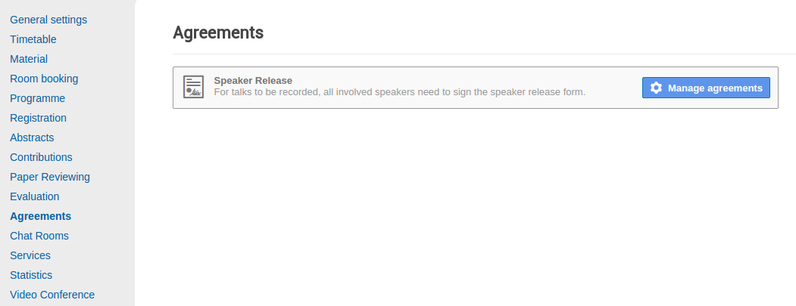
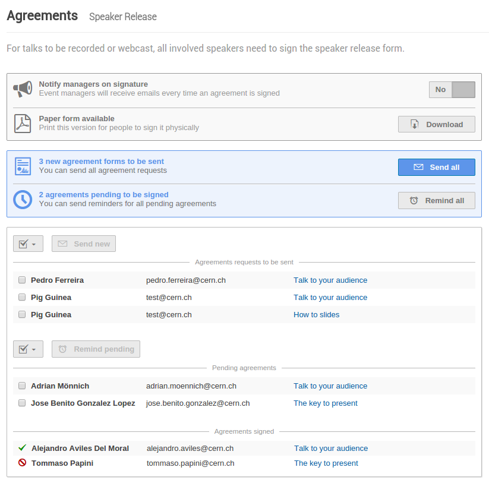
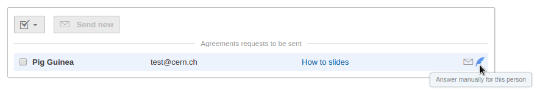
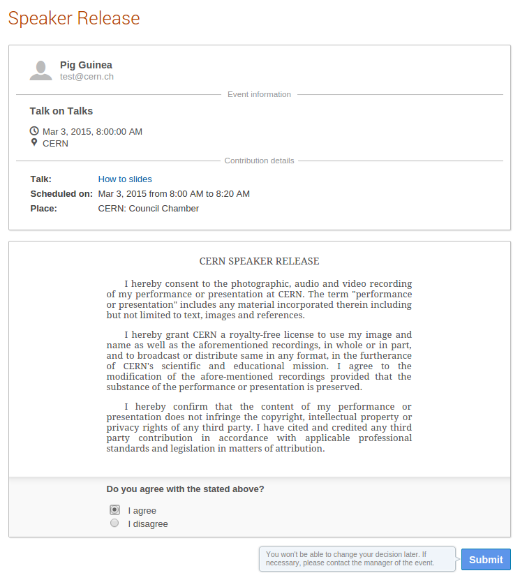

.. _event_agreements:

Event Agreements
================

The **Agreements** module provides a central hub to manage all necessary legally
binding documents between people related with the event and the organizers.

Management area
---------------

The menu displays all agreements types available for the event. These are
currently added only by plugins.

|agreement-types|

Agreement type management
~~~~~~~~~~~~~~~~~~~~~~~~~

Within each of the agreement types several actions can be taken as well as to
have an overview of the agreements to be sent, the ones pending to be signed
and the signed ones.

|agreement-type-management|

Manual answer of the agreement is also available.

|agreement-manual|

Agreement form
--------------

This view shows the agreement to be accepted or rejected by the person in
question.

|agreement-form|

