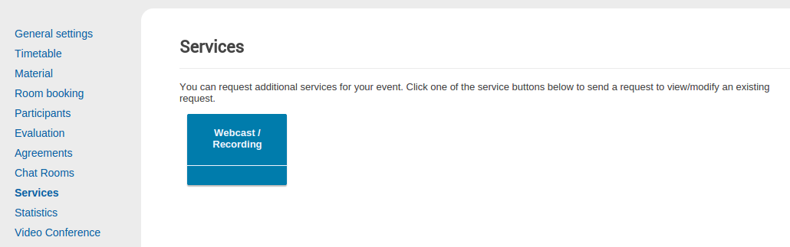
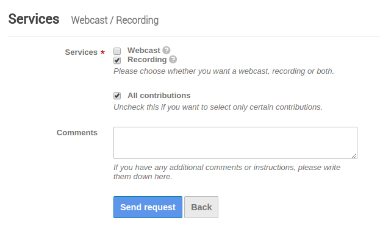
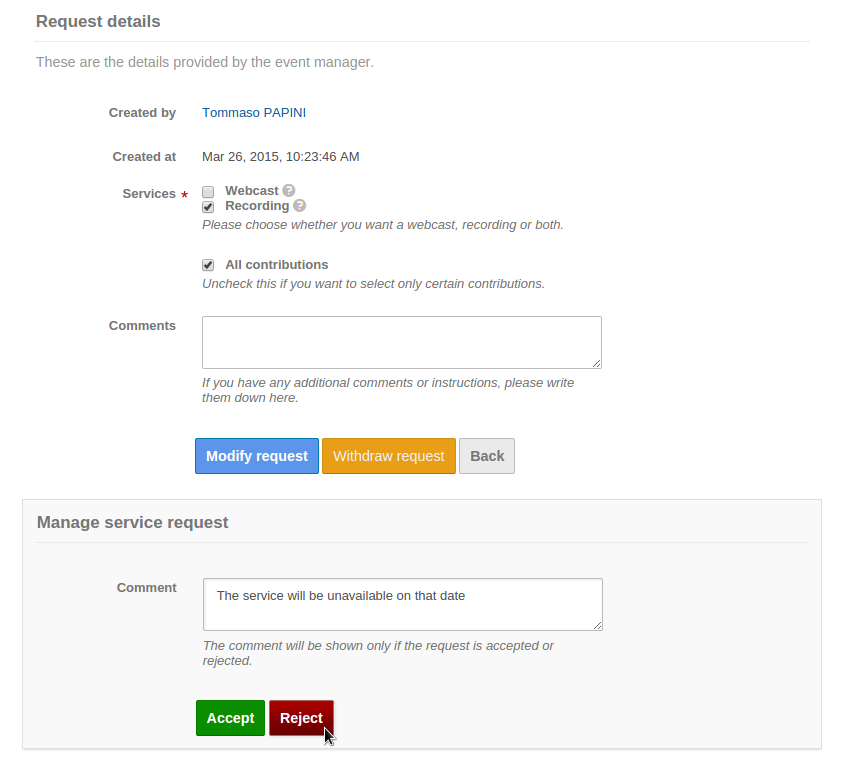

.. _event_services:

Event Services
==============

The **Services** module provides additional services that can be requested for
an event such as webcast or recording of talks.

Management area
---------------

The menu displays all agreements types available for the event. These are
currently added only by plugins.

|service-types|

Service request
~~~~~~~~~~~~~~~

The event manager will find a form to be filled with the selected
options for the requested service. Once the request is submitted, it will be
marked as pending awaiting for approval of the service administrator. At any
moment in the meantime the request can be modified or withdrawn. Upon reply from
a service manager, the service request issuer will receive a notification email.

|service-request|

Service request reply
~~~~~~~~~~~~~~~~~~~~~

Once the request has been submitted, service administrators will be able to
check the details and modify them if needed before accepting or rejecting as
well as leaving comments.

|service-request-admin|

