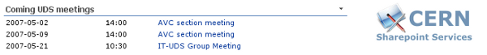
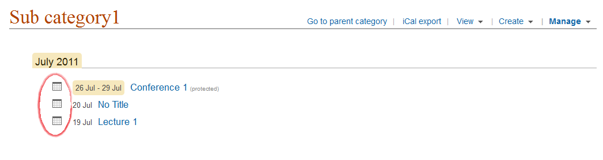
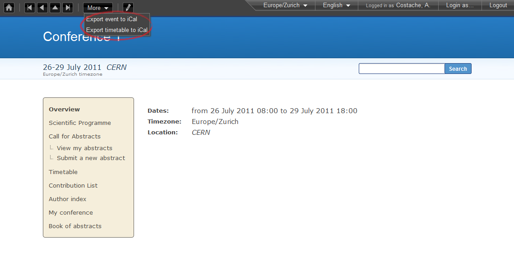
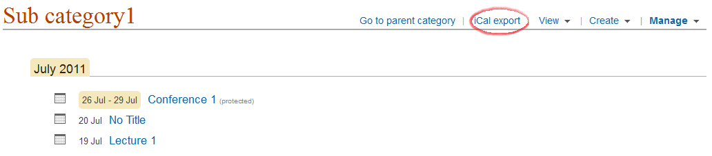

=====================
Exporting Indico Data
=====================

To Personal Scheduler Tools (Outlook, iCal, korganizer...)
----------------------------------------------------------

You can export an event or a set of events to your personal
scheduler tool by using the Indico iCal export. There are different ways
you can export data into iCal:

* With the icon |image162| which you can find when looking at a category’s events. This will export the whole event into iCal:

|image165|

* From the event page, from the menu *More* -> *Export to iCal*. You have the choice to export the event or the timetable. Clicking on *Export event* will export the event into iCal and clicking on *Export timetable* will export the timetable, with all the contributions etc. within it.

|image166|

* From the category’s overview page, by clicking on the link *iCal export*, on the top right. This will export all the events in the given category

|image167|

On a category page, all events in the category will be exported. Some scheduler tools
recognize multiple events (iCal, korganizer, Outlook 2007),
others do not (Outlook 2003); in this case, only the first event in
the list is recognized.

You can also ask your personal scheduler tool to subscribe to one
of these export URLs (this is particularly interesting for the
Category export). For iCal: "Calendar" menu -> menu item
"Subscribe", then enter the URL of the iCal export. Finally, set the
"Refresh" to "Every day". Every day, your iCal software will update
its content with any new event in the Category.

--------------

RSS feeds
---------

Indico provides RSS feeds on each Category page. If your browser
is RSS-aware, you will see an icon like this on the browser menu
bar: |image163|. Click on it to access the RSS feed, and
subscribe to it using an RSS aggregator.

--------------

Sharepoint
----------

If you maintain a Sharepoint web site, it is very easy to create
inside it a web part exposing the forthcoming events from an Indico
category. First add an XML web part, then in the "XML link" part,
add the `XML export <#using-the-export.py-script>`_ URL from indico (e.g.
http://indico.cern.ch/tools/export.py?fid=2l12&date=today&days=1000&of=xml)
and in the "XSL link" part, add this URL:
http://indico.cern.ch/export.xsl.

The result should look like this:

|image164|

Using the HTTP Export API
-------------------------

Indico has an export API which allows you to
export categories, events, rooms and room bookings in various formats such
as JSON, XML, iCal and Atom. For details no how to use this API, see
:doc:`/ExportAPI/index`.

--------------

