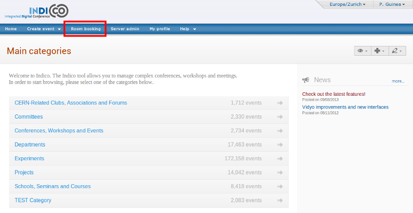
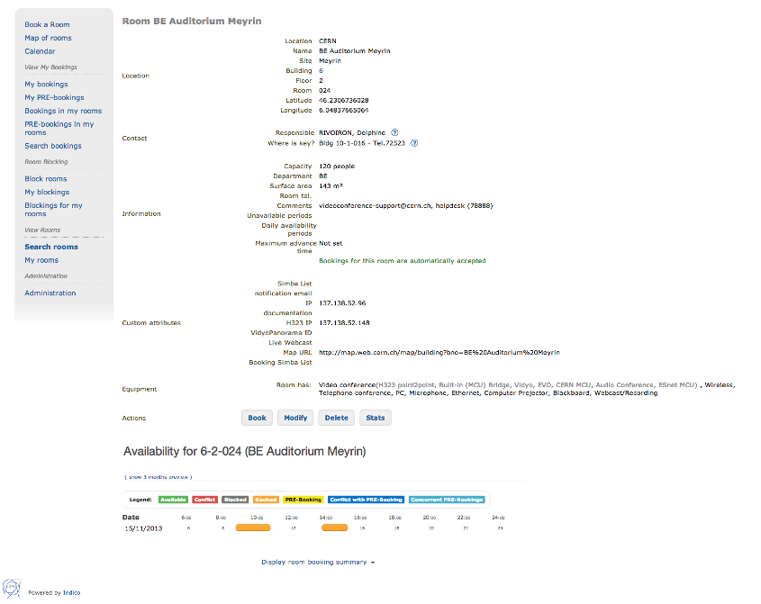
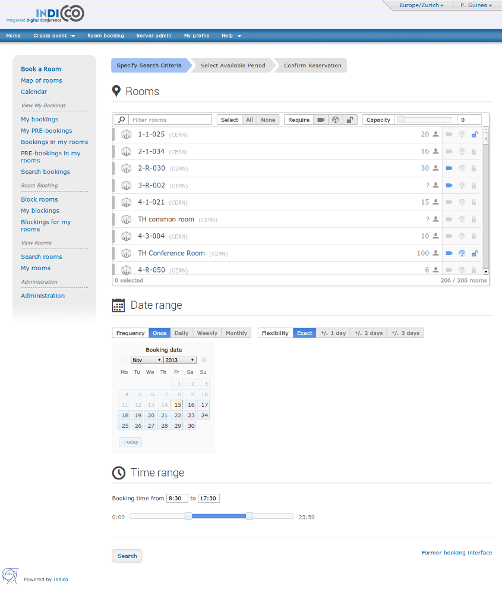
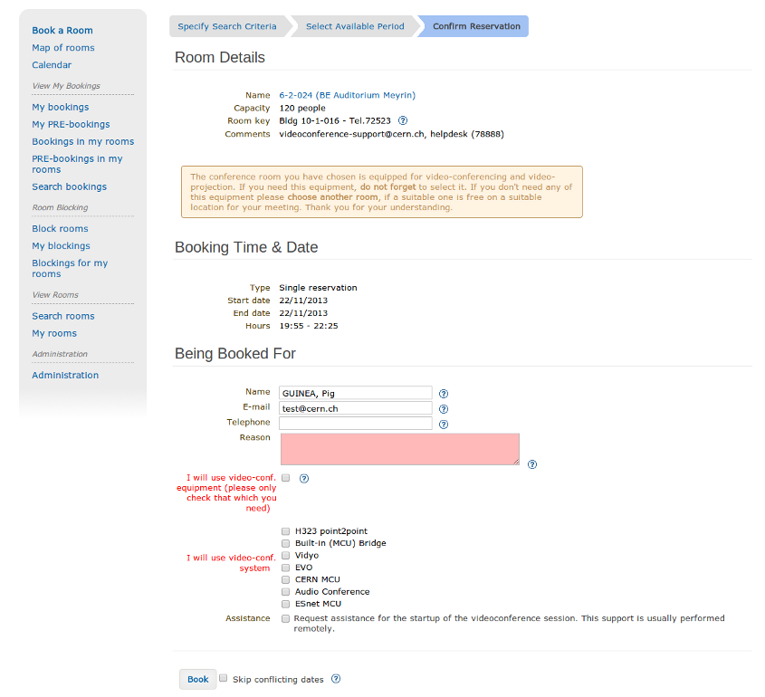

=======================
Conference Room Booking
=======================

Introduction
------------

This chapter describes the Indico module for booking conference
rooms.

Indico users can book conference rooms for their conference and
meeting purposes. Bookings can also be standalone - they
do not have to be bound to any event. Room managers can monitor and
moderate all bookings. Indico administrators can create rooms and
manage their data.

Instead of being a boring manual no one ever reads, this file is
an introduction, and it assumes you have some intuition of how the web
works. The suggested way of learning is to start with a tutorial,
then play with the module on your own. Simply use the software as
any other Web page. Read context help along the way. Finally, come
back for some tips.

--------------

The Tutorial
------------

You can read the Core Features listings in order to get a full overview
of the options of the room booking modules. It allows you to assign
a room to a particular event, a talk or simply to book a room on its
own, without attaching it to a event. The booking can then be managed
from the administration area.

|image165|

--------------

Getting into Room Booking Module
~~~~~~~~~~~~~~~~~~~~~~~~~~~~~~~~

To use Indico::CRBS directly, just click on *Room Booking* in the Indico
home page, in the top blue bar. To book rooms for your event, go to
the event management page and click on the *Room Booking* option. In both
cases you will be asked to sign in. Use your Indico login.

--------------

The First Page
~~~~~~~~~~~~~~

The Room Booking Module first page depends on who is logged in. For
most people, it will show a list of their bookings. The *My bookings*
menu option will give you the same list. Room managers will see
bookings of rooms they manage, so they can have a quick overview. If you
are a room manager, use the *Bookings* option in *My rooms* menu to
show the page again (this is only available for room manangers).

--------------

The Most Important Tip
~~~~~~~~~~~~~~~~~~~~~~

If you require it, point at the question mark icon |image166| with your
mouse to see context help. Context help is meant to answer most of
your questions along the way.

--------------

Room Names
~~~~~~~~~~

If a room does not have a name, the default name is built in the
following way:

"location: building-floor-room"

Examples: "CERN: 304-1-001", "Sheraton: 0-34-013".

|image167|

--------------

Three Kinds of Room
~~~~~~~~~~~~~~~~~~~

There are three kinds of room. They determine how much freedom
users have.

* *Public rooms* which do not require confirmation (black/green
   colour). This means all bookings are accepted.
* *Public rooms* which do require confirmation (orange colour). You can
   PRE-book them and wait for acceptance or rejection.
* *Private rooms* which cannot be booked at all (red colour). Only the room
   manager can book his/her private room. If you need such a room, you
   should ask this person to create a booking for you.

|image168|

--------------

Six Types of Booking
~~~~~~~~~~~~~~~~~~~~

There are six types of booking. They allow you to define
different types of recurring reservation. A common example is a weekly
meeting (which takes place at the same time every week). You can
choose from:

* *Single day*: not recurring, one-time event
* *Repeat daily*: use if you want to book many subsequent days, like
  an entire week
* *Repeat once a week*: the booking will take place every week,
  always on the same day
* *Repeat once every two weeks*: as above, but repeats every two
  weeks
* *Repeat once every three weeks*: as above, but repeats every
  three weeks
* *Repeat every month*: allows you to do bookings like 'first Friday
  of each month', 'second Wednesday of each month', 'fourth Saturday
  of each month', etc.

--------------

Booking a Room
~~~~~~~~~~~~~~

On the Indico main page, click the *Room Booking* menu option. This is how you access the Room Booking Module. From there, click the *Book a Room* menu option.

The booking process consists essentially on three steps:

* Specifying the search criteria
* Selecting an available period
* Confirming the reservation

|image169|

In the first step you can specify the rooms, date range and time range in which you want to search for bookings.

* The *room picker* allows you to filter by name, technical requirements, and minimum capacity.
  By clicking on a room you will mark it as a candidate for the booking.
* The *date range* selector allows you to specify the frecuency and flexibility of the booking.
  Frecuency allows to book the room a single time, daily, weekly or monthly.
  Flexibility extends the search a few days before and after the specified date.
* The *time range* simply serves the purpose of specifying the hours in which the room will be needed.

When you are done, click the button *Search* to proceed to the next step.

|image170|

In the second step, you will be presented with a calendar summarizing the rooms, dates and times you specified previously. In this view you can check all available periods (marked in green), other bookings (in yellow) or conflicts (in red).

This view is very versatile. Give it a try: set the frecuency of the search to to *Weekly*, set the end date to be at least 2 months after the start date, and search again. See the room calendar in its full glory.

If you click on an available period with you will be redirected to the next step in which you will confirm the reservation.

|image171|

In the third and final step, you will need to complete the booking form. Click *Book* to confirm the reservation.

If your booking conflicts with others, you have two options:

* In general, it is better to resolve conflicts manually: by
  changing dates, hours or maybe trying another room.
* The alternative is to automatically book everything except
  conflicting days. This may be useful if you do long-term, recurring
  booking, for example, *whole year, every week*. Imagine everything
  looks perfect, except for several weeks when the room is not available.
  In this case check the 'skip conflicting dates' option to book
  everything except problematic dates.

If your form is corectly filled, the system will ensure your new booking does not conflict with others. When no conflicts are found, you will be shown the confirmation page which lists the details of your booking.

* Click *My bookings* from the menu. Your new booking now appears on
  the list.

Note: some rooms require confirmation. These rooms are usually coded
in orange. In this case, you cannot directly book them. You
can only *PRE-book* such a room. PRE-booking works exactly the same
way as booking. The only difference is that you must wait for
acceptance from the room manager.

Note: you can always modify your booking (or PRE-booking). It
will again be checked for conflicts.

Note: you can always browse your own bookings and PRE-bookings
using the menu options *My bookings* and *My PRE-bookings*.

--------------

View your Booking
~~~~~~~~~~~~~~~~~

You can view the bookings or pre-bookings that you made by going
under the 'My bookings' and 'My PRE-bookings' sections of the Room
Booking side menu. By selecting one of the bookings in the list, you
will get the following :

|image172|

This page contains all the information about a booking, and it allows
you to modify, clone or cancel the booking. If the reservation is
done for more than a single day, each of the occurences of the booking
can be canceled individually. In addition, this page lets you watch
the history of the booking (i.e. all the past actions that were performed
on this reservation) if you are the creator of the booking. Only the most
recent entry is partially displayed, but you can see the rest of it by
clicking on the *Show All History...* link. Additional information about
a particular entry can be viewed by clicking the *More Info* link.

--------------

Blocking a Room
~~~~~~~~~~~~~~~

As a room manager you may create room blockings which prevent regular users
from booking certain rooms. This feature can be used for special events
during which only a few people should be allowed to create bookings for
some rooms.

To create such a blocking, go to 'Block rooms' in the Room Booking side
menu and follow these steps:

* Choose the period during which the rooms should be blocked by clicking the
  start and end date on the calendars.
* Enter a reason for the blocking - it will be displayed to users
  trying to book one of the blocked rooms.
* Add some rooms to the 'Rooms' list. Those will be affected by the
  blocking.
* Unless you want to be the only one to be able to book the blocked
  rooms, you can add other users or groupe to the "Allowed users/groups"
  list.
* Submit the blocking after confirming that the chosen period is correct.
  Once you have created the blocking, the dates cannot be changed.

When trying to book a blocked room, users in the 'Allowed users/groups'
list will see that the room is blocked and the reason why but will be able
to create bookings anyway. You as the creator of the blocking will always
be able to override your blocking, so you don't have to add yourself to
the list. The same applies to the owners of blocked rooms. They will see
the blocking and a warning that the room has been blocked, but they are
able to override the blocking.

You can also create blockings for rooms you don't own. These blockings
will have to be approved be the respective owners - until they do so,
other users trying to create a booking on that room will see the pending
blocking request but will be able to carry on with their booking.

As soon as the blocking for a room has been approved (blockings for your own
rooms are immediately approved when creating the blocking), all bookings
colliding with the blocking are automatically rejected.

--------------

Core Features and Constraints
-----------------------------

Introduction
~~~~~~~~~~~~

This section describes core capabilities and constraints of the Room
Booking Module. It may be useful to assess whether it meets your
needs.

Note that the Room Booking Module is NOT supposed to be a general-purpose
"room management" or "room booking" software.

It was built with conference rooms in mind. Its main purpose
is to make conference organization easier. We see room booking as a
part of conference organization (but it is possible to book rooms
without associating the booking to an event).

--------------

Core Features
~~~~~~~~~~~~~

General
^^^^^^^

General features are:

* Stand-alone and "in-conference" mode.

  - The stand-alone mode allows you to book, manage bookings and do
    administration stuff. You don't have to create an Indico event
    (the bookings will not be assigned to any Indico event).
  - The "In-conference" mode allows you to book rooms for your event. You
    can assign booked rooms to conferences, lectures, meetings, sessions,
    contributions or breaks.

* Recurring bookings ('every day', 'every week', 'every 3rd Wednesday
  of a month', etc).
* E-mail notifications (to users and room managers, about every
  important action).
* Three user roles: (1) Indico administrator, (2) room manager and
  (3) ordinary user.
* Optional booking moderation. Each room may work in one of the
  following modes:

  - Bookings require explicit confirmation of room manager, *or*
  - Bookings are automatically accepted.

--------------

User
^^^^

Options available to regular users:

* Book a room
* Manage own bookings (track, modify, cancel)
* Search for rooms
* Search for bookings (including archival)
* View existing room blockings

--------------

Room Manager
^^^^^^^^^^^^

In addition to what a user has access to, a room manager can:

* Accept and reject PRE-bookings (for his room(s))
* Reject bookings (for his room(s))
* Block rooms from being booked (with confirmation from the room owner)
* Accept blocking requests (for his room(s))

--------------

Indico Administrator
^^^^^^^^^^^^^^^^^^^^
In addition to what a room manager has access to, an Indico Administrator can:

* Switch on/off Room Booking Module
* Configure room booking plugins in admin section
* Add/remove location
* Define room attributes specific to the location
* Define possible room equipment specific to the location
* Manage meeting rooms (add/modify/remove)

--------------

Constraints
~~~~~~~~~~~

The room must have its manager. It is not possible to define
multiple managers for a single room (you can work around this by
creating an Indico account shared by several people).

The room must have a defined building, which must be a number.
This is mandatory. If you do not need building, put any number there
(like '0'). If your building naming scheme has letters, we are
sorry - the software is not flexible enough for you.

The room must have defined floor (alphanumerical) and room
'number' (alphanumerical in fact).

--------------

Dictionary
----------

*Room*: meeting or conference room. Please note that the software is
not suitable for managing other rooms, like offices, corridors, etc.

*Location*: physical location of rooms. Room custom attributes
and possible equipment are defined on a location basis. Example:
rooms at CERN may have different attributes and different equipment
than rooms in Fermilab.

*Booking*: final reservation of a room. While considered final,
it still may be rejected in case of emergency.

*PRE-booking*: unconfirmed reservation of a room. PRE-booking
is subject to acceptance or rejection.

*Room responsible/manager*: the person who accepts/rejects bookings.
Each room has exactly one person responsible. A person may be
responsible for any number of rooms.

*Room blocking*: a restriction created by a room manager which prevents
users from booking the rooms listed in the blocking unless they have
explicit permission to override the permission or own the rooms.

--------------

