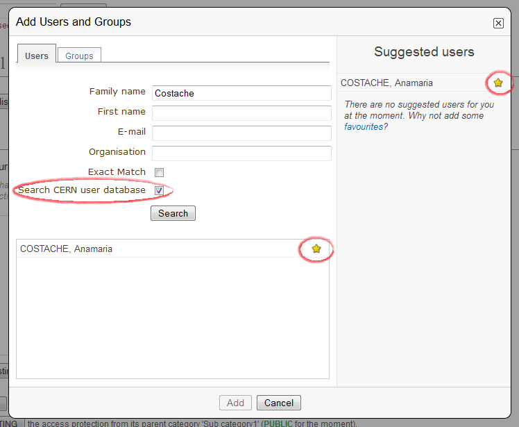

================
Users and Groups
================

Users
-----

Recognised users are Indico users or users belonging to an external database.

When searching for an Indico user, filling any of the criteria and then
clicking on the button *Search* will do.

If you are looking for someone and not finding that person, he or she
might not have an Indico account. In that case,  you may want to tick
the checkbox option to search for users in an external database (e.g.
at CERN you will see something like *Search CERN user database*).
Moreover, clicking on |image1| at the right of the name will add
the person to your favourites, which means you won't have to search for
them next time; they will appear at the right of the search box instead,
in the *Suggested users* area.

|image2|

--------------

Groups
------

In Indico, groups work similarly to users.

Recognised groups are Indico
groups, or groups belonging to an external database.
The searching criteria described above applies to groups; if you are not
finding a group, you may want to tick the option to search in an
external database.

|image3|

-----------------

.. |image1| image:: UserGuidePics/markMainResource.png

.. |image3| image:: UserGuidePics/searchGroup.png
