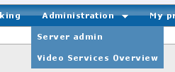
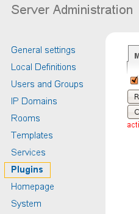
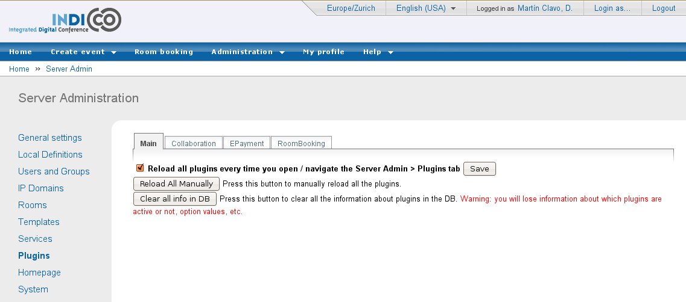
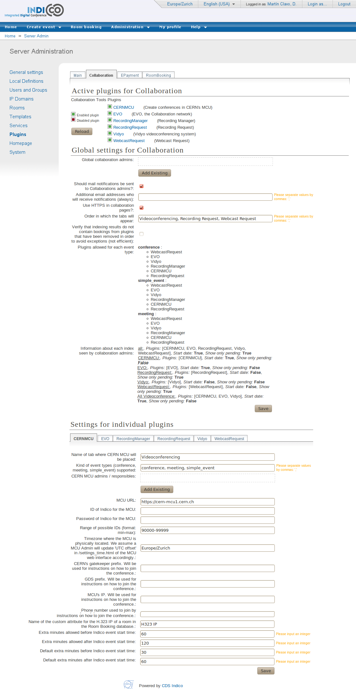
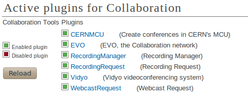
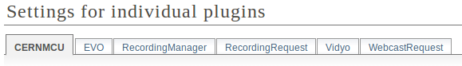
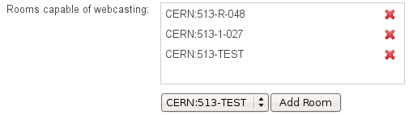

============
Introduction
============

Welcome to the Video Services User Guide for the Indico Server
Administrator.

As an Indico Server Administrator, you have rights to access and modify
everything in Indico. Please look at the three following guides:

- *Guide for the normal Indico user*, to see what you can do in
  Indico events' display pages;

- Guide for the Event Manager / Video Services Manager, to see what
  you can do in the Management Interface of an Indico event;

- Guide for the Video Services Administrator, to see what you can do
  in the Video Services Overview page.

Besides the things mentioned above, there is another section of Indico
that you will be able to see: the plug-in administration and
configuration pages.

========================================
Plug-in administration and configuration
========================================

Go to the Server Admin pages by clicking on Server admin menu entry
in the Administration menu:

|image01|

Figure 1. Administration Menu.

In the left-hand section list, click on Plugins.

|image02|

Figure 2. Server admin menu. Plugins entry is highlighted.

You will get to a page with several tabs:

- A *Main* tab, where you can perform actions that affect all
  *plug-in types*.

- A tab for every *plug-in type*: examples of plug-in types are:
  Collaboration (the plug-ins this guide concerned by), Epayment,
  RoomBooking.

--------
Main tab
--------

In this tab you can perform actions that affect all plug-in types.

|image03|

Figure 3. Plugins administration section.

As you know, in Indico's source code, plug-ins are inside the
MaKaC/plugins folder. Information about the plug-ins is stored in
the database (which plug-ins are currently active, for example),
if we change the code of the plug-ins, we may need to create
new objects in the database. For example, we may need to store an
additional option (global value) for the EVO plug-in.

The button *Reload All Manually* will reload information from **all**
of the plug-ins, regardless of their plug-in type, from their
source code files into the DB. When reloading, if some objects are
no longer in the source code file, they are still preserved in the
DB (although not visible anymore), marked as non present. Also, the
values of the objects are preserved. This button is useful when we
are adding new objects or changing some of their attributes that do
change when reloading.

The button *Clear all info in DB* is a real reset: all the
information about the plug-ins in the DB will be erased, and then
loaded again from the source code files. Values are lost and any
object that is not in the source code files will also disappear.

Finally, the *Reload all plugins every time you open / navigate ...*
option, if activated, means that every time you navigate through this
interface, it will be as if the *Reload* button is pressed. It's
useful to disable it for debugging.

-----------------
Collaboration tab
-----------------

In this tab you can perform actions that affect the Collaboration
plug-ins.

|image04|

Figure 4. Collaboration plugins administration and configuration
tab.

The other tabs (Epayment, RoomBooking) have the same structure as
this tab, but since this is a Video Services User Guide, we will
only go into the details for this tab.

~~~~~~~~~~~~~~~
Active plug-ins
~~~~~~~~~~~~~~~

The first part of the page shows you a list of the plug-ins that
are in the Indico source code. Exception: plug-ins that have been
marked as ignored (ignore = True in their \_\_init\_\_.py file).

You can decide which plug-ins should be active:

|image05|

Figure 5. Enabled and disabled plugins.

If a plug-in is not active, Indico users will not see anything
related to it in any of the Indico pages, be it display,
management, or Video Services Overview pages.

To toggle if a plug-in should be active or not, click on its name
or the green / red icon.

Also, there is a *Reload* button on this page. This has the same
effect as the *Reload All Manually* button in the Main tab, except
it will only reload information for the Collaboration plug-ins.

After an Indico installation, plug-ins will not be active. This is
desirable because you should configure their settings before
activating them.

~~~~~~~~~~~~~~~~~~~~~~~~~~~~~~~~~~~~~~~~~~~
Collaboration settings and plug-in settings
~~~~~~~~~~~~~~~~~~~~~~~~~~~~~~~~~~~~~~~~~~~

Under the Active plugins section, you can change settings. These
are separated into two categories.

- Global settings for Collaboration: settings that affect all the
  plug-ins.

- Settings for individual plug-ins: settings that affect only one of
  the plug-ins.

For the settings of individual plug-ins, you can browse between
plug-ins by clicking on their tabs (note: these tabs are
Javascript-powered, so the page is not reloaded every time):

|image06|

Figure 6. Subtabs for each of the plugins.

There are two kinds of settings: Options and Actions

~~~~~~~
Options
~~~~~~~

Options are objects in the database that hold a value. The value
can be of many types, and depending on the type of value, what will
appear in the page will be different:

- *String*: a simple string value. A text box will be shown.

  |image07|

  Figure 7. Example of a string option.

- *Integer*: a simple string value. A text box will be shown, and you
  will be reminded to input an integer.

- *List*: a list of strings. A text box will be shown, and you will
  be reminded to separate the strings by commas. You don't need to
  put quotes (“) around the strings.

- *Dictionary*: a Python-like dictionary, with keys and values.
  Example of how you should write a dictionary value:
  {“key1”:”value1”, “key2”:”value2”} . However, most of the time
  dictionary values are read-only.

- *Boolean*: a checkbox will be shown.

- List of users

  |image08|

  Figure 8. Example of a list of users option

  Use the *Add Indico User* button to search for an Indico user in the
  Database and add it to the list. You can also use the *Add from
  favourites* button to add a user from your personal favourites. If
  you want to remove a user from the list, use the |image0| button.

- List of rooms

  |image09|

  Figure 9. Example of a list of rooms option

  Use the *Add Room* button to add a room from the list of rooms in
  Indico's Room Booking database. If you want to remove a room from
  the list, use the |image1| button.

Once you edit an option, you need to press the *Save* button to send
the changes to the server. **Exception**: the options of type User
List and Room List, where every time you add or remove a user or
room, information is sent to the server.

As you may have noticed in the screenshot of the whole
Collaboration tab, some of the options are not actually editable.
This means you can see the value but not change it; Actions will
change them or you need to change the value in the source code and
reload.

If you go to the options.py file of a given plugin folder (or the
Collaboration folder, for the global Collaboration options), you
will notice that options have several attributes, besides their
description, type of value, and the initial value:

- *editable*: if set to True, you will be able to edit them;
  otherwise, you can only use the current value.

- *visible*: if set to False, this option will be in the database
  like any other option, but you won't be able to see it. It's useful
  for plugins to store global values that you don't need to see.

- *mustReload*: if set to True, this option's value will be re-set to
  the value written in the source code file every time you use the
  *Reload* button or the *Reload All Manually* (from the Main tab)
  button.

~~~~~~~
Actions
~~~~~~~

Actions are code that can be executed from the settings page.
Usually, the goal of this code is to update one of the values of the
the options, or they can execute some maintenance code.

Actions will appear as buttons that you can press. You will be able
to find the executed code in the file actions.py inside the
Collaboration folder or inside the folder of the respective.

~~~~~~~~~~~~~~~~~~~~~~~~~~~~~
Important options and actions
~~~~~~~~~~~~~~~~~~~~~~~~~~~~~

Here is the meaning of some options and actions that you should
know about:

- Use HTTPs for Collaboration pages: this option decides if the Video
  Services section of an event's Management interface should be
  loaded by HTTP or HTTPs. In this section, Event Managers can create
  bookings that may have a password; we don't want this password to
  be transmitted clearly (as in not encrypted) between the user and
  our Server. However, HTTPs reduces performance, and if your Apache
  server is not configured properly, HTTPs may not work at all; this
  is why it is possible to disable this option.

- Admins: each plug-in has a list of administrators; additionally, there is a
  global collaboration admininistrator list.

  + Global Collaboration Administrators are users who can:

    * access the Video Services section for any event, and

    * see the Video Services Overview page (thus, query the index of
      bookings).

    * What they can and cannot do is described in the Guide for the Video
      Services Administrator.

  + Individual plug-in administrators are users who can:

    * Access the Video Services pages for any event, but only if the
      plug-in they control is allowed for that particular kind of event
      (some plug-ins may only be allowed for meetings and not lectures,
      for example).

    * see and modify bookings / requests of the plug-in they control.

    * see the Video Services Overview page, but they can only see indexes
      for the plug-ins they control.

    * Also, for some plug-ins (like RecordingRequest and WebcastRequest),
      they can optionally receive the notification mails from the
      requests.

- Kind of event types (conference, meeting, simple\_event) supported:
  each plug-in can be configured to be available only for a given
  type of event.

  To change this, write a combination of the words conference,
  meeting and simple\_event (simple\_event = lecture in Indico
  lingo), separated by commas, in the corresponding field.

  When you save this option, you will notice that the
  *Plugins allowed for each event type* option in the
  *Collaboration global options* will update itself. It offers you a
  summary of the individual *Kind of event types supported* of each
  plug-in.

- Should mail notifications be sent to responsibles? Check this
  option if you want administrators to receive notification mails.

- Additional email addresses who will receive notifications (always):
  list of email addresses, separated by commas, who will receive
  notifications.

- Re-index ALL bookings (action): the indexing mechanism is very
  complex and even after several tests, it's possible that some
  inconsistency appears in the index. Pressing this button will erase
  all the indexes and loop through all of Indico's events and
  re-index all of the bookings again. This may take a lot of time.

.. |image08| image:: images/index_html_2d19d8bb.png

