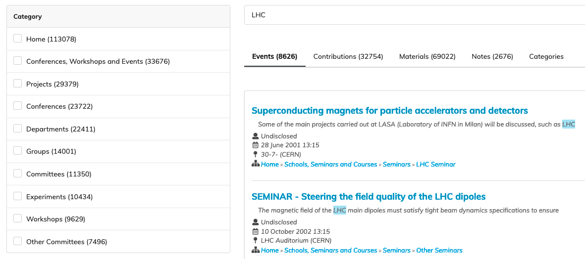
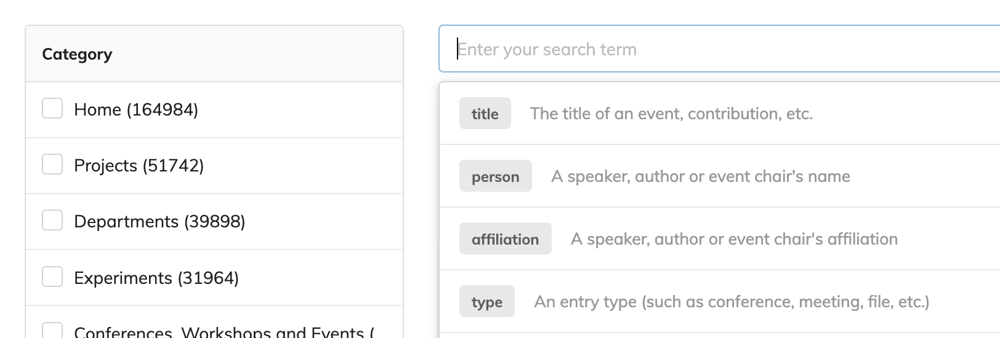

Internal Search
===============

The Internal Search is a default SQL based engine implementation, created to support the most basic queries.
While the performance and range of features might not be the same, depending on your instance, if your volume of
records is small and retrieval needs are simple, this module should be enough.

It supports the two types of records from a total of six targets where each query is made upon the respective title:

- Events
- Categories

.. note::
    The Internal Search does not yet support: contributions, sub-contributions, event notes and attachments.

External Search Service
=======================

Indico supports several powerful features for aggregation, filtering and retrieval of information natively
covered by the out-of-the-box `Citadel`_ service.

Aggregations
------------

Aggregations, `as seen in Elastic Search <https://www.elastic.co/guide/en/elasticsearch/reference/current/search-aggregations.html>`_,
provide a way to combine information in groups according to a certain metric, such as a field value, sum or average.

Indico supports any bucket or metric group, composed of a key, count and filter key:

.. autoclass:: indico.modules.search.result_schemas.AggregationSchema()
    :members:

.. autoclass:: indico.modules.search.result_schemas.BucketSchema()
    :members:

Filters
-------

Filters act combined upon a certain aggregation on structured data. Considering a bucket group composed of a
single affiliation:

.. code-block:: json

    {
        "affiliation": "CERN",
        "count": 5,
        "filter": "affiliation"
    }

A corresponding filter acting upon the same key would be ``affiliation=CERN``.

.. todo::
    Remove unused get_filters method

.. autoclass:: indico.modules.search.base.IndicoSearchProvider
    :members: get_filters

Placeholders
------------

Placeholders are a special type of filters specifically designed to be part of the user-facing text based search query.
Examples of valid placeholders would be: `affiliation:CERN` or `person:John Doe`.

Indico expects to receive a list of valid placeholders through ``get_placeholders()`` where each one will be
merely hinted to the user while doing a text based search.

.. autoclass:: indico.modules.search.base.IndicoSearchProvider
    :members: get_placeholders

.. _Citadel: https://gitlab.cern.ch/webservices/cern-search/cern-search-rest-api
