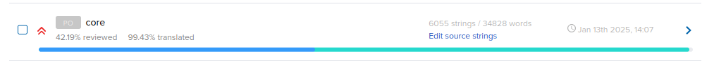
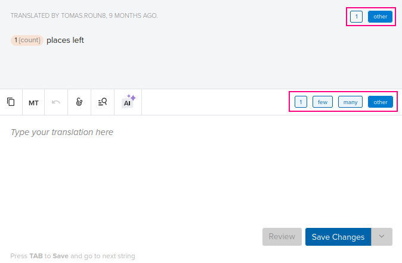

.. _translations:

Translating Indico
==================

Indico is currently available in the following languages:

- English 🇬🇧🇺🇸🇨🇦
- French 🇫🇷
- Portuguese 🇵🇹🇧🇷
- Spanish 🇪🇸
- Chinese 🇨🇳
- Ukrainian 🇺🇦
- Polish 🇵🇱
- Mongolian 🇲🇳
- Turkish 🇹🇷
- German 🇩🇪
- Czech 🇨🇿
- Italian 🇮🇹
- Hungarian 🇭🇺
- Swedish 🇸🇪
- Japanese 🇯🇵
- Finnish 🇫🇮

Languages with partial translations:

- Arabic
- Dutch 🇳🇱
- Korean 🇰🇷
- Russian 🇷🇺
- Croatian 🇭🇷
- Greek 🇬🇷
- Estonian 🇪🇪
- and more!

We are always looking for new translators to help us make Indico accessible to
the widest possible audience. You can help us achieve that goal by contributing
translations to Indico!

We need help both with completing languages which are only partially translated
but also keeping the official languages up to date as we add new features to
Indico.

This guide is intended to help you get started with translating Indico.

Becoming a Translator
---------------------

We manage all translations using `Transifex
<https://explore.transifex.com/indico/indico/>`_, so you will first need to
create a Transifex account. Afterwards, you can request to become a member of a
specific language team (if you speak multiple languages you can be part of
multiple teams). If we don't have your language yet, you can request it to be
added.

In general, we welcome anyone who wants to help us make Indico available in
other languages, however at least a basic knowledge of Indico is definitely
useful.

Once you've become a member on Transifex, you might also want to contact the
language coordinators - some languages have specific coordinators assigned. They
may point you to places, where work is needed and which rules have been agreed
for the translations.

You are also welcome to check out the `translation category
<https://talk.getindico.io/c/i18n/6>`_ on our `forum
<https://talk.getindico.io>`_ for any questions you might have!

Translating
-----------

When you first start translating, you will notice that each language has a list
of `resources`. Each resource contains messages which need to be translated. We
recommend focusing on a resource called `core` which contains messages from core
Indico. The remaining resources contain messages from various Indico plugins and
have lower priority.

Once you have selected a resource to translate, you will be presented with a
list of messages. Before you start translating, have a look at the messages
which are already translated to understand the style and the tone that is
already used and try to match it in your own translations.

When translating a message, you will also see suggestions based on similar
messsages that have already been translated. You will also have access to a
glossary with relevant terms. It is a good idea to consult both while
translating.

Translator comments & Message context
+++++++++++++++++++++++++++++++++++++

Some messages might contain comments and additional context. You can use these
to improve your translations.

Variables
+++++++++

Some messages might include `variables`. Variables are placeholders which will
get substituted with a value by Indico. A variable could represent a date,
person's name or any other dynamically generated value.

The translated message must include all variables from the source message. To
insert a variable in your translation, you can simply click on the variable in
the source message. If your translation is missing some variables, Transifex
will warn you when saving the translation.

Plural messages
+++++++++++++++

Messages containing a variable representing a number are called plural messages.
For example, the English message ``{n} places left`` must be formatted
differently based on the number of places, ``n``:

- n=1: ``{n} place left``
- n=0, n>1: ``{n} places left``

Thus, we must translate both versions of the message. However, languages have a
varying number of `plural forms
<https://en.wikipedia.org/wiki/Grammatical_number>`_ (English has 2, French 3,
Arabic 6, Japanese 1, etc.).

For example in Czech, this becomes:

- n=1: ``zbývá {n} místo``
- n=2,3,4: ``zbývají {n} místa``
- n>4: ``zbývá {n} míst``

To fully translate a plural message, you need to translate all plural forms.
Typically, the English singular will map to your language's singular and the
English plural will map to one or more forms in your language.

In Transifex, you can switch between the English singular and plural by
selecting either ``1`` or ``other`` at the top of the source message. You can
switch between your language's plural forms by selecting from the options
underneath.

See your translations live
--------------------------

We have a `demo instance <https://localization-demo.getindico.io>`_ where you
can try out your translations. All languages, including unofficial ones, are
available there. We update the latest translations from Transifex automatically
every 6 hours.

You can use the instance to:

- find untranslated strings,
- see if the translated messages look good (no overflowing text, broken UI, in
  that case report it to us!),
- check for typos, consistency,
- better understand where a string appears in the UI.

Tips for better translations
----------------------------

- Use the glossary - this helps keep the translations uniform. Feel free to add
  new terms to it as well.
- Use the suggestions - you can reuse existing translations.
- Use the `forum <https://talk.getindico.io/>`_ to discuss questions, issues and
  improvements.
- There is an option to use machine translations, but be careful and do not
  blindly accept machine-generated translations.

Reporting issues
----------------

If you spot any issues with the source messages such as missing pluralization,
missing context or typos, please let us know either in the `forum
<https://talk.getindico.io/>`_ or by opening an issue on `GitHub
<https://github.com/indico/indico>`_ (issues with the translated messages can be
fixed directly in Transifex, no need to open an issue in that case). By
reporting such issues, you will save time to your fellow translators!
